# SKALA-SHOP 온라인 쇼핑몰 백엔드 API

## 백엔드 최종 실습과제 보고서

| | |
|---|---|
| **교육생** | 은태현 (고유번호: ) |
| **제출일** | 2026-08-08 |
| **저장소** | github.com/Taeyum/skala-shop-api |
| **기술 스택** | Spring Boot 3.3.0 · Java 17 · Gradle<br>JPA · PostgreSQL 16 · JWT · Docker |
| **규모** | 엔드포인트 13개 · 테스트 160건 · 커버리지 91.4%<br>ArchUnit 12건 · 변이 테스트 46건<br>설계 문서 3종 (DECISIONS 29절 · JOURNAL · REVIEW) |

---

# 0부 — 구현 범위 요약

공지의 요구 구분에 맞춰 네 구획으로 나눈다. 각 항목에는 **어디까지 했는지**를 함께 적는다.

## 1. 필수 요구사항

| 항목 | 구현 범위 |
|---|---|
| **도메인** | 상품 · 고객 · 주문 3개 도메인. 엔티티 `Product` · `Customer` · `OrderItem` |
| **계층 구조** | Controller → Service → Repository. **도메인 기준 패키지**(`product` / `customer` / `order` / `global`)로 배치해 도메인 폴더 하나가 곧 미래의 마이크로서비스 하나가 되게 했다 |
| **엔드포인트 13개** | **상품 5**(목록·상세·등록·수정·삭제) · **고객 5**(목록·가입·로그인·수정·탈퇴) · **주문 3**(주문·취소·보유 상품 조회). URI·메서드·JSON 필드명은 과제 스펙 그대로 유지<br>보유 상품 조회는 URI가 `/api/customers/{customerId}` 이지만 **주문 도메인이 소유**한다 — 응답이 고객 정보가 아니라 주문 목록이기 때문이다 |
| **비즈니스 규칙** | 포인트 결제(부족 시 `INSUFFICIENT_FUNDS`), 같은 상품 재주문 시 **수량 누적**, 취소 시 수량 차감·0이면 행 삭제, **주문 당시 가격 기준 환불**(현재가 아님) |
| **전역 예외 처리** | `@RestControllerAdvice` 단일 지점. `Error` enum → HTTP 상태 매핑. 예상 못한 예외는 **일반 메시지 + traceId만** 노출하고 스택트레이스는 로그에만 |
| **트랜잭션** | 주문·취소는 `@Transactional`로 원자 처리. 조회는 `@Transactional(readOnly = true)` |

> **공지가 허용한 자유를 어떻게 썼는가** — 공지는 *"교재에서의 프로젝트 내 폴더 구조를 그대로 동일하게
> 준수할 필요 없으며, 자유롭게 구성하기 바람"* 이라고 밝혔다. 이 프로젝트는 그 자유를 써서
> **기술 계층(controller/service/repository)이 아니라 도메인 기준**으로 재배치했다.
> 다만 **클래스명과 API 계약은 교재와 동일하게 유지**했다 — 대조 가능성을 잃지 않기 위해서다.
> 판단 근거와 트레이드오프는 **3부**에서 다룬다.
>
> 공지는 *"쇼핑몰이 아닌 자유주제를 대상으로 하셔도 됩니다"* 도 밝혔으나,
> **교재의 쇼핑몰 시나리오를 그대로 따랐다.** 스펙이 고정돼 있어야 "무엇을 개선했는가"를
> 개선 전/후로 비교할 수 있기 때문이다.

## 2. 공지가 "안 해도 되는 요소"로 명시한 것 — JWT, Docker적용

| 항목 | 구현 범위 |
|---|---|
| **JWT 인증** | 로그인 시 `bff-access` 쿠키로 발급. **HttpOnly · SameSite=Strict · Secure 스위치**. 시크릿은 환경변수로 분리하고 **기동 시점에 검증**(없거나 짧으면 기동 실패). 만료 1시간. 인증은 `@LoginCustomer` ArgumentResolver로 Controller에서 해결하고 **Service는 `customerId`만 받는다** |
| **Docker** | 멀티스테이지 빌드(빌드 스테이지의 JDK·Gradle·소스가 최종 이미지에 남지 않음) · **`eclipse-temurin:17-jre`** 런타임 · **non-root 실행**(`USER shop`, uid 1001) · **layered jar**(의존성/로더/스냅샷/애플리케이션 4계층 분리) · `HEALTHCHECK`(Actuator readiness) · 컨테이너 인식 JVM(`MaxRAMPercentage=75`) · graceful shutdown 연동(`stop_grace_period 30s`) · **PostgreSQL 연동 compose 1줄 실행** · **HA 2인스턴스 + nginx** 별도 구성 |

> Docker 이미지 크기는 하드닝으로 **줄지 않았다** — 160MB → 168MB로 오히려 8MB 늘었다
> (이전에도 멀티스테이지 + JRE였다). 얻은 것은 크기가 아니라 **재배포 전송량 56.9MB → 393kB**다 —
> layered jar로 변경된 계층만 전송된다.

## 3. 공지가 "자유롭게 선택적으로 하기 바람"이라 한 것 — Actuator, AOP

| 항목 | 구현 범위 |
|---|---|
| **Actuator** | **화이트리스트로 `health` 하나만** 노출. `readiness`/`liveness` 프로브 분리, `show-details: never`. `include: "*"`로 열면 `/actuator/env`에 `JWT_SECRET`·DB 비밀번호가 그대로 보이고 `/heapdump`는 힙 전체를 파일로 내려준다. **닫혀 있어야 할 11개 엔드포인트를 이름으로 단언하는 테스트**를 두어 화이트리스트가 실수로 넓어지면 깨지게 했다 |
| **AOP** | Controller 진입·종료와 **실행시간**을 남긴다. 실패도 실행시간과 함께 기록한다(느린 실패와 빠른 실패는 원인이 다르다). **비밀번호 마스킹 이중 방어** — 요청 DTO의 `@JsonProperty(WRITE_ONLY)` + `SensitiveDataMasker`. 스프링과 같은 `ObjectMapper`로 직렬화해 같은 규칙이 로그에도 적용되게 했다 |

## 4. 요구되지 않았으나 수행한 것

| 항목 | 구현 범위 |
|---|---|
| **DB 전환 (H2 → PostgreSQL 16)** | H2를 의존성·설정에서 완전히 제거. 테스트도 Testcontainers PostgreSQL. **H2로는 이 프로젝트가 목표한 측정 자체가 성립하지 않는다** — 커넥션 풀 튜닝·락 실험·HA 실증이 모두 불가능하다 |
| **테스트 160건** | 도메인 단위(순수 JUnit) · Service(Mockito) · Repository(`@DataJpaTest` + Testcontainers) · Controller(`@WebMvcTest`) · E2E(`@SpringBootTest` + MockMvc) · 동시성(`ExecutorService` + `CountDownLatch`) |
| **JaCoCo 커버리지 게이트** | 라인 **85%** / 분기 **80%** 를 **빌드에 묶었다**(`check` 태스크). 실측 라인 91.4% · 분기 86.3%. **100%를 목표하지 않는다** — DTO·설정 클래스는 제외하고 제외 사유를 주석으로 남겼다 |
| **ArchUnit 12건** | 계층·도메인 경계를 문서가 아니라 테스트로 강제. Controller의 Repository 직접 호출 금지, 도메인 간 Repository 직접 참조 금지, 엔티티 public setter 금지, Service의 웹 타입 의존 금지 등 |
| **변이 테스트 46건** | 운영 코드를 일부러 깨뜨려 **테스트가 실제로 실패하는지** 확인. `domain` 9 · `layer` 12 · `arch` 10 · `exception` 15. 실행 전 작업트리 clean 검사와 3중 복원 안전망 포함 |
| **k6 성능 측정** | 부하 · 스트레스 · 스파이크 · 동시 주문 정합성 · 설정 스윕(풀·스레드) · HA 비교 · graceful shutdown. **반복 편차를 먼저 재고 그보다 큰 차이만 신호로 판정**하는 방식 |
| **HA 다중 인스턴스** | nginx + app 2대 + 공유 PostgreSQL. 기존 `docker compose up` 한 줄 실행은 그대로 두고 **독립 파일**로 분리. 무상태·분산·장애 내성 실증. **다만 처리량은 늘지 않고 줄었고**(단일 머신에서 자원을 나눠 쓴다) **DB·LB는 여전히 단일 지점**이다 — 정확한 서술은 *"앱 계층의 수평 확장 가능성을 실증했다"* 이다 (5·7부) |
| **Swagger / OpenAPI** | 13개 엔드포인트 전체. **쿠키 인증이 브라우저에서 그대로 동작**해 토큰을 따로 넣는 절차가 없다. `SWAGGER_ENABLED` 스위치 |
| **MDC traceId** | 모든 로그 줄과 응답 헤더 `X-Trace-Id`에 같은 값. 500 응답의 traceId와 로그의 traceId가 일치 |
| **JPA Auditing** | `createdAt` / `updatedAt`. 감사 필드도 setter 없이 리스너가 채운다 |
| **낙관적 락 + 충돌 처리** | `Customer`에 `@Version`. 충돌은 **409 `CONCURRENT_MODIFICATION`**. 자동 재시도는 넣지 않았다(근거는 3부) |
| **BCrypt 비밀번호 해싱** | `spring-security-crypto`. 응답 DTO + `@JsonIgnore` + 로그 마스킹의 삼중 차단 |
| **설계 문서 3종** | `DECISIONS.md`(29절, 2,224줄) · `JOURNAL.md`(1,506줄) · `REVIEW.md`(1,298줄). Phase별 태그 7개로 각 시점을 고정 |
| **발견·수정한 결함 6건** | **넷은 스펙에서 물려받았고**(Mass Assignment · BOLA · 사용자 열거 · 음수 수량 우회) **둘은 개선 과정이 만들었다**(404/405/415→500은 Phase 2의 예외 핸들러가, 동시 첫 주문 UNIQUE 위반→500은 Phase 1의 복합 UNIQUE가 드러냈다). **상세는 2부** |

---

## 이 보고서의 구성

**1부**는 도메인·API·아키텍처와 실행 방법을, **2부**는 발견한 결함 6건을 발견 경위부터 검증까지 다룬다 — 그중 **넷은 스펙대로 구현하면 그대로 남는 것**이고 **둘은 개선이 만든 것**이다. **3부**는 스펙을 따른 것과 벗어난 것, 넣었다 뺀 것과 정정한 것을 근거와 함께 정리한다.

**4부**는 테스트 전략과 그것을 검증한 방법(변이 테스트·ArchUnit)을, **5부**는 측정 결과와 **측정이 내 해석을 뒤집은 사례**를 다룬다. **6부**는 운영·배포와 HA 구성 및 그 한계를, **7부**는 미해결 항목과 확장 방향을 적는다.

수치는 측정 조건(커밋·머신·반복 횟수·워밍업)과 함께 적었고, **확인한 것과 추정한 것을 구분**했다. 미검증·미해결은 그대로 남겼다.

---

# 1부 — 개요

## 1.1 주제와 범위

교재의 **쇼핑몰 시나리오를 그대로 따랐다.** 공지가 자유주제를 허용했으나 선택하지 않았다 —
스펙이 고정돼 있어야 개선 전/후를 같은 기준으로 비교할 수 있고, 이 프로젝트 산출물의 상당 부분이
**"스펙대로 만든 것을 어떻게 바꿨고 왜 그랬는가"** 이기 때문이다.

고객이 포인트로 상품을 주문하고 취소하는 백엔드 REST API다. 화면(Frontend)은 만들지 않았고
**Swagger UI가 그 자리를 대신한다** — 브라우저만으로 전체 API를 호출할 수 있다.

## 1.2 도메인 모델

엔티티는 셋이다. 모두 `BaseTimeEntity`를 상속해 `createdAt` / `updatedAt` 감사 필드를 갖는다.

```
┌─────────────────────────┐              ┌──────────────────────────┐
│ customers               │              │ products                 │
├─────────────────────────┤              ├──────────────────────────┤
│ id             BIGINT PK│              │ id             BIGINT PK │
│ customer_id    VARCHAR U│              │ product_name   VARCHAR U │
│ customer_password VARCHAR              │ product_price  NUMERIC   │
│ customer_point NUMERIC  │              │                (19,2)    │
│                (19,2)   │              │ created_at     TIMESTAMP │
│ version        BIGINT   │              │ updated_at     TIMESTAMP │
│ created_at     TIMESTAMP│              └──────────────────────────┘
│ updated_at     TIMESTAMP│                          ▲
└─────────────────────────┘                          │ N:1 (LAZY)
              ▲                                      │
              │ N:1 (LAZY)               ┌───────────┴──────────────┐
              └───────────────────────── │ order_items              │
                                         ├──────────────────────────┤
                                         │ id             BIGINT PK │
                                         │ customer_id    BIGINT FK │
                                         │ product_id     BIGINT FK │
                                         │ quantity       INTEGER   │
                                         │ ordered_amount NUMERIC   │
                                         │                (19,2)    │
                                         │ created_at     TIMESTAMP │
                                         │ updated_at     TIMESTAMP │
                                         └──────────────────────────┘
                                         UNIQUE (customer_id, product_id)
                                           = uk_order_items_customer_product
```

**설계에서 스펙과 다르게 한 세 가지** (근거는 3부):

| 항목 | 내용 |
|---|---|
| **대리키** | PK는 `Long id`. 자연키 `customer_id`·`product_name`은 `UNIQUE NOT NULL` 제약으로 둔다. API 경로(`/api/customers/{customerId}`)는 그대로 자연키를 쓰므로 **계약은 바뀌지 않는다** |
| **`ordered_amount` — 단가가 아니라 총액** | 스펙이 "재주문 시 수량 누적(신규 행 생성 아님)"을 요구해 여러 주문이 한 행에 병합된다. **병합된 행에서는 단가로 결제 총액을 복원할 수 없다** |
| **`(customer_id, product_id)` 복합 UNIQUE** | "고객당 상품 1행"이라는 불변식을 **DB가 강제**한다. 애플리케이션 검증만으로는 동시 재주문에서 행이 2개 생긴다 |

`OrderItem`의 두 연관은 모두 `fetch = LAZY`이고, `Customer`에는 낙관적 락을 위한 `@Version`이 있다.
금액은 전부 `BigDecimal(precision = 19, scale = 2)`이며 `double`은 쓰지 않는다.

## 1.3 API 목록 — 13개

`GET /v3/api-docs` 에서 추출한 실제 목록이다 (`docs/captures/c5-swagger.txt`).

### 상품 `/api/products` — 인증 불필요

| Method | URI | 설명 |
|---|---|---|
| GET | `/api/products/list?offset=0&count=10` | 목록 (페이징) — **offset은 페이지 번호** |
| GET | `/api/products/{id}` | 상세 |
| POST | `/api/products` | 등록 — **요청의 `id`는 무시된다** |
| PUT | `/api/products` | 수정 — id를 바디에 담는다 (스펙 계약) |
| DELETE | `/api/products` | 삭제 — 주문된 상품이면 **409 `DATA_IN_USE`** |

### 고객 `/api/customers`

| Method | URI | 설명 | 인증 |
|---|---|---|---|
| GET | `/api/customers/list` | 전체 목록 | 불필요 |
| POST | `/api/customers` | 회원가입 — 초기 포인트는 서버가 정한다 | 불필요 |
| POST | `/api/customers/login` | 로그인 → `bff-access` 쿠키 발급 | 불필요 |
| PUT | `/api/customers` | 정보 수정 | **본인만** |
| DELETE | `/api/customers` | 탈퇴 — 보유 상품이 있으면 **409 `DATA_IN_USE`** | **본인만** |

### 주문 — URI는 `/api/customers/*` 이지만 주문 도메인이 소유

| Method | URI | 설명 | 인증 |
|---|---|---|---|
| GET | `/api/customers/{customerId}` | 고객 정보 + 보유 상품 목록 | **본인만** |
| POST | `/api/customers/order` | 주문 — 포인트로 결제, 같은 상품 재주문은 수량 누적 | **필수** |
| POST | `/api/customers/cancel` | 취소 — 주문 당시 가격으로 환불, 0이 되면 행 삭제 | **필수** |

> **URI와 도메인 소유가 어긋나는 이유** — 스펙이 `/api/customers/order`로 고정했다.
> URI는 계약이라 바꾸지 않았고, **코드 소유는 주문 도메인에 두었다.**
> 이 어긋남을 방치하면 `customer`와 `order` 사이에 순환 참조가 생기는데,
> 실제로 그런 순환이 있었고 **ArchUnit이 찾아냈다** (4부).

> **`PUT`·`DELETE`·`GET {customerId}` 의 인증 요구는 원래 스펙에 없다.**
> BOLA 취약점 방어를 위해 추가한 것이며, **URI와 요청/응답 형식은 그대로 유지**했다 (2부).

### 표에 적힌 엔드포인트가 실제로 동작하는 화면

**아래 세 장은 13개 중 3개다.** 지면상 대표만 싣는다 —
상품 목록(`GET`), 상품 수정(`PUT`), 고객 정보 수정(`PUT`)이다.

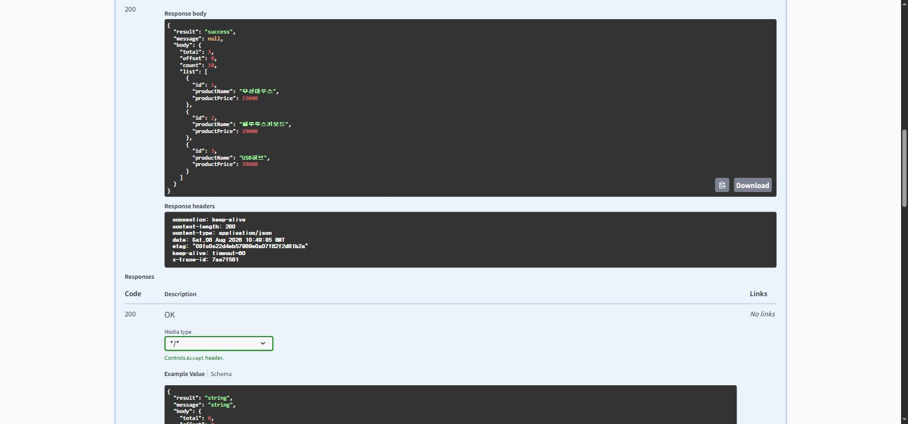

시드 3건이 그대로 나온다. 응답 헤더에 `etag`가 붙어 있다 (5부에서 전송량 −51%로 측정된 그 헤더다).

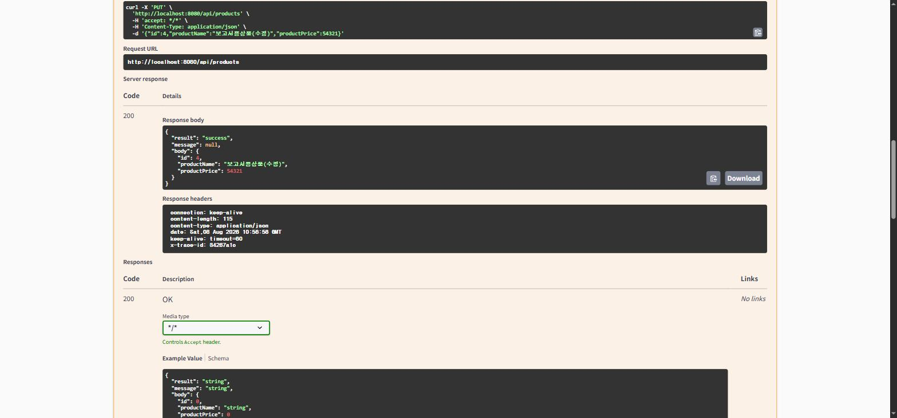

**id를 URI가 아니라 바디로 받는다.** REST 관례와 다르지만 **스펙이 고정한 계약**이라 그대로 뒀다 (3부).

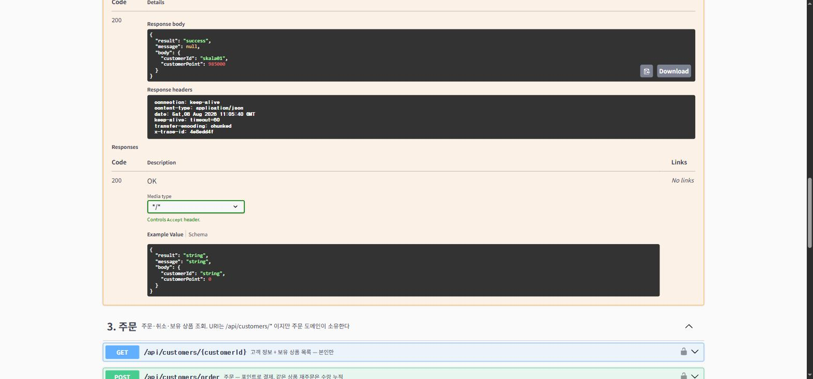

본인만 가능하다. 남의 `customerId`를 넣으면 403이다 (2부 ②).

> **나머지 10개는 이 보고서의 다른 자리에서 확인된다.**
> 로그인·주문·조회·취소는 1.7의 E2E 시나리오 네 장에, 상품 등록·삭제와 회원가입·탈퇴·고객 목록은
> 2부의 결함 캡처에 있다. **그리고 13개 전부가 Swagger 화면(1.6)에 열거돼 있고,
> 자동 회귀 검증 48건(1.7)이 매 커밋마다 계약을 확인한다.**
> 화면 캡처는 증거의 한 형태이지 유일한 형태가 아니다.

## 1.4 아키텍처

### 계층

```
HTTP 요청
   │
   ├─ TraceIdFilter            요청마다 traceId 발급 → MDC + 응답 헤더 X-Trace-Id
   ├─ ShallowEtagHeaderFilter  상품 상세 응답에 ETag
   │
   ▼
Controller  ─ @LoginCustomer ArgumentResolver 로 인증 해결
   │          요청 바인딩·검증(@Valid), Service 호출, Response 포장만 한다
   │          ← ApiLoggingAspect 가 진입·종료·실행시간을 남긴다
   ▼
Service     ─ 트랜잭션 경계. 웹 타입(HttpServletRequest·Cookie)을 모른다
   │          도메인 간 호출은 Service 를 거친다 (Repository 직접 참조 금지)
   ▼
Entity      ─ 불변식을 스스로 지킨다 (usePoint, addQuantity ...)
   │          public setter 없음. 생성은 정적 팩토리
   ▼
Repository  ─ Spring Data JPA
   │
   ▼
PostgreSQL 16
```

예외는 계층을 가로질러 `GlobalExceptionHandler` 한 곳으로 모인다.

### 패키지 — 기술 계층이 아니라 도메인 기준

```
com.sk.skala.shopapi
├── product/     controller · service · repository · entity · dto
├── customer/    controller · service · repository · entity · dto
├── order/       controller · service · repository · entity · dto
└── global/      auth · common · config · exception · logging · tools
```

**도메인 폴더 하나가 곧 미래의 마이크로서비스 하나다.** 이 경계를 지키기 위해
"도메인 간 Repository 직접 참조 금지"를 두었고, 문서가 아니라 **ArchUnit 규칙으로 강제**한다.
MSA로 분리할 때 Service 호출부만 HTTP Client 구현으로 교체하면 되지만,
Repository를 직접 물면 데이터 접근 코드를 전부 헤집어야 한다.

## 1.5 실행 방법

```bash
docker compose up
```

**이 한 줄이면 PostgreSQL과 애플리케이션이 함께 뜬다.** 별도 설치·설정이 필요 없고
`.env` 파일도 필요 없다 — 기본값이 compose에 들어 있다.

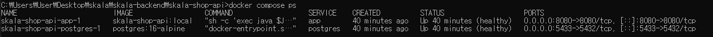

```
NAME                        SERVICE    STATUS                    PORTS
skala-shop-api-app-1        app        Up (healthy)              0.0.0.0:8080->8080/tcp
skala-shop-api-postgres-1   postgres   Up (healthy)              0.0.0.0:5433->5432/tcp
```

| 확인 | 의미 |
|---|---|
| `(healthy)` | 단순 기동이 아니라 **헬스체크 통과** — `HEALTHCHECK`가 `/actuator/health/readiness`를 본다. "포트가 열렸다"가 아니라 "DB까지 연결돼 트래픽을 받을 수 있다" |
| **5433** → 5432 | 호스트에 5433으로 내보낸다. 개발 머신에 로컬 PostgreSQL이 5432를 쓰고 있으면 Docker가 와일드카드 바인딩에 "성공"해버려 `localhost:5432`가 **기존 로컬 DB로 조용히 연결된다** (3부) |

Windows에서 실행할 때 필요한 사항은 `README.md`의 별도 절에 정리했다
(Docker Desktop 기동 확인, 검증 스크립트는 Git Bash 사용).

## 1.6 Swagger UI

`http://localhost:8080/swagger-ui.html` 에서 **13개 엔드포인트 전체**를 브라우저로 호출할 수 있다.

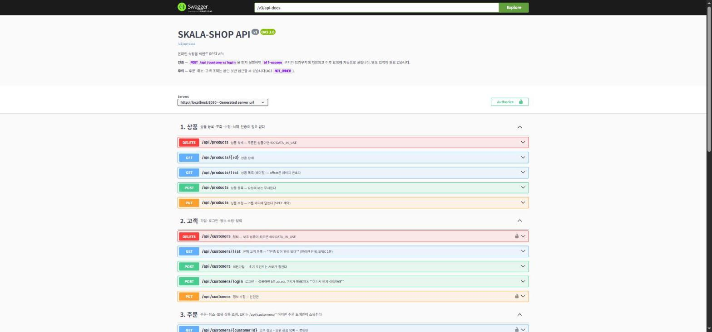

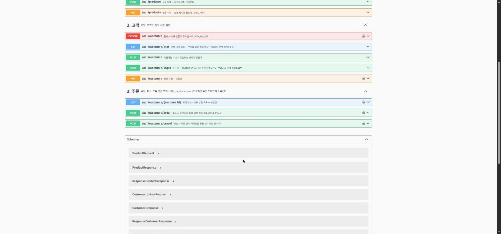

**쿠키 인증이 브라우저에서 그대로 동작한다.** 로그인을 한 번 실행하면 `bff-access` 쿠키가
브라우저에 저장되고 이후 요청에 자동으로 실린다 — **Swagger에서 토큰을 따로 넣는 절차가 없다.**

## 1.7 E2E 시나리오 실행 결과

교재 스펙 5절의 6단계 시나리오를 **Swagger에서 그대로 실행**했다.

### ① 로그인 — `bff-access` 쿠키 발급

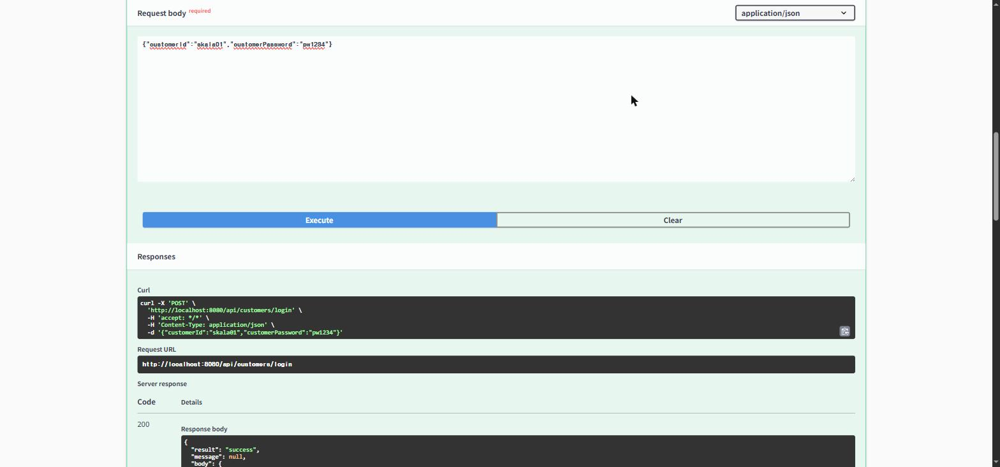

*(화면은 `"body": {` 에서 잘렸다. 아래 값과 `x-trace-id` 헤더는 스크롤 아래에 있으며,
같은 내용이 `s11`·`s13`·`s14`에 온전히 보인다.)*

```json
{ "result": "success", "message": null,
  "body": { "customerId": "skala01", "customerPoint": 1000000 } }
```

응답 헤더에 `x-trace-id`가 있다. 비밀번호는 응답에 없다.

### ② 주문 — 무선마우스 2개

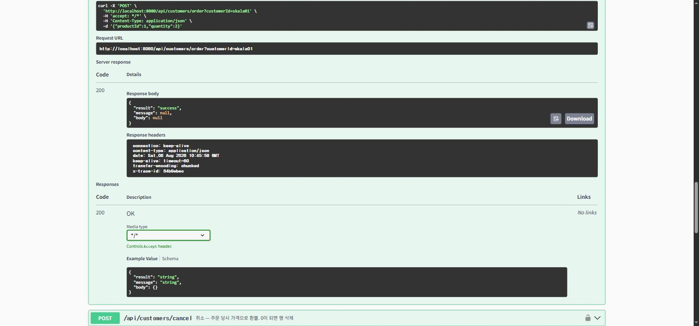

```
curl -X 'POST' \
  'http://localhost:8080/api/customers/order?customerId=skala01' \
  -H 'accept: */*' \
  -H 'Content-Type: application/json' \
  -d '{"productId":1,"quantity":2}'
```

**이 curl 명령에 인증 헤더가 없다.** 그런데 200이다 — 쿠키가 브라우저에 저장돼 자동으로 실렸다.

### ③ 보유 상품 조회 — 잔액 970,000

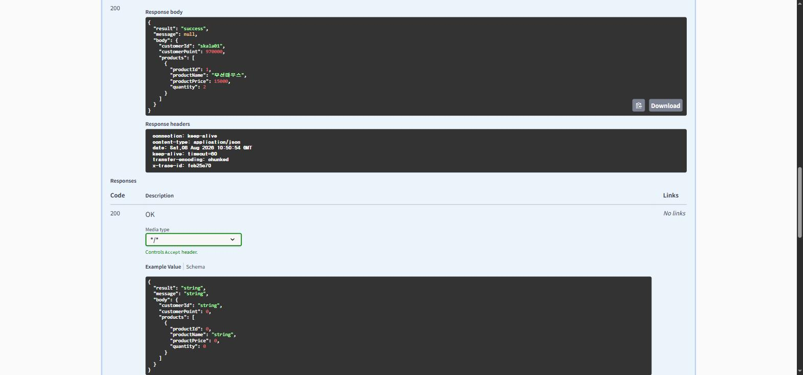

```json
{ "result": "success", "message": null,
  "body": { "customerId": "skala01", "customerPoint": 970000,
            "products": [ { "productId": 1, "productName": "무선마우스",
                            "productPrice": 15000, "quantity": 2 } ] } }
```

1,000,000 − (15,000 × 2) = **970,000**. 수량 2가 한 행으로 누적돼 있다.

### ④ 취소 — 1개, 잔액 985,000

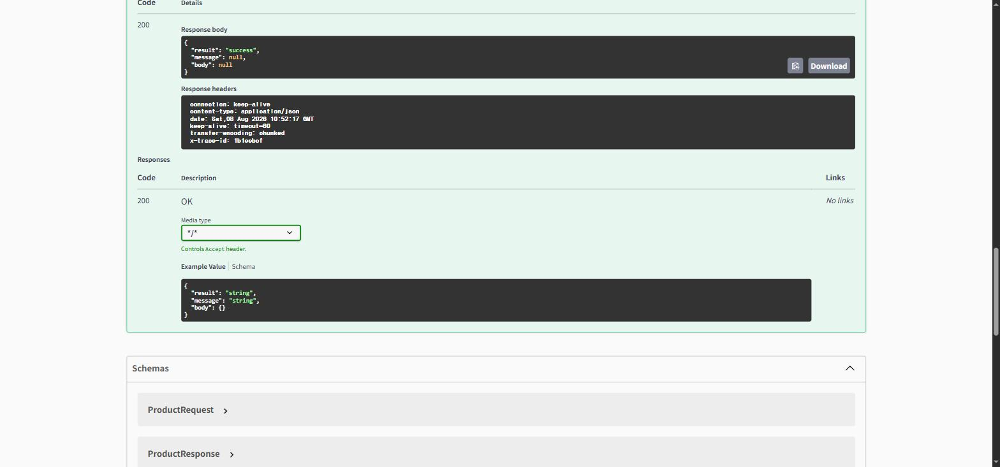

*(취소 API는 **응답 바디를 반환하지 않는다**(`body: null`). 잔액은 이 화면이 아니라
뒤이은 조회에서 확인된다 — `s13`·`s14`에 **985000**이 찍혀 있다.)*

취소 후 잔액이 **985,000**이 된다(970,000 + 15,000). **주문 당시 가격 기준 환불**이다.

### 브라우저만으로 완주된다

```
가입/로그인 1,000,000  →  주문(무선마우스 × 2)  970,000  →  조회 확인  →  취소(× 1)  985,000
```

### 자동 회귀 검증 — 48건

같은 시나리오를 포함해 **48건을 스크립트로 고정**했다. 매 커밋 전에 돌린 회귀 방어선이다.

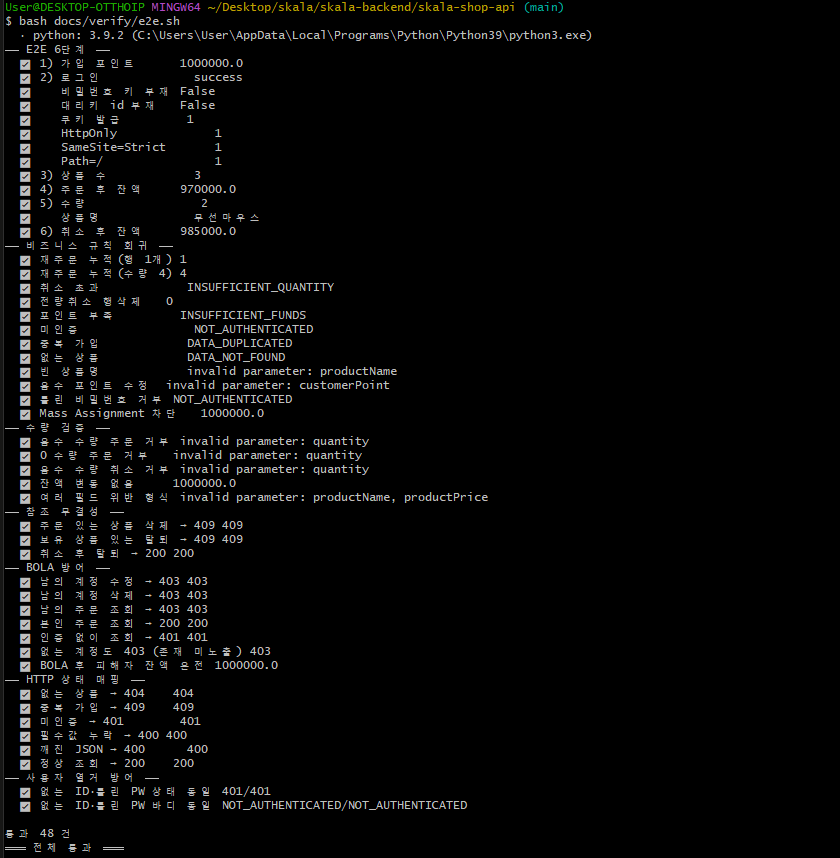

```
  · python: 3.9.2 (C:\Users\User\AppData\Local\Programs\Python\Python39\python3.exe)

── 참조 무결성 ──
  ✅ 주문 있는 상품 삭제 → 409        409
  ✅ 보유 상품 있는 탈퇴 → 409        409
── BOLA 방어 ──
  ✅ 남의 계정 수정 → 403             403
  ✅ 없는 계정도 403 (존재 미노출)    403
── HTTP 상태 매핑 ──
  ✅ 없는 상품 → 404                  404
  ✅ 깨진 JSON → 400                  400
── 사용자 열거 방어 ──
  ✅ 없는 ID·틀린 PW 상태 동일        401/401

통과 48 건
═══ 전체 통과 ═══
```

48건이 검증하는 것은 스펙 6단계만이 아니다 — **비즈니스 규칙 회귀**(재주문 누적, 전량취소 행삭제,
주문 당시 가격 환불), **수량 검증**, **참조 무결성**, **BOLA 방어**, **HTTP 상태 매핑**,
**사용자 열거 방어**가 포함된다. 2부에서 다루는 결함 6건이 여기서 회귀 테스트로 고정돼 있다.

> 첫 줄의 `· python:` 은 검증 스크립트가 **인터프리터가 살아 있는지 먼저 확인한** 흔적이다.
> 이것이 왜 필요했는지는 4부에서 다룬다.

---

# 2부 — 발견한 결함 6건

## 2.0 이 부의 주장

**여섯 중 넷은 스펙대로 구현하면 그대로 남는 결함이다. 스펙 준수와 안전은 다른 축이다.**

과제 스펙은 "무엇을 만들 것인가"를 정한다. "무엇을 막을 것인가"는 정하지 않는다.
그래서 스펙을 100% 충실히 구현해도 ①~④는 그대로 남는다 — 스펙을 어겨서 생긴 결함이 아니라,
**스펙이 말하지 않은 자리에 그대로 있던 것**이다.

나머지 둘의 성격은 다르다. **⑤와 ⑥은 내가 개선하면서 만들었다.**

| # | 결함 | 발견 Phase | 출처 |
|---|---|---|---|
| ① | Mass Assignment — 가입 시 포인트 지정 | 0 (자체 점검) | **스펙에서 물려받음** |
| ② | BOLA — 남의 계정 조작 | 0 (자체 점검) | **스펙에서 물려받음** |
| ③ | 사용자 열거 — 계정 존재 여부 노출 | 2 (에러 매핑 작업 중) | **스펙에서 물려받음** |
| ④ | 음수 수량 우회 — 취소가 주문처럼 동작 | 2 (조치 전 재현 중) | **스펙에서 물려받음** |
| ⑤ | 404·405·415·타입불일치가 전부 500 | 5 (Actuator 점검 중) | **Phase 2의 내 예외 핸들러가 만듦** |
| ⑥ | 동시 첫 주문의 제약 위반이 500 | 6 (부하 측정 중) | **Phase 1의 내 복합 UNIQUE가 드러냄** |

발견 순서대로 적었다. **아래로 갈수록 발견 도구가 무거워진다** — 눈으로 읽기(①②) →
전수 조사(③④) → 운영 계측 붙이기(⑤) → 부하 측정(⑥).
결함 자체보다 **발견 경로**가 값진 경우가 있어, 각 건에서 "왜 이걸 발견했는가"를 먼저 적는다.

> **개선 전 상태는 대부분 다시 찍을 수 없다.** 고쳐버렸기 때문이다.
> ①~④의 개선 전 코드는 Phase 1~2에서 사라졌고, 그 시점에는 캡처 도구도 없었다.
> 그래서 **개선 전은 당시 기록(`REVIEW.md`·`JOURNAL.md`·`DECISIONS.md`)의 실측 수치를 인용**하고,
> **개선 후는 현재 커밋에서 실제로 찍은 캡처**를 붙인다.
> 같은 일이 캐시에서도 일어났다 — 낡은 값 6/6 재현은 `@Cacheable`을 지우면서 재현 불가능해졌고
> `docs/evidence/perf/ha-cache-risk.txt`가 그 현상이 존재했다는 유일한 기록이다 (5부).
> **결함을 고치면 그 증거는 기록에만 남는다.**

---

## 2.1 ① Mass Assignment — 클라이언트가 자기 포인트를 정할 수 있었다

### 발견 경위

Phase 0을 끝내고 **자체 점검 목록을 만들면서** 찾았다. 코드를 읽다 발견한 것이 아니라,
"클라이언트가 보낼 수 있는 필드"와 "서버가 정해야 하는 필드"를 **표로 나란히 적어보다** 걸렸다.

원인은 컨트롤러가 **엔티티를 그대로 요청 바디로 받고 있었다**는 것이다.

```java
// Phase 0 — 강의 자료 그대로
@PostMapping
public Response<Customer> createCustomer(@RequestBody Customer customer) { ... }
```

`Customer` 엔티티에는 `customerPoint` 필드가 있다. 요청 JSON에 그 이름을 넣으면 그대로 바인딩된다.
**서버가 정해야 할 값을 클라이언트가 정할 수 있다** — 이것이 Mass Assignment다.

### 재현

가입 요청에 `customerPoint`를 얹으면 그 값이 그대로 계정 잔액이 됐다.
초기 포인트는 서버 고정값 1,000,000이어야 한다.

### 조치

**엔티티를 받지 않고 요청 DTO를 받는다.** `CustomerRequest`에는 `customerPoint` 필드 자체가 없다.

```java
@PostMapping
public Response<CustomerResponse> createCustomer(@Valid @RequestBody CustomerRequest request) {
    return Response.success(customerService.createCustomer(request));
}
```

**필드를 검증한 것이 아니라 받을 통로를 없앴다.** 검증은 잊을 수 있지만 없는 필드는 잊을 수 없다.

기록상 흥미로운 점이 있다. 이 항목은 Phase 2(보안)의 작업 목록에 있었는데, 착수해보니
**Phase 1의 DTO 분리에서 이미 해소돼 있었다.** 보안 목적이 아니라 계층 규칙("엔티티를
Controller에 노출하지 않는다") 때문에 한 작업이 취약점을 함께 닫은 것이다.
`PLAN.md`의 해당 항목에 취소선을 긋고 *"Phase 1 4단계에서 해소"* 로 남겼다.

### 검증

같은 계열의 결함이 하나 더 있어 함께 확인했다 — **상품 등록 시 클라이언트가 `id`를 지정**하는 경우다.

**회원가입 — 요청 `customerPoint: 999999999` → 응답 `1000000`**

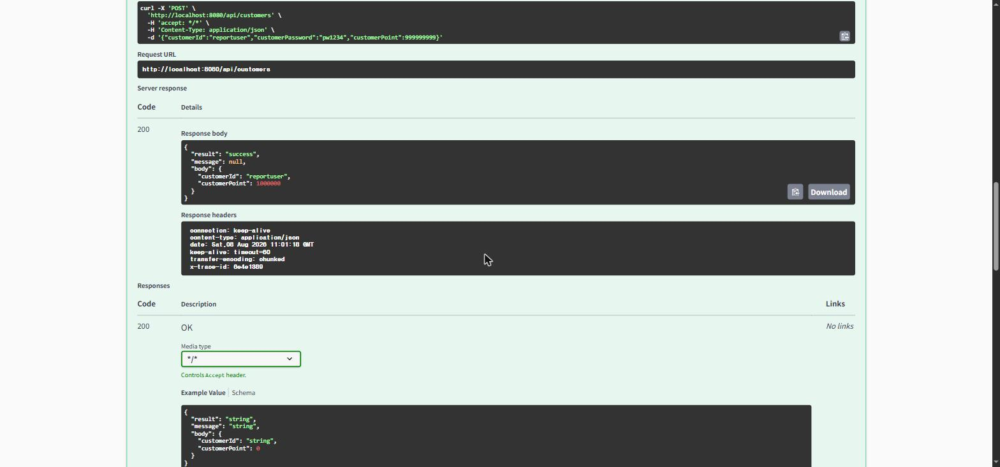

```
요청: {"customerId":"mcap27812","customerPassword":"pw","customerPoint":999999999}
응답: {"result":"success","message":null,
       "body":{"customerId":"mcap27812","customerPoint":1000000.00}}
```

**상품 등록 — 요청 `id: 999` → 응답 `id: 4`**

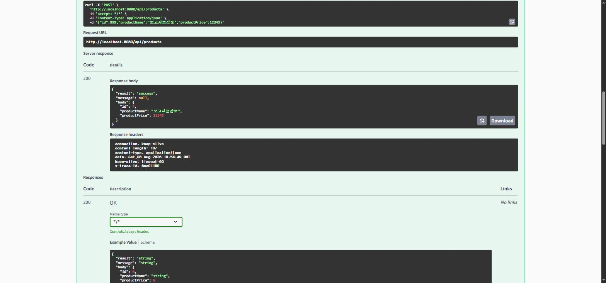

두 화면 모두 **보낸 것과 받은 것이 같은 화면에 있다.** "서버가 클라이언트 지정 값을 무시한다"를
설명이 아니라 대조로 보인다.

E2E 회귀 검증에 `Mass Assignment 차단 1000000.0` 으로 고정돼 있다.

---

## 2.2 ② BOLA — 로그인만 하면 남의 계정을 조작할 수 있었다

**BOLA**(Broken Object Level Authorization)는 **OWASP API Security Top 10 #1**이다.
API 취약점 중 가장 흔하고 가장 위험한 것으로 분류된다.

### 발견 경위

①과 같은 Phase 0 자체 점검에서 찾았다. 점검 항목이 *"인증(누구인가)"* 과
*"인가(그것을 해도 되는가)"* 를 나눠 적게 돼 있었고, **인가 열이 통째로 비어 있었다.**

스펙은 `PUT`·`DELETE`가 `customerId`를 **요청 바디로** 받게 돼 있다.
JWT로 로그인은 확인하지만, **바디에 적힌 `customerId`가 로그인한 본인인지는 아무도 확인하지 않았다.**

```java
// 로그인은 했다. 그런데 누구를 수정하는지는 요청이 정한다
public void updateCustomer(CustomerRequest request) {
    Customer customer = findCustomer(request.getCustomerId());   // 남의 ID여도 그대로 찾는다
    ...
}
```

### 재현

로그인한 계정으로 **바디의 `customerId`만 남의 것으로 바꾸면** 그대로 통했다.
수정·삭제·주문 이력 조회 전부다. 잔액과 주문 이력은 개인정보이고, 삭제는 되돌릴 수 없다.

### 조치

**JWT에서 꺼낸 로그인 ID와 요청 대상이 같은지 확인하고, 다르면 403 `NOT_OWNER`를 낸다.**

```java
requireOwner(loginCustomerId, request.getCustomerId());   // 먼저
Customer customer = findCustomer(request.getCustomerId()); // 나중
```

**순서가 중요하다.** 뒤집으면 남의 계정에 대해 404(없음)와 403(있지만 권한 없음)이 갈려
**계정 존재 여부가 노출된다** — ③과 같은 형태의 누설이다. 실측으로 확인했다: 존재하는 계정과
없는 계정 **모두 403**이다.

에러 코드 이름을 `NOT_AUTHORIZED`가 아니라 `NOT_OWNER`로 정했다.
`NOT_AUTHENTICATED`와 철자가 두 글자 차이라 **코드에서 눈으로 구별되지 않고**,
401과 403을 뒤바꿔 쓰는 실수가 정확히 그 혼동에서 나온다.

| 코드 | 상태 | 뜻 |
|---|---|---|
| `NOT_AUTHENTICATED` | 401 | **누구인지** 확인되지 않았다 |
| `NOT_OWNER` | 403 | 누구인지는 알지만 **그 대상에 권한이 없다** |

**스펙에 없던 인증 요구를 세 곳에 추가했다.** `PUT`·`DELETE`·`GET /{customerId}`다.
스펙은 이들을 "인증 불필요"로 두었으나 그대로 두면 개인정보가 익명에게 열린다.
**URI와 요청/응답 형식은 그대로 유지**했으므로 계약은 깨지지 않는다.

### 검증

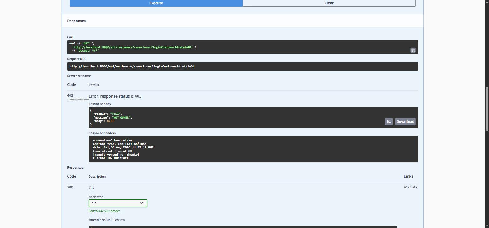

```
남의 주문 조회 : HTTP 403
없는 계정 조회 : HTTP 403   ← 404가 아니다. 존재 여부를 노출하지 않는다
```

E2E 회귀 7건으로 고정했다.

```
── BOLA 방어 ──
  ✅ 남의 계정 수정 → 403             403
  ✅ 남의 계정 삭제 → 403             403
  ✅ 남의 주문 조회 → 403             403
  ✅ 본인 주문 조회 → 200             200
  ✅ 인증 없이 조회 → 401             401
  ✅ 없는 계정도 403 (존재 미노출)    403
  ✅ BOLA 후 피해자 잔액 온전         1000000.0
```

마지막 줄이 이 블록의 핵심이다. **"403이 나왔다"만 확인하면 부족하다** — 403을 내면서도
부수 효과가 이미 발생했을 수 있다. 그래서 **공격 시도 후 피해자의 잔액이 그대로인지**를 함께 단언한다.

---

## 2.3 ③ 사용자 열거 — 응답만 보고 유효한 계정 목록을 만들 수 있었다

### 발견 경위 — 예고한 결함을 고치러 갔다가 예고 못 한 것을 만났다

Phase 0~1에서는 **모든 응답이 HTTP 200**이었다. 비즈니스 예외도 200에 바디로만 실려 나갔다.
그래서 각 `Error` 코드가 실제로 어떤 상황에 나가는지 **HTTP 레벨에서 확인된 적이 없었다.**

Phase 2에서 `Error` → HTTP 상태 매핑을 붙였다. 이때 **매핑을 붙이기 전에
`ResponseException`·`ParameterException` 발생 지점을 전수 조사했다** — 11곳과 8곳이었다.
고쳐야 할 것은 이미 예고해둔 한 건(음수 포인트 검증이 `DATA_NOT_FOUND`라 404로 나가는 문제)뿐이었지만,
**같은 종류를 전부 훑는 원칙**을 지켰다.

그 전수 조사에서 예고 못 한 것이 나왔다. **로그인 실패가 두 갈래였다.**

| 상황 | 매핑 후 응답 | 공격자가 아는 것 |
|---|---|---|
| 없는 `customerId` | `DATA_NOT_FOUND` → **404** | 이 ID는 **없다** |
| 틀린 비밀번호 | `NOT_AUTHENTICATED` → **401** | 이 ID는 **있다** |

응답 코드만 보고 **유효한 계정 목록을 만들 수 있다.** 확보된 ID 목록은 크리덴셜 스터핑과
표적 피싱의 입력이 된다.

**매핑은 기능 추가이면서 동시에 그동안 쌓인 에러 코드 배치의 전수 검사였다.**
"모든 응답이 200"인 상태에서는 코드가 상황과 맞는지 확인할 계기 자체가 없었다.

### 재현 · 조치에서 부분 대응을 걸러냈다

처음 검토한 안은 **"응답 상태만 401로 통일하고 내부 `Error` 코드는 유지"** 였다.
겉보기에는 둘 다 401이 되니 막힌 것처럼 보인다. 그런데 확인해보니

```json
{"result":"fail","message":"DATA_NOT_FOUND","body":null}
```

**응답 바디에 `message: "DATA_NOT_FOUND"`가 그대로 실려 구분이 새어 나갔다.**
상태 코드만 맞춰서는 막히지 않는다. 내부 코드까지 401 `NOT_AUTHENTICATED`로 통일했다.

**부분적 대응이 대응처럼 보일 수 있다.** 방어를 설계할 때는 공격자가 실제로 볼 수 있는 것
전부 — 상태, 바디, 헤더, 응답 시간 — 를 확인해야 한다.

내부 진단은 포기하지 않았다. **응답은 같게, 로그는 다르게** 남긴다.

```
business error: NOT_AUTHENTICATED: no such customerId
business error: NOT_AUTHENTICATED: password mismatch
```

### 검증

```
없는 ID      : {"result":"fail","message":"NOT_AUTHENTICATED","body":null}
틀린 비밀번호: {"result":"fail","message":"NOT_AUTHENTICATED","body":null}
→ 상태·바디 동일
```

E2E에 **상태와 바디를 각각 따로** 단언해 고정했다.

```
── 사용자 열거 방어 ──
  ✅ 없는 ID·틀린 PW 상태 동일   401/401
  ✅ 없는 ID·틀린 PW 바디 동일   NOT_AUTHENTICATED/NOT_AUTHENTICATED
```

### ★ 이 성과를 나 자신이 제한했다 — 함께 읽어야 한다

BOLA 방어(②)에서 인증 없이 열려 있던 조회 두 개를 검토했고, **하나는 고치고 하나는 남겼다.**

| 엔드포인트 | 노출되는 것 | 범위 안의 완전한 해법이 있는가 | 결정 |
|---|---|---|---|
| `GET /api/customers/{customerId}` | 특정 고객의 주문 이력·잔액 | **있다** — 본인만 조회. 역할 개념이 필요 없다 | **고쳤다** |
| `GET /api/customers/list` | **전체 고객 ID + 잔액** | **없다** — 올바른 해법은 관리자 역할 기반 접근 제어다 | 계약 유지 |

`GET /list`를 남긴 근거는 **"인증만 요구"가 방어가 되지 못하기 때문**이다. 가입이 자유로우므로
공격자는 계정 하나 만들고 그대로 전체 목록을 얻는다. 익명 스크래핑은 막지만 열거는 못 막는
반쪽 조치를 위해 계약을 바꾸는 것은 이득보다 비용이 크다고 판단했다.

**그런데 이 판단이 ③의 성과를 그대로 무력화한다.**

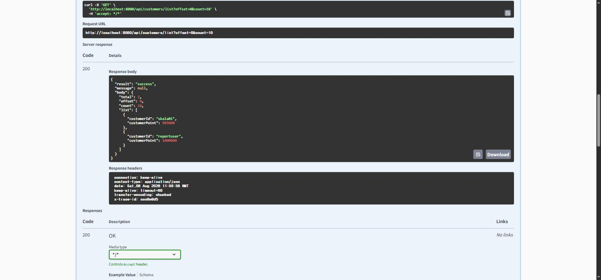

로그인 응답에서 계정 존재 여부를 지웠는데, **`GET /api/customers/list` 한 번이면 전체
`customerId`를 그대로 얻는다.** 실측으로 확인했다. 로그인 벡터는 닫혔고 목록 벡터는 계약상 열려 있다.

**"사용자 열거를 막았다"고 단독으로 주장하면 과장이다.** 정확히 말하면
**"로그인 경로의 사용자 열거를 막았고, 목록 경로는 계약상 열려 있다"** 이다.

여기서 얻은 것이 이 결함에서 가장 값진 부분이다.

> **경로가 아니라 자산에서 출발해야 한다.**
> "로그인 응답이 안전한가"를 물으면 ③은 해결된 것으로 보인다.
> **"유효한 `customerId` 목록이라는 자산에 도달하는 경로가 몇 개인가"** 를 물어야
> 목록 엔드포인트가 시야에 들어온다. 경로 단위로 점검하면 점검하지 않은 경로가 남는다.

이 관점은 Phase 5에서 다시 쓰였다. **비밀번호라는 자산의 경로를 전부 세어보니
API 로그(AOP)라는 새 경로가 추가돼 있었다** — 응답 DTO만 보고 있으면 보이지 않는 경로다 (6부).

> **남아 있는 것** — 없는 ID는 BCrypt 검증을 건너뛰므로 **응답이 미세하게 빠르다.**
> 타이밍으로 존재 여부를 추정할 여지가 있다. 표준 대응은 없는 ID에도 더미 해시 연산을 태우는 것이다.
> 지금 넣지 않은 이유는 **이 서비스에 요청 속도 제한이 없어** 타이밍 차이를 재기 전에
> 무제한 시도가 먼저 가능하기 때문이다. **순서상 rate limiting이 먼저다** (7부).

---

## 2.4 ④ 음수 수량 우회 — 취소가 주문처럼 동작했다

### 발견 경위 — "고치기 전에 재현해보라"가 한 건을 더 찾았다

Phase 0 점검 목록에 *"`quantity` 음수 검증 없음"* 이 적혀 있었다.
그런데 Phase 1에서 불변식을 엔티티로 옮기면서 **이미 막혔을 수도 있었다.**
그래서 `@Positive`를 붙이기 전에 **먼저 재현했다.**

주문 경로는 예상대로 뚫려 있었다. **그다음이 예상 밖이었다 — 취소 경로도 확인해봤더니 더 나빴다.**

### 재현 — 세 케이스 실측

| 시나리오 | 결과 |
|---|---|
| `quantity = -5` 주문 | 잔액 **1,000,000 → 1,075,000** (75,000이 공짜로 생김). DB에 `(-5, -75000.00)` |
| `quantity = 0` 주문 | 의미 없는 행이 생성됨 |
| **`quantity = -10` 취소** (2개 보유) | 수량 **2 → 12**, 잔액 **970,000 → 820,000** |

세 번째가 심각하다. `cancel(-10)`이 `remain = 2 - (-10) = 12`를 만들고 환불액이 음수가 되어
**취소가 주문처럼 동작했다.** 상품은 늘고 포인트는 줄었다.

### ★ 왜 뚫렸는가 — 옳은 설계가 전제를 잃으면 뚫린다

포인트를 다루는 두 메서드는 이렇게 생겼다.

```java
public void usePoint(BigDecimal amount) {
    if (customerPoint.compareTo(amount) < 0) {     // 잔액 검사가 있다
        throw new ResponseException(Error.INSUFFICIENT_FUNDS);
    }
    this.customerPoint = this.customerPoint.subtract(amount);
}

public void refundPoint(BigDecimal amount) {
    this.customerPoint = this.customerPoint.add(amount);   // 잔액 검사가 없다
}
```

**`refundPoint`에 잔액 검사가 없는 것은 설계상 옳다.** 환불은 잔액을 **늘리는** 연산이니
잔액이 모자랄 일이 없다. 검사를 넣으면 의미 없는 코드가 된다.

**그 판단이 성립하려면 `amount ≥ 0`이라는 전제가 필요하다.** 그리고 그 전제를 아무도 지키지 않았다.
`amount`가 음수면 `add`는 실질적으로 **뺄셈**이 되고, 그 뺄셈은 `usePoint`의 잔액 검사를
**우회한다.** 잔액이 음수까지 갈 수 있다.

> **"포인트는 음수가 될 수 없다"는 불변식이, 그 불변식을 지키라고 만든 메서드가 아니라
> 옆문으로 뚫려 있었다.**
>
> 불변식을 지키는 메서드가 있다고 불변식이 지켜지는 것은 아니다.
> `usePoint`는 잔액을 검사한다. 하지만 **잔액을 바꾸는 메서드가 그것 하나가 아니었다.**
> 같은 상태를 건드리는 **모든 경로**를 세어봐야 한다 — ③의 "자산에서 출발한다"와 같은 형태다.

### 조치 — 두 계층으로 막는다

| 계층 | 무엇 | 왜 |
|---|---|---|
| 웹 진입 | `@NotNull @Positive quantity` + `@Valid` | 잘못된 요청을 도메인까지 내려보내지 않는다 |
| 도메인 | `usePoint`·`refundPoint`·`addOrder`·`cancel`의 **양수 검사** | Bean Validation은 **HTTP 진입만** 지킨다. 배치나 다른 Service가 부르면 그대로 통과한다 |

**Bean Validation은 한 겹이지 전부가 아니다.** 이 프로젝트에는 아직 배치도 다른 진입점도 없지만,
없다는 이유로 도메인 검사를 생략하면 **진입점이 하나 늘어나는 순간 조용히 다시 뚫린다.**

재현이 없었다면 `@Positive` 하나로 주문 경로만 막고 취소 경로는 그대로 뒀을 것이다.
**재현은 확인 절차이면서 동시에 인접 경로를 훑는 계기다.**

### 검증

```
음수 수량 취소 시도
→ {"result":"fail","message":"invalid parameter: quantity","body":null}
```

E2E 5건으로 고정했다.

```
── 수량 검증 ──
  ✅ 음수 수량 주문 거부   invalid parameter: quantity
  ✅ 0 수량 주문 거부      invalid parameter: quantity
  ✅ 음수 수량 취소 거부   invalid parameter: quantity
  ✅ 잔액 변동 없음        1000000.0
  ✅ 여러 필드 위반 형식   invalid parameter: productName, productPrice
```

②의 마지막 줄과 같은 이유로 **`잔액 변동 없음`을 함께 단언한다.**
거부 응답이 나갔다는 것과 부수 효과가 없다는 것은 별개다.

---

## 2.5 ⑤ 404·405·415·타입 불일치가 전부 500이었다

**여기부터는 스펙이 물려준 결함이 아니다. 내가 개선하면서 만들었다.**

### 발견 경위 — 다른 일을 하다 옆에서 나왔다

Phase 5에서 Actuator를 붙였다. 화이트리스트로 `health` 하나만 열었으므로,
**닫혔어야 할 엔드포인트가 정말 닫혔는지 확인하려고 손으로 두드려봤다.**
`/actuator/env`, `/actuator/heapdump`, 그리고 아무 의미 없는 경로 몇 개를.

닫혀 있었다. **그런데 응답이 전부 500이었고, 로그에 스택트레이스가 48줄씩 쌓였다.**

원인은 Phase 2에서 500 유출을 막으려고 넣은 최종 안전망이었다.

```java
@ExceptionHandler(Exception.class)   // 아는 예외를 다 처리한 뒤의 최종 안전망
public ResponseEntity<Response<Void>> handleUnexpected(Exception e) { ... 500 ... }
```

**스프링이 정상적으로 던지는 프레임워크 예외들이 여기로 떨어지고 있었다.**
그것들은 "예상 못한 예외"가 아니라 **각자 정해진 HTTP 상태가 있는 예외**다.

| 요청 | 발생 예외 | 나갔어야 할 상태 | 실제 |
|---|---|---|---|
| `GET /nope` | `NoResourceFoundException` | 404 | **500** |
| `PATCH /api/products` | `HttpRequestMethodNotSupportedException` | 405 | **500** |
| `POST` + `text/plain` | `HttpMediaTypeNotSupportedException` | 415 | **500** |
| `GET /api/products/abc` | `MethodArgumentTypeMismatchException` | 400 | **500** |

### ★ 세 Phase 동안 드러나지 않은 이유

Phase 2 이후 줄곧 이 상태였다. Phase 3·4·5를 지나는 동안 테스트가 160건까지 늘었는데도 안 잡혔다.

> **테스트가 전부 실재하는 경로만 호출했기 때문이다.**
>
> `@WebMvcTest`도, E2E도, 통합 테스트도 **존재하는 URL에 올바른 메서드와 올바른
> Content-Type으로** 요청한다. 그것이 정상적인 테스트 작성 방식이다.
> 결함은 **애플리케이션 밖**, 즉 매핑되지 않은 요청에 있었다.
>
> Phase 4에서 *"예외 경로를 전수로 본다"* 는 원칙을 세웠는데도 놓쳤다.
> 그 전수 조사도 **애플리케이션 안의 예외**를 대상으로 했기 때문이다.

### ★ 상태 코드가 틀린 것보다 로그가 더 문제였다

이 결함의 실제 위험은 응답 코드가 아니다. **관측 가능성이 무너진다는 것**이다.

스캐너가 `/wp-admin`, `/.env`, `/phpmyadmin` 같은 경로를 **훑기만 해도**
ERROR 레벨 스택트레이스가 48줄씩 쌓인다. 인터넷에 노출된 서버는 이런 스캔을 상시로 받는다.

> **진짜 장애가 그 안에 묻힌다.** ERROR 로그를 알람에 연결해두면 알람이 상시 울려
> 아무도 보지 않게 되고, 알람이 무의미해진 뒤에 오는 진짜 500은 발견되지 않는다.
> **운영에서 관측이 죽는 경로다.**

Phase 5에서 MDC traceId와 AOP 로깅을 붙여 "장애를 추적할 수 있게" 만드는 중이었는데,
**추적 대상 로그 자체가 노이즈로 채워지고 있었다.** 계측을 붙이는 작업이 계측의 전제를 점검하게 했다.

### 조치

각 예외에 정확한 상태를 매핑하고, `TypeMismatchException`은 **상위 타입으로 받아**
바인딩 과정의 타입 불일치를 한자리에서 처리했다.

```
404 no such endpoint
405 method not allowed   (+ Allow 헤더)
415 unsupported media type
400 invalid parameter type
```

**응답에 요청 값을 되비추지 않는다** — 요청 경로도, 타입이 맞지 않은 값도.
입력을 그대로 돌려주면 그 자체가 반사(reflection) 경로가 된다.
9-3절의 500 유출 차단(traceId만 노출)과 같은 판단이다.

### 검증

```
없는 경로            : HTTP 404
잘못된 메서드        : HTTP 405
잘못된 Content-Type  : HTTP 415
타입 불일치          : HTTP 400
```

**교정 후 같은 요청들에 대해 ERROR 로그 0건.** 상태 코드와 로그를 **둘 다** 확인했다 —
이 결함의 본체가 로그였으므로 상태 코드만 확인하면 절반만 검증한 것이 된다.

`GlobalExceptionHandlerTest`에 4건을 추가해 8건으로 만들었다.
각 상태 코드, `Allow` 헤더 존재, 그리고 **응답에 입력값이 포함되지 않음**을 단언한다.

---

## 2.6 ⑥ 동시 첫 주문의 제약 위반이 500이었다 — 부하 측정이 찾았다

### 발견 경위 — 소수점 아래에 숨어 있었다

Phase 6에서 HikariCP 풀 크기 스윕을 돌리고 있었다. 성능 튜닝이 목적이었다.

k6 요약의 **성공률은 99.99%** 였다. 이 숫자만 보면 아무 문제가 없다.
스윕 스크립트에서 **`resp_5xx`를 별도 카운터로 따로 세도록** 만들어둔 것이
`0`이 아닌 값을 찍었다 — 부하 중 `POST /api/customers/order`에서 **요청당 1~9건의 500**이었다.

> **99.99%를 성공으로 읽는 한 이 결함은 영원히 보이지 않는다.**
> 집계가 결함을 가리고 있었다. 임계값을 "성공률 99% 이상"으로 걸었다면 통과했을 것이다.
>
> 부하 측정의 산출물이 성능 수치가 아니라 **정확성 결함**이었다.

### ★ Phase 3의 동시성 테스트는 왜 못 잡았는가

Phase 3에서 100스레드 동시 주문 테스트를 만들어 Lost Update를 잡았다.
그 테스트는 **미리 주문 이력이 있는 상태에서** 시작한다.

**"경합 지점을 하나만 남긴다"는 좋은 격리 설계가, 정확히 이 경우를 배제했다.**

Lost Update를 측정하려면 경합 지점이 포인트 차감 하나여야 한다.
그래서 `OrderItem` 행이 이미 존재하는 상태로 시작했고 — **행이 없는 상태에서 동시에 들어오는
첫 주문**은 시나리오에서 빠졌다. 격리는 측정을 정확하게 만들지만 **조건도 함께 좁힌다.**

### 재현과 원인 — check-then-act 경합

같은 `(고객, 상품)` 조합의 **첫** 주문이 동시에 들어오면:

```
스레드 A                              스레드 B
findByCustomerAndProduct → 없음       findByCustomerAndProduct → 없음
                                      (양쪽 다 "신규 주문" 경로로 진입)
INSERT order_items → 성공             INSERT order_items → uk_order_items_customer_product 위반
                                      → DataIntegrityViolationException → 500
```

**"확인하고 나서 행동한다"는 순서 자체가 경합 지점이다** — 확인과 행동 사이에 남이 끼어든다.

복합 UNIQUE 제약은 Phase 1에서 **내가 추가한 것**이다.
"고객당 상품 1행"이라는 불변식을 DB가 강제하도록. 제약이 없었다면 500은 나지 않고
**행이 조용히 2개 생겼을 것이다** — 데이터가 틀리는 쪽이 더 나쁘다.
제약은 결함을 만든 것이 아니라 **조용한 데이터 손상을 시끄러운 500으로 바꿔놓았고**,
부하 측정이 그 소리를 들었다.

### ★ `Customer`의 `@Version`은 이것을 막지 못한다 — 이유가 두 겹이다

Phase 3에서 낙관적 락을 넣었으니 동시성은 처리됐다고 생각하기 쉽다. 그렇지 않다.

| 겹 | 이유 |
|---|---|
| **① 검사 대상 행이 다르다** | 낙관적 락이 검사하는 것은 `customers` 행의 `version` 컬럼이다. 여기서 충돌하는 것은 `order_items` 행이고, **그 행에는 버전이 없다** |
| **② 검사보다 먼저 터진다** | PK 생성이 `IDENTITY` 전략이라 영속화 시점에 **INSERT가 즉시 실행**된다. 커밋 시점의 버전 검사에 **도달하기 전에** 제약이 걸린다 |

두 번째가 비직관적이다. `SEQUENCE` 전략이었다면 INSERT가 flush까지 미뤄져
**예외가 터지는 시점과 순서가 달라진다.** 즉 **동시성 동작이 키 생성 전략에 좌우된다** —
JPA 매핑 선택이 성능이나 이식성만의 문제가 아니라는 뜻이다.

**`@Version`을 `OrderItem`에 추가해도 해결되지 않는다.** 낙관적 락은 *이미 존재하는 행의
동시 수정*을 막는 장치인데, 여기서 충돌하는 것은 **아직 존재하지 않는 행을 양쪽이 만들려는 상황**이다.
막을 대상이 없다.

### 조치 — 409로 교정

`DataIntegrityViolationException`을 **409 `CONCURRENT_MODIFICATION`** 으로 매핑했다 (커밋 `278b077`).

- **제약 위반은 정의상 상태 충돌이다.** 요청 자체는 올바르다. 500은 "서버가 잘못했다"는 뜻이라
  클라이언트가 재시도해도 되는지 알 수 없다
- **재시도하면 성공한다.** 상대 트랜잭션이 만든 행을 찾아 **수량 누적 경로**로 진입한다.
  즉 이것은 재시도 가능한 실패이고, 409가 말하는 바로 그 상황이다
- 낙관적 락 충돌과 **같은 부류**이므로 같은 에러 코드를 쓴다. 코드를 새로 만들지 않았다
- **의미를 아는 제약 위반은 여기까지 오지 않는다.** 삭제 시 참조 무결성(`DATA_IN_USE`)은
  각 Service가 먼저 잡는다. 이 핸들러가 받는 것은 **의미를 모르는 나머지**다
- **제약 이름·테이블명을 응답에 싣지 않는다.** `uk_order_items_customer_product`를 그대로
  내보내면 스키마 구조를 알려주는 셈이다 (⑤의 "입력을 되비추지 않는다"와 같은 판단)

**자동 재시도(`@Retryable`)는 넣지 않았다.** 재시도 정책은 충돌 분포 측정 위에서 정해야 하고,
주문은 금전 거래라 클라이언트가 **시도 횟수를 알아야 한다.** 409로 알리고 재시도 여부는 클라이언트에 맡긴다.

### 검증

**회귀 테스트 2건**으로 고정했다.

| 테스트 | 무엇을 고정하는가 |
|---|---|
| `ConcurrentOrderTest` | 같은 상품 다중 스레드 동시 **첫** 주문. 발생한 예외가 **전부 409로 매핑되는 종류**인지 — 즉 **"500이 될 예외"가 섞이지 않는지** 단언한다 |
| `GlobalExceptionHandlerTest` | 제약 위반 → 409, **제약명 미노출** |

```
[동시성] 스레드 100 · 성공 14 · 실패 {ObjectOptimisticLockingFailureException=86} · 774ms
[동시성] 최종 포인트 986000.00 · 기대 986000.00 · 차이 0.00
[첫 주문 경합] {성공=5, DataIntegrityViolationException=9,
                ObjectOptimisticLockingFailureException=16}
```

*(화면 캡처를 싣지 않는다 — Git Bash 터미널이 한글을 cp949로 출력해 이 출력을 걸러내는 grep이
**한 줄도 매칭하지 못했다.** 캡처에는 `BUILD SUCCESSFUL`만 남아 수치를 담지 못하므로,
텍스트로 보관한 값을 코드블록으로 싣는다.)*

**첫 번째 테스트에 "최소 1건은 성공한다"를 함께 넣었다.**

이것이 없으면 30건이 전부 실패해도 *"발생한 예외가 모두 409 종류였다"* 로 **통과한다.**
Phase 5에서 *"비밀번호가 로그에 없다"* 가 **로그가 아예 없어서** 통과했던 것과 같은 형태다.

> **"나쁜 일이 없었다"는 단언에는 "일이 실제로 일어났다"가 붙어야 한다.**
> 이것이 이 프로젝트 전체를 관통하는 원칙이고, 4부에서 측정 장치 자체를 검증하는 근거가 된다.

**부하 재측정 — 교정 후 500이 전 구간 0.**

```
풀 크기  성공률      p95         처리량         409     5xx
   2     100.00%   46.32ms    710.19 req/s     46      0
   5     100.00%   16.57ms   1001.92 req/s    262      0
  10     100.00%   14.72ms   1003.32 req/s    500      0
  20     100.00%   14.82ms   1011.01 req/s    743      0
  40     100.00%   15.54ms    990.93 req/s    754      0
```

409는 여전히 발생한다. **그것이 정상이다** — 동시 첫 주문은 실제로 충돌하며,
달라진 것은 **그 충돌이 "서버 오류"가 아니라 "상태 충돌"로 보고된다**는 점이다.
(이 표의 409 건수 자체가 5부에서 별도의 이야기가 된다 — 사전 등록한 예측이 빗나갔다.)

---

## 2.7 여기 세지 않은 한 건 — FK 위반 500

Phase 0 점검 목록에는 한 건이 더 있었다. **주문 이력이 있는 상품을 삭제하거나 보유 상품이 있는
고객이 탈퇴하면 FK 제약에 걸려 500**이 났다.

이것을 6건에 세지 않은 이유는, 이 건의 본체가 결함 수정이 아니라 **정책 결정**이기 때문이다.
거부할 것인가, Soft Delete인가, Cascade인가 — 셋 다 "틀리지 않은" 선택지이고,
어느 것을 고르느냐가 도메인 정책이다. 판단 근거는 **3부**에서 다룬다.

결과만 적으면 **거부(409 `DATA_IN_USE`)** 를 택했다.

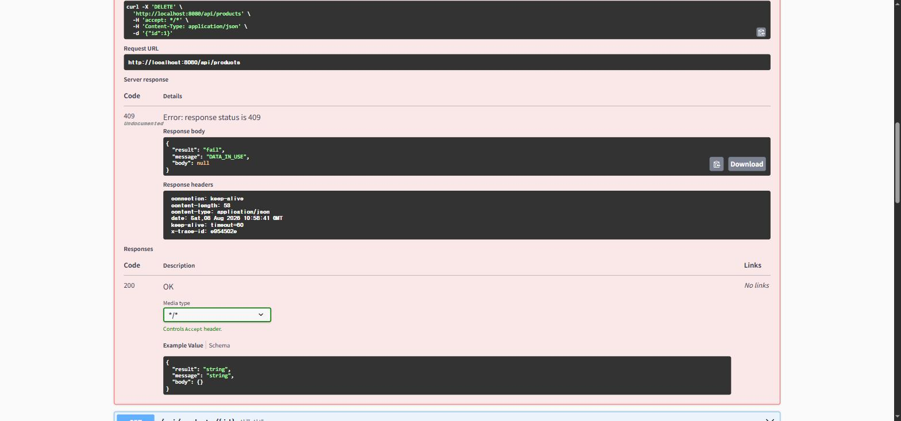

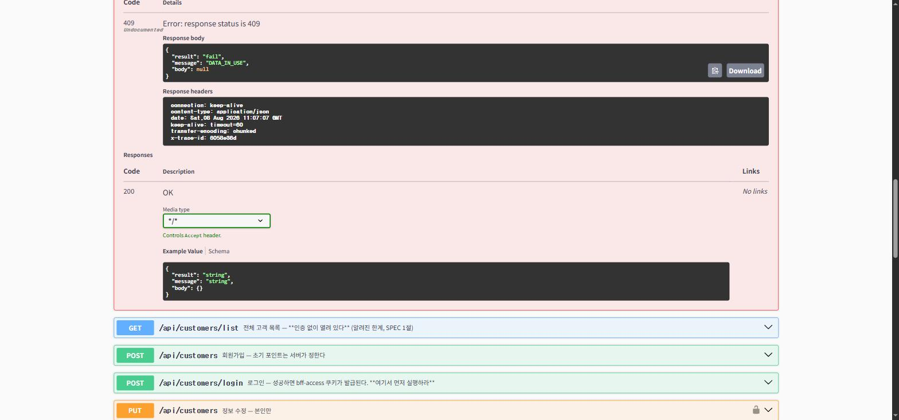

---

## 2.8 이 부의 결론

### 넷은 스펙에서 왔고, 둘은 개선이 만들었다

**①~④는 스펙대로 구현하면 그대로 남는다.** 스펙을 어겨서 생긴 것이 아니다.
스펙은 URI·요청/응답 형식·비즈니스 규칙을 정하지만, **"클라이언트가 이 필드를 정해도 되는가"**,
**"이 요청의 주체가 대상의 주인인가"**, **"실패 응답이 무엇을 알려주는가"** 는 정하지 않는다.

> **스펙 준수와 안전은 다른 축이다.**
> 스펙을 100% 충족했다는 것은 "요구된 것을 다 만들었다"는 뜻이지
> "요구되지 않은 것이 일어나지 않는다"는 뜻이 아니다.

**⑤⑥은 반대다. 개선하는 과정이 만들었다.**
⑤는 500 유출을 막으려고 넣은 안전망이 프레임워크 예외까지 삼킨 것이고,
⑥은 데이터 정합성을 지키려고 넣은 제약이 예외 경로를 새로 만든 것이다.
**개선은 결함을 줄이는 동시에 결함을 만든다.** 그래서 개선마다 검증이 따라붙어야 한다.

### 발견 도구가 결함의 종류를 정한다

| 도구 | 찾은 것 |
|---|---|
| 눈으로 읽기 (자체 점검 표) | ①② — **구조적으로 빠진 것**. 코드를 읽어서가 아니라 표의 빈칸이 보여줬다 |
| 전수 조사 · 조치 전 재현 | ③④ — **인접 경로**. 고칠 대상이 하나여도 같은 종류를 전부 훑어서 나왔다 |
| 운영 계측 붙이기 | ⑤ — **애플리케이션 밖**. 정상 경로를 도는 테스트로는 도달하지 않는다 |
| 부하 측정 | ⑥ — **집계에 묻힌 것**. 99.99%를 성공으로 읽으면 보이지 않는다 |

**한 가지 도구로는 네 종류를 다 못 찾는다.**

### 여섯 건 모두 회귀 테스트로 고정돼 있다

발견하고 고치는 것만으로는 부족하다. 같은 결함이 다시 들어오면 잡혀야 한다.

| # | 고정 위치 |
|---|---|
| ① | E2E `Mass Assignment 차단` |
| ② | E2E BOLA 방어 **7건** (피해자 잔액 온전 포함) |
| ③ | E2E 사용자 열거 방어 **2건** (상태·바디 각각) |
| ④ | E2E 수량 검증 **5건** (잔액 변동 없음 포함) + 도메인 단위 테스트 |
| ⑤ | `GlobalExceptionHandlerTest` **4건** (상태·`Allow` 헤더·입력값 미포함) |
| ⑥ | `ConcurrentOrderTest` + `GlobalExceptionHandlerTest` (409·제약명 미노출) |

②③④의 고정 방식에 공통점이 있다. **"거부됐다"만 단언하지 않고 "부수 효과가 없다"를 함께 단언한다.**
403이 나가면서도 데이터가 바뀌었을 수 있고, 400이 나가면서도 잔액이 움직였을 수 있다.
이 습관이 ⑥의 `"최소 1건은 성공한다"` 로 이어졌다.

---

# 3부 — 설계 판단

## 3.0 다섯 갈래

스펙과 다르게 구현한 항목은 전부 `docs/DECISIONS.md`에 **무엇을 / 왜 / 트레이드오프**로 기록했다.
29개 절이 쌓였는데, 그대로 순서만 바꿔 옮기면 목록이지 판단이 아니다.
**판단이 어떻게 갈렸는지**로 다시 묶는다.

| 갈래 | 무엇인가 | 대표 사례 |
|---|---|---|
| **1. 스펙을 따른 것** | 바꿀 수 있었지만 **바꾸지 않기로 판단**한 것 | 400 vs 409 |
| **2. 스펙을 벗어난 것** | 계약을 지키면서 내부를 바꾼 것 | `ordered_amount` 총액 스냅샷 |
| **3. 추가하지 않은 것** | 넣을 수 있었지만 **근거가 없어 넣지 않은** 것 | MyBatis 혼용 |
| **4. 넣었다가 뺀 것** | 만들어서 재보고 **지운** 것 | `@Cacheable` |
| **5. 틀려서 정정한 것** | 스스로 쓴 결론을 **철회**한 것 | 409 "특이 지표" 반증 |

1과 2를 가르는 기준, 3과 4를 가르는 기준이 각각 다르고, 5는 앞의 넷 전부에 걸린다.
각 갈래에서 대표 하나를 깊게 보고 나머지는 표로 압축한다.

---

## 3.1 스펙을 따른 것 — 바꿀 수 있었는데 바꾸지 않았다

### 대표: `INSUFFICIENT_FUNDS`를 400으로 남겼다

Phase 2에서 `Error` → HTTP 상태를 매핑하면서 이 항목이 걸렸다.

`INSUFFICIENT_FUNDS`(포인트 부족)와 `INSUFFICIENT_QUANTITY`(취소 수량 초과)는
**요청 자체는 올바르고 현재 상태와 충돌하는** 경우다. 형식이 틀린 것이 아니다.
그렇다면 `400 Bad Request`보다 **`409 Conflict`가 더 정확하다**는 견해가 있고, 나도 그렇게 생각했다.

**그런데 스펙 4절이 400으로 명시하고 있다.**

이 판단에는 근거가 필요했다. 같은 Phase에서 **스펙을 벗어난 결정을 이미 여럿 하고 있었기 때문이다** —
스펙에 없는 인증을 세 곳에 추가했고(BOLA), 스펙이 정한 에러 코드를 바꿨다(사용자 열거).
**"스펙을 지켜야 하니까"는 그 결정들과 앞뒤가 맞지 않는다.**

그래서 기준을 명문화했다.

> **명백한 오류는 고치고, 견해가 갈리는 것은 계약을 따른다.**

이 기준으로 세 항목이 서로 다르게 갈렸다. **같은 작업 세션에서, 같은 사람이, 반대 방향으로 결정했다.**

| 항목 | 성격 | 결정 |
|---|---|---|
| 검증 실패가 `DATA_NOT_FOUND`(404)로 나감 | **명백한 오류** — 검증 실패인데 "데이터를 찾을 수 없음"이라고 알린다. 클라이언트가 잘못 읽을 여지가 없다 | **고쳤다** (400) |
| 로그인 실패가 404와 401로 갈림 | **명백한 오류** — 계정 존재 여부가 노출된다. 취약점이다 | **고쳤다** (401 통일) |
| `INSUFFICIENT_*`가 400 | **견해가 갈린다** — 비즈니스 규칙 위반을 400으로 두는 API가 실무에 흔하다. 400이 틀렸다고 단정할 수 없다 | **따랐다** (400 유지) |

**"내가 더 낫다고 생각한다"는 계약을 벗어날 근거가 되지 못한다.**
근거가 되려면 *"이 상태로 두면 무엇이 잘못되는가"* 에 답할 수 있어야 하는데,
`INSUFFICIENT_FUNDS`가 400으로 나가서 잘못되는 것은 없다.
클라이언트는 `message`로 사유를 알고, 400도 4xx라 "클라이언트 쪽 문제"라는 대분류는 맞다.

이 기준이 실제로 작동한다는 증거는 **같은 기준이 반대 결론도 낸다**는 것이다.
`DATA_IN_USE`(참조 무결성 위반)는 **409로 정했다.** 성격은 `INSUFFICIENT_*`와 똑같은
"상태 충돌"인데 결론이 다르다 — **이 코드는 강의 자료에 아예 없어서 계약이 존재하지 않았기 때문이다.**
빈칸은 의미대로 채우고, 채워져 있는 칸은 견해차만으로 덮어쓰지 않는다.
(동작 화면은 2부 2.7의 두 캡처)

### 나머지 — 계약이라 따른 것

| 항목 | 따른 내용 | 바꾸고 싶었던 이유와 그럼에도 따른 근거 |
|---|---|---|
| `PUT`·`DELETE`가 id를 **바디**로 받는다 | 스펙 그대로 | REST 관례로는 `DELETE /api/products/{id}`가 맞다. **URI는 계약의 핵심**이라 손대지 않았다 |
| 주문 URI가 `/api/customers/order` | 스펙 그대로 | 주문 도메인의 API이므로 `/api/orders`가 자연스럽다. URI는 고정하고 **코드 소유만 주문 도메인**에 두었다 |
| 재주문 시 **수량 누적** | 스펙 그대로 | 주문 건별 행이 있어야 이력 추적이 된다. 이 계약이 `ordered_amount` 설계를 강제했다 (3.2) |
| `GET /api/customers/list` **인증 불필요** | 스펙 그대로 | 전체 고객 ID·잔액이 익명에 열린다. **올바른 해법이 역할 기반 접근 제어인데 이 프로젝트에 역할 개념이 없다.** "로그인만 요구"는 가입이 자유로워 방어가 되지 못한다 (2부 2.3) |
| 모든 응답을 공통 `Response`로 감쌈 | 스펙 그대로 | HTTP 상태와 중복된다. 계약이 명시한 형식이다 |

### 스펙이 비워둔 자리 — 계약을 어긴 것이 아니라 채운 것

스펙이 규정하지 않아 **직접 정해야 했던** 항목들이다. 계약 위반이 아니므로 갈래가 다르다.

| 항목 | 결정 | 근거 |
|---|---|---|
| `Response` 필드명 | `result` / `message` / `body` | 스펙은 "공통 Response로 감싼다"만 규정했다. 성공·실패 판별 / 사유 / 페이로드의 3분할 |
| `PagedList` 필드명 | `total` / `offset` / `count` / `list` | 위와 같음 |
| 주문 요청 클래스 | `OrderRequest(productId, quantity)` | **엔티티로는 이 바디를 받을 수 없다** — `OrderItem`은 `Product` **참조**를 갖지 `productId`를 갖지 않는다 |
| 고객 주문 조회 응답 | `OrderListDto` + `OrderItemDto` | 스펙이 요구하는 **평탄화된 `products` 배열**은 엔티티만으로 만들 수 없다 |
| **`offset` 해석** ⚠️ | **페이지 번호** | 아래 참조 |

**`offset`은 확정하지 못한 항목이다.** 강의 자료는 *"Pageable 객체 생성"* 까지만 명시하고
`PageRequest.of()`에 무엇을 넣는지 제시하지 않는다. 완성 코드는 별도 배포라고만 돼 있어 확인할 수 없었다.

`Pageable`의 표준 용법인 **페이지 번호**로 해석했다. 다만 파라미터명 `offset`은 통상
**건너뛸 레코드 수**를 뜻하므로, 명칭만 놓고 보면 `page`가 정확한 이름이다.

```
--- 실측 (상품 id 1..N 존재) ---
  offset=0 count=2 → id [1, 2] / total 9
  offset=1 count=2 → id [3, 4] / total 9
  offset=2 count=2 → id [5, 6] / total 9

  → 건너뛸 개수라면 offset=1 이 [2,3] 이어야 하나 [3,4] 다. 페이지 번호가 맞다.
```

건수 해석으로 바꿔야 한다면 `PageRequest.of(offset / count, count)`가 되며,
**API 계약(URI·파라미터명)은 그대로이고 Service 한 줄만 고치면 된다.**

> **이 실측이 문서의 오류를 잡았다.** `REVIEW.md`의 미해결 항목 표에 *"현행(건너뛸 개수)"* 이라고
> 적혀 있었다. 코드·주석·Swagger·실제 동작이 **모두 페이지 번호**였는데 요약 문서만 반대로 적혀 있었다.
> 마감 문서를 쓰면서 원본을 다시 읽지 않고 기억으로 적은 결과다.
> 캡처를 만드는 작업이 **문서 검증을 겸했다.**

---

## 3.2 스펙을 벗어난 것 — 계약은 지키고 내부를 바꿨다

### 대표: `ordered_amount` — 단가가 아니라 **총액**을 스냅샷한다

이 프로젝트에서 가장 오래 붙든 설계 판단이고, **실무 표준에서 벗어난 유일한 항목**이다.

#### 출발 — 스펙대로면 환불 금액이 틀린다

스펙의 `OrderItem`은 `id`, `customer`, `product`, `quantity`만 갖는다.
가격 정보가 없으므로 **취소 시 환불액을 `product`의 현재 가격에서 가져올 수밖에 없다.**

```
1) 15,000원에 2개 주문      → 30,000 차감 (잔액 970,000)
2) 관리자가 50,000원으로 인상
3) 1개 취소                 → 50,000 환불 (잔액 1,020,000)   ← 원금을 20,000 초과
```

**주문·결제 도메인에서 가격은 이력성 데이터다.** 현재 값을 참조하면 과거 거래가 왜곡된다.
개선 전후를 실제로 돌려 확인했다.

| | 1개 취소 후 잔액 | |
|---|---|---|
| 개선 전 (`2adfc0c`) | **1,020,000** | 현재가 50,000 환불 → 원금 **초과** |
| 개선 후 | **985,000** | 주문가 15,000 환불 → 정상 |

여기까지는 표준적인 결론이다. **가격 스냅샷을 저장한다.** 문제는 그다음이다.

#### 단가 스냅샷이 실무 표준인 이유 — 그리고 그 이유가 성립하는 조건

실무의 주문 테이블은 거의 예외 없이 **단가**(`unit_price`)를 저장한다. `orderedPrice`로 출발한 것도
그래서다. 그런데 **왜 단가인가**를 따져보면 이유가 형태 자체에 있지 않다.

> **주문 건마다 행이 따로 있기 때문이다.**
> 한 행이 한 번의 결제에 대응하므로 `단가 × 수량`이 **그 행의 결제액과 정확히 일치한다.**
> 단가만 저장해도 결제액이 복원된다.

```
order_lines
  #1  마우스  단가 15,000  수량 2   → 30,000   (2월 1일 주문)
  #2  마우스  단가 20,000  수량 3   → 60,000   (3월 5일 주문, 가격 인상 후)
```

**단가라는 형태가 표준인 것이 아니라, 행이 분리돼 있다는 구조가 단가를 충분하게 만든다.**

#### 이 프로젝트는 그 조건이 없다 — 스펙이 병합을 계약으로 요구한다

스펙 3절은 **"같은 상품 재주문 시 수량 누적(신규 행 생성 아님)"** 을 명시한다.
게다가 `(customer_id, product_id)` 복합 UNIQUE로 **고객당 상품은 1행**이다.

```
order_items
  마우스  수량 5   ← 2월의 2개(30,000)와 3월의 3개(60,000)가 한 행에 병합됐다
```

**이 행에 단가를 뭐라고 적을 것인가.** 15,000도 20,000도 아니다.
결제 총액 90,000을 5로 나눈 **평균 단가 18,000**을 적는 수밖에 없다.

그리고 그 나눗셈이 정보를 지운다.

```
40,000을 3개에 결제 → 단가 13,333.33 저장 (scale 2)
                      이 순간 "40,000"이라는 사실이 소실된다
                      13,333.33 × 3 = 39,999.99      ← 0.01 증발
```

**병합된 행에서는 단가로 결제 총액을 복원할 수 없다.**

#### A안(잔여 보정)이 왜 대안이 아닌가

가장 먼저 떠오른 대안은 **"마지막 취소에서 잔여를 보정한다"** 였다.
전량을 취소할 때 `13,333.33 × 3` 대신 원래 결제액을 돌려주면 된다는 발상이다.

**성립하지 않는다. 보정하려면 원래 총액을 알아야 하는데, 그 정보는 취소 시점이 아니라
저장 시점에 이미 사라져 있다.**

`(단가 13,333.33, 수량 3)`이라는 두 값에서 40,000을 복원할 방법이 없다.
39,999.99일 수도 있고 40,000일 수도 있고 40,000.01일 수도 있다.
**취소 시점에 어떤 로직을 넣어도 없는 정보를 만들어낼 수는 없다.**

보정을 하려면 원래 총액을 어딘가에 들고 있어야 한다. **그리고 총액을 저장하는 순간 그것이 B안이다.**

> **두 안은 대등한 선택지가 아니다. A는 B의 불완전한 형태다.**
> A를 제대로 구현하면 B가 되고, B가 되지 않으면 A는 동작하지 않는다.
> 처음에는 "두 방법 중 어느 쪽이 나은가"로 접근했는데, 그것이 질문 자체가 잘못이었다.

**scale을 4로 올리는 것도 해법이 아니다.** `13,333.3333`으로 저장해도 7로 나누는 조합에서
같은 잔여가 생긴다 — **유리수 나눗셈의 잔여는 scale로 없앨 수 없고 줄어들 뿐이다.**
게다가 금액 컬럼의 scale이 2가 아닌 것 자체가 설명 부담이며,
그 설명이 *"나눗셈 때문에"* 라면 근본 해결이 아님을 스스로 드러낸다.

#### 결론 — 실무 표준의 이탈이 아니라 구조에 맞춘 적응

> **단가 스냅샷이 표준인 이유(행이 분리돼 있다)가 이 구조에서는 성립하지 않는다.**
> 병합을 계약으로 요구하는 구조에서는 **총액이 올바른 표현**이며,
> 이것은 실무 표준에서의 이탈이 아니라 **스펙이 강제한 구조에 맞춘 적응**이다.

#### 부분 취소 — 반올림을 한 번만 일으킨다

총액을 저장하면 전량 취소는 나눗셈이 없다. 문제는 부분 취소다.

| 상황 | 계산 |
|---|---|
| **전량 취소** | `orderedAmount` 전액. **나눗셈이 없어 반올림이 개입하지 않는다** |
| **부분 취소** | `orderedAmount × 취소수량 ÷ 보유수량` — **곱한 뒤 나눈다.** 반올림 **1회**, `RoundingMode.DOWN` |

```java
// 곱하고 나서 나눈다 — 반올림이 마지막에 한 번만 일어난다
BigDecimal refund = item.getOrderedAmount()
        .multiply(BigDecimal.valueOf(cancelQuantity))
        .divide(BigDecimal.valueOf(item.getQuantity()), 2, RoundingMode.DOWN);
```

**남은 총액은 재계산이 아니라 차감한다.**
재계산하면 반올림이 매번 새로 일어나 오차가 누적된다.
차감하면 잔여가 그대로 남아 다음 취소로 이월되므로 **환불 합계가 결제 총액과 항상 일치한다.**

`DOWN`을 고른 근거는 경계 케이스다. `HALF_UP`도 **합계는 정확하고** 잔여가 음수가 되지도 않는다
(`orderedAmount`가 scale 2 값이라 그 이하를 scale 2로 반올림해도 초과할 수 없다).
차이는 **개별 환불액**이다 — 7개/10,000에서 `HALF_UP`은 6번째 취소가 1,428.58로
정확한 몫(1,428.57…)을 **초과한다.** `DOWN`은 각 취소가 몫을 넘지 않고 잔여를 마지막에 몰아준다.

#### 실측 — 나눠떨어지지 않는 조합으로 원금 복귀를 확인했다

`15,000 × 3 + 10,000 × 4 = 85,000`을 **7개에 결제**했다.
85,000 ÷ 7 = 12,142.857… 로 나눠떨어지지 않는다. 여기서 1개씩 **7회 취소**했다.

```
927,142.85 → 939,285.70 → 951,428.56 → 963,571.42 → 975,714.28 → 987,857.14 → 1,000,000.00
                                                        마지막 취소가 12,142.86 (누적 잔여 포함)
```

**원금 1,000,000으로 정확히 복귀한다.**
7회 환불액의 합이 결제 총액 85,000과 정확히 일치하며, `DOWN`으로 잘린 잔여가 소실되지 않고
다음 취소로 이월된다는 것이 이 수열이 보여주는 것이다.

> **한계** — 부분 취소는 **평균 단가로 환불**되므로 *"어느 시점에 산 물건을 취소하는가"* 를
> 구분하지 못한다. 15,000에 산 것을 취소해도 12,142.85가 환불된다.
> 정확히 하려면 주문 건별 행(`Order` + `OrderLine`)이 필요하고,
> **그러면 행마다 결제액이 하나씩 대응하므로 단가 스냅샷으로 충분해진다.**
> 즉 이 설계는 "주문 이력이 아니라 현재 보유 수량"이라는 한계와 **같은 뿌리**다 (7부).

### 나머지 — 계약을 지키며 내부를 바꾼 것

| 항목 | 스펙 | 변경 | 근거 | 계약 영향 |
|---|---|---|---|---|
| **대리키 전환** | `customerId`(String)가 PK | `Long id`가 PK, `customerId`는 `UNIQUE NOT NULL` | 자연키는 **변경 가능성**이 있어 바뀌면 참조하는 FK를 전부 갱신해야 한다. 문자열 PK는 인덱스가 크고 자식 FK로 전파돼 조인 비용이 는다 | **없음.** URI는 `/api/customers/{customerId}` 그대로 |
| **`BigDecimal` 전환** | `Double` | `BigDecimal(precision=19, scale=2)` | 부동소수점은 십진 소수를 정확히 표현하지 못한다(`0.1 + 0.2 != 0.3`). 금액 오차가 누적되면 잔액이 틀어진다 | 필드명·URI 동일. **다만 표기가 바뀐다** — 아래 참조 |
| **도메인 기준 패키지** | `controller/`·`service/`·`repository/`·`data/` | `product/`·`customer/`·`order/`·`global/` | 아래 별도 | **없음** |
| **인증 위치 이동** | Service가 `SessionHandler`로 쿠키를 읽음 | Controller의 `@LoginCustomer` ArgumentResolver, Service는 `customerId`만 받음 | 웹 의존성이 Service에 있으면 ① 순수 단위 테스트 불가 ② 배치·스케줄러가 재사용 불가 ③ 인증 방식 변경이 도메인까지 번진다 | **없음** |
| **복합 UNIQUE 추가** | 없음 | `(customer_id, product_id)` UNIQUE | "고객당 상품 1행"을 **DB가 강제**한다. 애플리케이션 검증만으로는 동시 재주문에서 행이 2개 생긴다 | **없음.** 다만 이 제약이 2부 ⑥의 500을 드러냈다 |
| **`@Version` 낙관적 락** | 없음 | `Customer.version` | 락이 없을 때 **차감 88건이 증발**하는 것을 먼저 실측했다 (5부) | **없음.** 충돌 시 409가 추가된다 |

**`BigDecimal` 전환의 계약 영향은 "없음"이 아니라 "표기가 바뀐다"였다.**
실측 결과 `1000000.0` → `1000000.00`, `15000.0` → `15000.00`이 됐다. scale 2가 직렬화에 그대로 드러난다.
필드명이 아니라 **값의 표기**이고 JSON 숫자는 표기 형식이 정해져 있지 않으므로
(`970000` · `970000.0` · `970000.00`은 모두 같은 수) 계약 위반은 아니다.
표기를 자료에 맞추려면 금액을 `Double`로 되돌리거나 직렬화 시 스케일을 죽여야 하는데,
**둘 다 정확성을 표기 일치와 맞바꾸는 것**이라 하지 않았다.
"직렬화 결과가 동일할 것"이라는 당초 예상이 틀렸다는 사실은 그대로 기록했다.

### 폴더 구조 재배치 — 공지가 허용한 자유를 근거를 갖고 썼다

공지는 *"교재에서의 프로젝트 내 폴더 구조를 그대로 동일하게 준수할 필요 없으며,
자유롭게 구성하기 바람"* 이라고 밝혔다. **허용됐다는 것이 곧 바꿀 이유는 아니다.**
바꾼 근거를 따로 세웠다.

```
com.sk.skala.shopapi
├── product/     controller · service · repository · entity · dto
├── customer/    controller · service · repository · entity · dto
├── order/       controller · service · repository · entity · dto
└── global/      auth · common · config · exception · logging · tools
```

**모듈러 모놀리스다. 도메인 폴더 하나가 미래의 마이크로서비스 하나에 대응한다.**
기술 계층 구조는 서비스를 분리할 때 모든 폴더를 헤집어야 하지만, 도메인 구조는 **폴더째 떼어낼 수 있다.**
"Monolith First" — 처음부터 쪼개지 않고, **경계만 명확히 그어** 필요할 때 분리한다.

`OrderItem`을 별도 도메인으로 둔 것에도 근거가 필요했다. 주문은 고객·상품 **양쪽에 걸쳐** 있다.

- `OrderItem`은 `quantity`·`orderedAmount`라는 **고유 속성**을 가진다. 속성 없는 연결 테이블이면
  한쪽에 붙여도 되지만, 결제 총액을 들고 있는 이상 독립 개념으로 볼 근거가 있다
- `customer/`에 두면 상품 도메인이 고객 도메인 내부를 참조해야 하고, `product/`에 두면 반대가 된다.
  **어느 쪽이든 한 도메인이 다른 도메인의 내부 구조에 묶인다**
- 별도로 두면 `order → customer`, `order → product` **단방향**으로 정리된다

```
        order
        ╱    ╲
   customer  product      (customer ↔ product 사이에는 의존이 없다)
```

이 규칙이 API 배치까지 결정했다. `GET /api/customers/{customerId}`의 조립을 **주문 도메인이 맡는다** —
고객 도메인이 조립하면 `customer → order` 의존이 생겨 **순환**이 되기 때문이다.

**트레이드오프는 대조 가능성이다.** 폴더가 교재와 달라지므로 **클래스명과 API는 100% 동일하게
유지**해 어느 클래스가 교재의 어느 클래스에 대응하는지 바로 확인되게 했다.
자유를 쓰되 **비교 가능성은 잃지 않는다.**

> 이 경계가 실제로 지켜지는지는 문서가 아니라 **ArchUnit 규칙 12건**이 강제한다.
> 그리고 첫 실행에서 **`customer ↔ order` 순환을 실제로 찾아냈다** — 위 문단이 "단방향"이라고
> 적혀 있는 동안 코드는 그렇지 않았다 (4부).

---

## 3.3 추가하지 않은 것 — 넣을 수 있었지만 근거가 없었다

### 대표: MyBatis 혼용

실무에서 JPA와 MyBatis를 함께 쓰는 것은 흔하고, **그 근거는 명확하다.**

| 영역 | 유리한 쪽 | 이유 |
|---|---|---|
| 단순 CRUD | **JPA** | 영속성 컨텍스트·더티 체킹으로 생산성이 높다 |
| 복잡한 집계·다중 조인·동적 조건·튜닝된 SQL | **MyBatis** | SQL을 직접 통제한다 |

**혼용이 적합한 조건을 먼저 세우고, 이 프로젝트가 거기 해당하는지 확인했다.**

| 도입 조건 | 이 프로젝트의 상태 |
|---|---|
| `GROUP BY`·`HAVING`을 동반한 **통계성 조회** | ❌ 없다. 집계 API가 하나도 없다 |
| 조건 조합이 많은 **동적 검색** | ❌ 없다. 검색 API 자체가 없고 목록 조회는 전체 페이징뿐이다 |
| **대량 배치** | ❌ 없다. 배치 진입점이 없다 |

**본 프로젝트의 API 13개는 전부 단순 CRUD이며, MyBatis가 우위를 갖는 쿼리가 하나도 존재하지 않는다.**
기존 CRUD를 XML로 옮기는 것은 **기술을 목적 없이 추가하는 것**이므로 도입하지 않았다.

**"이력서에 쓸 기술이 하나 늘어난다"는 도입 근거가 아니다.** 오히려 반대다 —
근거 없이 스택을 늘리면 *"왜 이걸 썼는가"* 에 답할 수 없고, 그것은 설계 능력이 아니라 그 반대를 보여준다.

> **★ 이 원칙이 3.4의 판단으로 이어진다.**
> MyBatis를 거부한 근거는 "이득 없는 기술을 추가하지 않는다"이다.
> 그렇다면 **이득이 측정되지 않은 기술을 남겨두는 것도 같은 원칙 위반**이다.
> **추가하지 않는 것과 같은 이유로, 남겨두지도 않는다.**
> `@Cacheable`을 지운 근거가 바로 이것이다.

### 나머지

| 패턴 | 미적용 근거 |
|---|---|
| **서킷브레이커 · 벌크헤드** | 존재 목적은 **여러 외부 의존성 사이의 장애 격리**인데, 이 서비스의 외부 호출은 **DB 하나뿐**이다. 벌크헤드가 나눌 경계가 없고, DB가 죽으면 어차피 모든 요청이 실패하므로 서킷을 열어 얻을 것도 없다. **DB 장애는 커넥션 풀 타임아웃·획득 대기 상한으로 다루는 것이 정석**이다. 풀 크기가 **DB 동시 실행 폭을 정한다는 것은 스윕에서 확인했으나**(5부), 타임아웃·대기 상한을 걸고 **격리 동작 자체를 시험하지는 않았다** |
| **CDN** | 순수 REST API로 **정적 자원이 없다.** 캐싱이라는 동일 목적은 HTTP 캐시 헤더(ETag)로 달성했고, 그쪽은 **효과를 측정했다** (5부) |
| **Redis 공유 캐시** | `@Cacheable`의 다중 인스턴스 문제를 풀 수는 있다. 그러나 **측정되지 않은 이득을 지키려고 인프라를 늘리는 것은 순서가 거꾸로다.** 새 인프라 1개 + 네트워크 홉 + 장애점 + 운영 부담을 낸다. `@Cacheable` 제거 후에는 지킬 이득 자체가 없어 논의도 성립하지 않는다 |
| **Service 인터페이스 분리** | 구현체가 하나뿐인 인터페이스는 **과설계**다. 단, 도메인 간 호출부는 MSA 분리 시 Client 교체 지점이 되므로 예외로 둔다 |
| **`@ManyToMany`** | 연결 테이블에 `quantity`·`orderedAmount` 같은 **속성이 있어 표현 불가**하다. `OrderItem`을 독립 엔티티로 승격했다 |

---

## 3.4 넣었다가 뺀 것 — 만들고, 재고, 지웠다

### 대표: `@Cacheable` 상품 캐시

**Phase 3에서 계획한 항목이었다.** 그때는 넣지 않고 미뤘다 —
*"k6가 없는 상태에서 캐시 TTL을 정하면 근거 없는 숫자가 된다"* 는 이유였다.
Phase 6에서 측정 도구가 갖춰진 뒤 **구현했고, 재봤고, 지웠다.**

#### 구현은 제대로 했다

지우기 전에 짚어둘 것이 있다. **잘못 만들어서 지운 것이 아니다.**

| 설계 판단 | 내용 |
|---|---|
| **상품만 캐시한다** | 읽기가 압도적이고, 쓰기가 드물며, **모두에게 같은 데이터**다. 고객·주문은 사용자마다 다르고 주문마다 바뀌어 적중률이 낮고 무효화가 복잡하다 |
| **엔티티가 아니라 DTO를 캐시한다** | 엔티티를 캐시하면 **detached 인스턴스 하나를 여러 요청이 공유**한다. 지연 로딩 예외가 나거나 한 요청이 만진 상태가 다른 요청에 보인다 |
| **`allEntries = true`를 쓰지 않는다** | `key`를 지정해 해당 항목만 비운다. 전체를 비우면 상품 하나를 고칠 때마다 나머지 전부의 적중률이 무너진다. **무효화는 정확한 만큼만** |
| **"빨라졌는가"보다 "무효화되는가"를 먼저 테스트했다** | **캐시는 틀린 값을 빠르게 주는 방식으로 실패한다.** 느려지는 실패는 눈에 띄지만 낡은 값을 주는 실패는 조용하다 |

#### ★ 첫 측정을 폐기했다 — 수치가 나온다고 측정이 된 것은 아니다

`load.js`로 캐시 on/off를 재서 **0.3% 차이**를 얻었다. 그리고 그 측정을 버렸다.

> **`load.js`는 캐시가 걸린 `GET /api/products/{id}`를 한 번도 호출하지 않는다.**
> (`listProducts` · `getOrders` · `placeOrder` 뿐)
> 두 측정이 **동일한 코드 경로**를 돌았고, 나온 0.3%는 캐시와 무관한 노이즈였다.

전용 시나리오 `docs/perf/cache.js`를 새로 만들었다.
**트래픽 100%가 캐시 대상 경로 — 이득의 상한을 재는 설계다.**

#### 이득 — 상한 조건에서도 측정되지 않았다

포화 조건(`THINK=0`, VU 50, 45초):

| 실행 | req/s | p95 |
|---|---|---|
| 캐시 ON (1회) | 10,645.7 | 11.58ms |
| **캐시 OFF** | **10,440.9** | **11.60ms** |
| 캐시 ON (2회) | 10,462.5 | 11.70ms |

**이 시나리오의 반복 편차**(ON 두 번의 폭): req/s **1.75%**, p95 **0.12ms**.

- **p95 — 효과 0.** OFF(11.60)가 ON 두 번(11.58, 11.70) **사이에 들어간다**
- **req/s — 편차 안.** ON 평균 대비 +1.08% < 편차 1.75%

> **상한 조건에서도 이득이 없다.** 포화시켰고, 트래픽 전부가 캐시 대상이었다.
> **실제 트래픽에는 이 경로가 아예 없으므로 어떤 트래픽에서도 이득이 없다.**
>
> 이유는 추정할 수 있다 — 단일 행 PK 조회는 PostgreSQL 버퍼 캐시에서 이미 빠르고,
> 병목이 DB가 아니라 HTTP 처리·직렬화에 있다. **다만 이건 측정하지 않았고 추정이다.**

#### 위험 — 예고보다 나빴다

25절이 *"다중 인스턴스에서 낡은 값을 준다"* 를 **한계로 예고**해뒀다. HA 구성에서 실측했다.

| 항목 | 예고 | **실측** |
|---|---|---|
| 낡은 값 | "다른 인스턴스는 낡은 값을 계속 준다" | ✅ **불일치 50%** (라운드로빈 분포 그대로, 40회 중 20회) |
| 지속 시간 | *(언급 없음)* | ❌ **만료되지 않는다.** 61초·**3분 후에도** 낡은 값 |
| 결제 영향 | *(언급 없음)* | ✅ **없음.** 낡은 인스턴스가 처리한 주문 4건 전부 새 가격으로 차감 |

**`ConcurrentMapCacheManager`에는 만료 정책이 없다.**
`Cache-Control: max-age=60`과 혼동하면 안 된다 — 그건 클라이언트·중간 캐시의 몫이고,
**서버 캐시의 낡은 값 수명은 60초가 아니라 무한**이다.

결제 안전성은 **코드 판단이 아니라 실측으로** 확인했다. `findProduct()`가 캐시를 거치지 않는다는
코드 판단을, 낡은 캐시가 떠 있는 상태에서 주문을 걸어 검증했다 — 8건 중 4건이 낡은 인스턴스에서
처리됐고 **전부 새 가격으로 차감**됐다. **영향 범위: 조회 표시에 한정, 금액 무관.**

#### 네 선택지 — B와 C를 택하지 않은 근거

| 선택지 | 비용 | 판단 |
|---|---|---|
| **A. `@Cacheable` 제거** | 코드·테스트 3건 삭제 | ✅ **채택** |
| B. HA에서만 기본 off | 0 (compose 기본값) | ❌ 아래 |
| C. 현상 유지 + 한계 명시 | 0 | ❌ 아래 |
| D. Redis 공유 캐시 | 새 인프라 1개 + 네트워크 홉 + 장애점 | ❌ 3.3 참조 |

**왜 B(환경별 비활성화)가 아닌가 — 단일 구성에서도 같은 결함이 남는다.**

낡은 값은 다중 인스턴스에서 **눈에 띄었을 뿐**, 기제는 단일에서도 동일하다.
DB를 직접 수정하거나 다른 경로로 데이터가 바뀌면 캐시는 여전히 낡은 값을 **무한히** 들고 있다.

> **환경별 비활성화는 결함을 고치는 것이 아니라 결함이 보이는 환경을 피하는 것이다.**
> "HA에서는 끄면 된다"는 처방은 결함의 존재를 인정하면서 그것을 **설정 뒤에 숨긴다.**
> 게다가 그 설정을 잊은 채 다중 인스턴스로 배포하면 결함이 그대로 돌아온다.

**왜 C(현상 유지)가 아닌가 — 이득 없는 코드를 유지하는 데도 비용이 든다.**

애노테이션 3개, 설정 클래스 1개, 테스트 3건, 그리고 무엇보다
**"이 캐시는 왜 있는가"를 다음 사람이 다시 검토해야 하는 비용**이다.

그리고 3.3에서 적은 원칙과 정면으로 충돌한다.
이 프로젝트는 MyBatis를 도입하지 않으면서 *"기술을 목적 없이 추가하는 것"* 을 거부했다.
**이득이 측정되지 않은 캐시를 유지하는 것은 같은 원칙을 반대 방향에서 어기는 것이다.**

**지운 것**: `@Cacheable`·`@CacheEvict` 애노테이션, `CacheConfig`(`@EnableCaching` 포함),
`ProductCacheTest` 3건, `docker-compose.ha.yml`의 `SPRING_CACHE_TYPE` 스위치.

> **다만 측정은 이 환경의 것이다.** 상품 수가 많아지거나 조회가 무거워지면(조인·집계)
> 결론이 바뀔 수 있다. **재도입 조건**을 적어둔다 —
> **상세 조회가 단일 행 PK 조회를 넘어서거나, DB가 병목으로 측정될 때.**

### ★ 같은 "캐싱"인데 하나는 남았다 — ETag

같은 Phase에, 같은 측정 도구로, **반대 결론이 나왔다.**

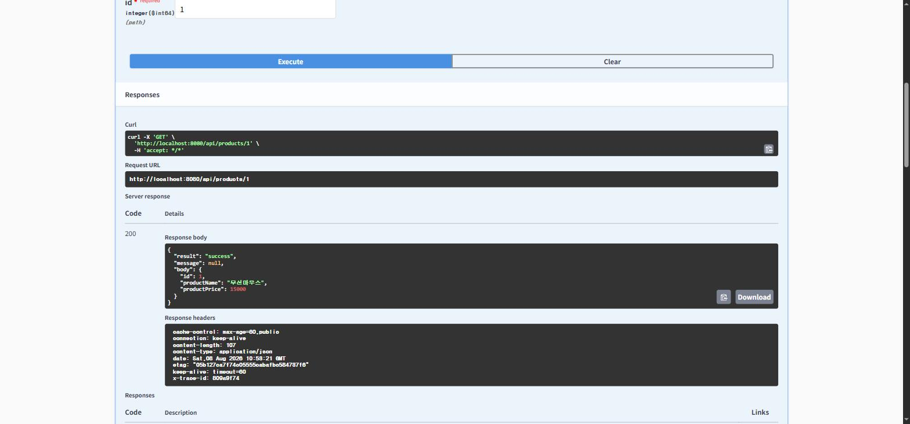

| | **ETag** (`HttpCacheConfig`) | **`@Cacheable`** |
|---|---|---|
| 아끼는 것 | **네트워크 전송** | 서버 부하(DB 조회·직렬화) |
| 측정된 이득 | **−51%** (7.4 → 3.6 MB) | **없음** (p95 효과 0) |
| 위험 | **없음** — 서버 상태를 캐시하지 않는다 | 낡은 값, **만료 없음** |
| **판단** | **유지** | **제거** |

| | 전송량 | p95 | 2xx |
|---|---|---|---|
| 일반 GET | 7.4 MB | 2.86ms | 23,090 |
| **ETag 조건부 요청** | **3.6 MB (−51%)** | 3.08ms | **20** (나머지 304) |

25절이 **측정 전에** 적어둔 문장이 그대로 실증됐다.

> **ETag가 아끼는 것은 네트워크 전송뿐이다.** `ShallowEtagHeaderFilter`는 응답 본문을 **다 만든 뒤**
> 해시를 계산하므로 DB 조회도 직렬화도 그대로 일어난다. 304를 받아도 **서버 일은 줄지 않는다.**
> `@Cacheable`은 그 앞단의 작업 자체를 건너뛴다. **둘을 "캐싱"으로 뭉쳐 말하면 안 된다.**

전송량은 절반이 됐고 **서버 응답 시간은 변하지 않았다**(1.45 → 1.49ms). 예측한 그대로다.

> **★ 용어가 같다는 이유로 함께 측정하지 않은 것이 두 개의 다른 결론을 가능하게 했다.**
> 뭉쳐서 봤다면 ETag의 −51%를 보고 *"캐싱은 효과가 있다"* 로 가거나,
> `@Cacheable`을 보고 *"캐싱은 효과가 없다"* 로 갔을 것이고,
> **어느 쪽이든 나머지 하나에 대해 틀린 결정을 했을 것이다.**

한 가지 더 — **`max-age=60`은 측정값이 아니다.**
*"가격 변경이 그만큼 늦게 보여도 되는가"* 로 정한 **도메인 판단**이다.
`CLAUDE.md`의 *"설정값에는 측정 결과나 **명시적 근거**가 붙어야 한다"* 에서 후자에 해당한다.
**측정으로 정할 수 있는 종류의 값이 아니라는 것까지 근거의 일부다** —
부하를 아무리 재도 "가격이 1분 늦게 보여도 되는가"는 나오지 않는다.

> **개인 데이터에는 캐시 헤더를 붙이지 않는다.** `Cache-Control: public`은 중간 캐시(프록시·CDN)에게
> **보관해도 좋다**고 말하는 것이다. 잔액·주문 이력에 붙이면 **남의 개인정보를 중간 캐시가 들고 있게 된다.**
> Phase 2에서 막은 자산이 **헤더 한 줄로 새는 경로**이므로 테스트로 고정했다.

---

## 3.5 틀려서 정정한 것 — 내가 쓴 결론을 철회했다

### 대표: "409는 DB 동시성 폭을 재는 특이 지표"를 철회했다

#### 어떻게 그 주장에 도달했는가

Phase 6 설정 스윕에서 p95·처리량과 함께 **409 충돌 건수**를 셌다.
그리고 절대 건수를 그대로 읽으면 안 된다는 것을 먼저 처리했다 —
409는 주문 요청 수에 비례하므로 처리량이 높은 설정에서 자동으로 커진다.
**요청 수로 나눠 정규화했다.**

| 풀 | 409 비율 | | 스레드 | 409 비율 |
|---|---|---|---|---|
| 2 | **0.08%** | | 10 | 0.90% |
| 5 | 0.34% | | 25 | 0.88% |
| 10 | 0.65% | | 50 | 0.71% |
| 20 | 0.96% | | 100 | 0.70% |
| 40 | **0.99%** | | 200 | 0.85% |
| | **단조 증가 12배** | | | **경향 없음 (0.70~0.90 배회)** |

기전은 깔끔했다. **DB 동시 실행 폭을 정하는 것은 커넥션 풀이지 톰캣 스레드가 아니다.**
스레드가 200이어도 풀이 10이면 DB에서 동시에 도는 트랜잭션은 10개다. 나머지는 커넥션을 기다린다.

**논증의 형태가 특히 좋아 보였다 — 반응하지 않은 것이 증거였다.**

> 409가 풀에 반응한 것만으로는 *"부하가 세지면 충돌이 는다"* 로도 읽힌다.
> 결정적인 것은 **스레드 스윕에서 움직이지 않았다는 사실**이다.
> 409가 일반적인 부하 지표였다면 스레드 스윕에서도 따라 움직였어야 한다.
> 움직이지 않았다 — 그래서 **"409는 DB 동시성 폭을 재는 특이 지표"** 라는 해석이 섰다.

게다가 **이 예측은 데이터를 보기 전에 기전에서 나왔다.** 가설이 데이터를 사후에 맞춘 것이 아니라
기전이 예측한 대로 나왔고, 두 스윕이 서로의 대조군이 된 셈이었다.

#### ★ 사전 등록한 예측이 빗나갔다

HA 측정에 들어가기 전, **`LB + 2대` 구성에서 409가 얼마나 나올지 예측을 먼저 기록**했다.
위 기전대로라면 인스턴스가 2대면 DB 동시성 폭이 10 → 20이 되므로,
풀 스윕 곡선(10에서 0.65%, 20에서 0.96%)을 따라 **≈0.96%** 가 나와야 했다.

**실측은 2.33%였다.**

#### `LB + 1대` 대조가 결정적이었다

예측이 빗나간 것만으로는 기전이 틀렸는지, 다른 요인이 끼었는지 알 수 없다.
그래서 **DB 동시성 폭을 전혀 바꾸지 않고 LB 홉만 추가한 구성**을 함께 쟀다.

| 구성 | DB 동시성 폭 | 409 비율 |
|---|---|---|
| 직접 1대 (LB 없음) | 10 | 0.65% |
| **LB + 1대** | **10 (동일)** | **2.02%** |
| LB + 2대 | 20 | 2.33% |

> **동시성 폭을 전혀 바꾸지 않고 LB 홉만 추가했는데 409가 3.1배가 됐다.**
> 따라서 *"409는 DB 동시성 폭을 재는 **특이** 지표"* 라는 **인과적 일반화는 근거가 없다.**

이 대조군이 없었다면 `0.96% 예측 → 2.33% 실측`을 보고
*"인스턴스가 2대라 예상보다 경합이 더 심했다"* 는 **그럴듯한 설명을 붙이고 넘어갔을 것이다.**
`LB + 1대`가 그 설명을 봉쇄했다 — **동시성 폭이 같은데 3.1배**이므로 동시성으로는 설명되지 않는다.

#### 철회 / 유지 / 기각을 나눴다

**한 문장이 틀렸다고 절 전체를 버리지 않는다.** 무엇이 살아남는지 항목별로 판정했다.

| 서술 | 판정 |
|---|---|
| 풀 스윕 안에서 409가 풀 크기에 **단조 반응했다** | ✅ **관찰로서 유효** |
| 스레드 스윕에서 409가 **반응하지 않았다** | ✅ 관찰로서 유효 |
| 동시성 폭이 409에 **영향을 준다** | ✅ 유효하나 **작다** (LB+1 2.02% → LB+2 2.33%, +15%) |
| **"409는 동시성 폭을 재는 특이 지표"** | ❌ **철회.** 다른 변수로도 3배 움직인다 |

관찰은 남고 **인과적 일반화만 무너졌다.**

> **그 분리는 지표의 성질이 아니라, 그 실험이 다른 변수를 고정했기 때문에 생긴 것이다.**
> 스윕은 풀만 바꾸고 나머지를 고정했고, 그래서 깨끗한 단조 관계가 보였다.
> **조건을 벗어나자 관계가 무너졌다.**

#### 대체 설명도 세우고, 그것도 기각했다

"충돌 창 = 동시성 × 트랜잭션 지속시간"이라는 대체 모델을 세워봤다.
LB 홉이 지연을 늘리면 트랜잭션이 오래 열려 있어 충돌이 는다는 설명이다.

**이것도 성립하지 않는다.** 스레드 스윕에서 p95가 **2배**(7.22 → 14.79ms)로 늘었는데
409 비율은 0.90 → 0.85%로 **오히려 줄었다.**

**두 모델이 다 깨졌다.**

#### 기전을 모른다로 남기고, 가르는 데 필요한 측정을 명시했다

> **현재로선 기전을 설명하지 못한다. 미해결로 남긴다.**
> 가르려면 **동시성 폭과 트랜잭션 지속시간을 각각 고정한 측정**이 필요하다.

**설명을 만들어 붙이지 않는 것이 여기서의 판단이다.**
2.33%에 맞는 이야기를 새로 쓰는 것은 언제든 가능하고, 그것이 정확히 하지 말아야 할 일이다.
가설이 둘 다 깨졌으면 **"모른다"가 현재의 정확한 상태**이고,
무엇을 재면 알 수 있는지까지 적어두면 다음 사람이 이어받을 수 있다.

#### 원문을 지우지 않고 반증 블록을 앞에 덧붙였다

`DECISIONS.md` 26절의 원래 서술은 **그대로 남아 있다.** 그 앞에 반증 블록을 붙이고,
원문에는 *"이 논증은 위 반증 이후 조건부로만 유효하다"* 는 경고를 달았다.

> **어떤 논증이 어디까지 갔다가 어디서 깨졌는지가 기록의 핵심이기 때문이다.**
>
> 원문을 지우고 결론만 남기면 *"기전을 모른다"* 라는 한 줄이 된다.
> 그러면 **그 결론에 도달하기까지 어떤 근거가 있었고 무엇이 그것을 무너뜨렸는지가 사라진다.**
> 다음에 비슷한 단조 관계를 보는 사람이 같은 일반화를 다시 할 것이다.

**그리고 이 반증은 사전 등록한 예측이 빗나간 덕에 드러났다.**
예측을 측정 **후에** 적었다면 2.33%에 맞는 설명을 붙였을 것이고,
**일반화는 그대로 남았을 것이다.**

### 함께: 결론이 맞아서 근거가 검토되지 않았다

Phase 3에서 `OrderItem`에 `@Version`을 붙이지 않기로 하며 이렇게 적었다.

> *"같은 (고객, 상품) 조합에 대한 동시 주문은 복합 UNIQUE 제약이 먼저 막고,
> **그 경합은 고객 행 경합에 포함된다.**"*

Phase 6에서 뒷문장이 틀린 것으로 판명됐다.

| 서술 | 판정 |
|---|---|
| "복합 UNIQUE 제약이 먼저 막는다" | ✅ 맞다. 실제로 제약이 막았다 |
| **"그 경합은 고객 행 경합에 포함된다"** | ❌ **틀렸다.** 별개의 경합이고 `Customer`의 `@Version`은 관여하지 못한다 |
| 결론(`OrderItem`에 `@Version`을 붙이지 않는다) | ✅ **유지.** 다만 **이유가 다르다** |

`OrderItem`에 `@Version`을 붙이지 않는 **진짜 이유**는 *"붙여도 이 경합을 막지 못하기 때문"* 이다.
낙관적 락은 **이미 존재하는 행의 동시 수정**을 막는 장치인데, 여기서 충돌하는 것은
**아직 존재하지 않는 행을 양쪽이 만들려는 상황**이다. 해법은 락이 아니라 예외 매핑이었다.

> **★ 이 항목이 3.5에서 가장 값진 이유.**
>
> **결론이 우연히 맞았기 때문에 틀린 근거가 세 Phase 동안 검토되지 않았다.**
>
> "포함된다"고 적어둔 탓에 *제약 위반이 애플리케이션 예외로 어떻게 나타나는가* 를
> **아무도 확인하지 않았다.** 제약이 막기는 했으나 **그 결과가 500으로 나가고 있었다** (2부 ⑥).
>
> 틀린 결론은 눈에 띈다 — 동작이 어긋나기 때문이다.
> **맞는 결론에 딸린 틀린 근거는 아무 증상이 없다.** 그래서 오래 남는다.
> 이것을 찾아낸 것은 코드 리뷰가 아니라 **부하 측정**이었다.

---

## 3.6 다섯 갈래를 관통하는 것

### 판단의 근거가 결론보다 오래 간다

다섯 갈래의 결론만 모으면 이렇게 된다 — 400을 유지했고, 총액을 저장했고, MyBatis를 안 썼고,
캐시를 지웠고, 일반화를 철회했다. **다섯 줄이면 끝난다.**

그런데 실제로 쓸모 있는 것은 결론이 아니라 **그 결론을 만든 기준**이다.

| 갈래 | 기준 | 이 기준이 다른 결정에 재사용된 곳 |
|---|---|---|
| 1 | 명백한 오류는 고치고, **견해가 갈리는 것은 계약을 따른다** | `DATA_IN_USE`를 409로 정할 때 (빈칸이라 자유롭다) |
| 2 | 표준의 **형태**가 아니라 표준이 성립하는 **조건**을 본다 | 단가→총액. `@ManyToMany`를 안 쓴 것도 같은 형태 |
| 3 | **이득 없는 기술은 추가하지 않는다** | → 4의 `@Cacheable` 제거 근거가 됐다 |
| 4 | **결함이 보이는 환경을 피하는 것은 결함을 고치는 것이 아니다** | B(HA에서만 off) 기각 |
| 5 | **관찰과 인과를 분리한다.** 모르면 모른다고 적고, 무엇을 재면 알 수 있는지를 적는다 | 26절 반증, 14절 정정 |

**3의 기준이 4의 결론을 만들었다는 것이 이 표의 요점이다.**
MyBatis를 거부할 때 세운 원칙이, 두 Phase 뒤에 **내가 만든 코드를 지우는 근거**가 됐다.
기준이 남의 코드에만 적용되면 그건 기준이 아니라 변명이다.

### 벗어남에는 계약 영향 검토가 붙는다

3.2의 여섯 항목은 전부 **"API 영향: 없음"** 을 확인하고 넘어갔다.
대리키를 도입해도 URI는 `/{customerId}`이고, 패키지를 재배치해도 엔드포인트는 그대로다.

**단 하나 예외가 `BigDecimal`이었고, 그 예외를 숨기지 않았다.**
`1000000.0` → `1000000.00`으로 표기가 바뀌었다. 계약 위반은 아니지만
*"직렬화 결과가 동일할 것"* 이라는 예상은 틀렸고, **틀린 예상은 틀렸다고 적었다.**

### 무엇을 하지 않았는지가 무엇을 했는지만큼 기록돼 있다

3.3과 3.4는 **코드에 흔적이 없는 판단**이다.
MyBatis는 처음부터 없었고, `@Cacheable`은 지워져서 없다.
**저장소만 보면 이 두 갈래는 존재하지 않는 것처럼 보인다.**

그래서 기록이 유일한 증거가 된다 — 그것이 `DECISIONS.md`가 29절까지 쌓인 이유다.

---

# 4부 — 품질 확보

이 프로젝트에서 가장 두꺼운 영역이다. **다만 핵심은 테스트 건수가 아니라 발견한 것이다.**

160건이라는 숫자는 이 부에서 가장 덜 중요한 정보다. 중요한 것은
**커버리지 93%인 클래스가 인증 우회 회귀를 잡지 못하는 상태였다**, **문서가 "단방향"이라고 적은 의존이
실제로는 순환이었다**, **검증 스크립트가 쓰레기와 쓰레기를 비교하며 통과를 찍고 있었다** 같은 것들이다.

---

## 4.1 테스트 전략

### 계층별 배치와 근거

| 대상 | 방식 | 왜 이 방식인가 |
|---|---|---|
| **도메인 로직** | 순수 JUnit (**Spring 컨텍스트 없음**) | 가장 빠르고 가장 많이 둔다. **풍부한 도메인 모델의 이점이 여기서 회수된다** — 불변식이 엔티티 안에 있으므로 DB도 웹도 없이 검증된다 |
| **Service** | Mockito 단위 테스트 | Repository를 목으로 대체해 **분기 조합**을 빠르게 훑는다 |
| **Repository** | `@DataJpaTest` + **Testcontainers PostgreSQL** | 쿼리 검증에는 **실제 방언**이 필요하다. H2로 하면 방언 차이를 못 잡는다 |
| **Controller** | `@WebMvcTest` + MockMvc | 요청 바인딩·검증·상태 매핑을 **JSON 수준**에서 단언한다. 슬라이스가 `HandlerMethodArgumentResolver`·`@ControllerAdvice`를 자동 포함한다 |
| **아키텍처** | ArchUnit | 경계를 문서가 아니라 **테스트로 강제**한다 (4.3) |
| **인증** | 순수 JUnit + `MockHttpServletRequest` | 4.2에서 다룬다 — **원래 계획에 없던 항목이고, 그래서 추가됐다** |
| **전체 흐름** | `@SpringBootTest` E2E | 애플리케이션 내부 배선이 이어지는가 |
| **동시성** | `@SpringBootTest` + `ExecutorService` | Phase 3에서 선수행. **테스트 메서드에 `@Transactional`을 붙이지 않는다** — 붙이면 모든 스레드가 한 트랜잭션을 공유해 동시성 검증 자체가 무의미해진다 |

**도메인 테스트가 가장 많고 가장 빠르다.** Phase 4 완료 시점 기준 도메인 32건이 **0.27초**에 돈다.
그리고 이 배치는 Phase 1의 설계 판단이 회수되는 자리다 — 불변식을 Service가 아니라 엔티티에
넣었기 때문에 Spring 없이 검증할 수 있다.

현재 커밋 기준 **총 160건, 실패 0건**이다.

```
총 160건 · 실패 0건

  etc                     33건        repository              10건
  controller              21건        exception               10건
  logging                 15건        e2e                      7건
  service                 14건        order                    7건
  auth                    13건        entity                   5건
  architecture            12건        actuator                 4건
                                      common · config · tools  각 3건
```

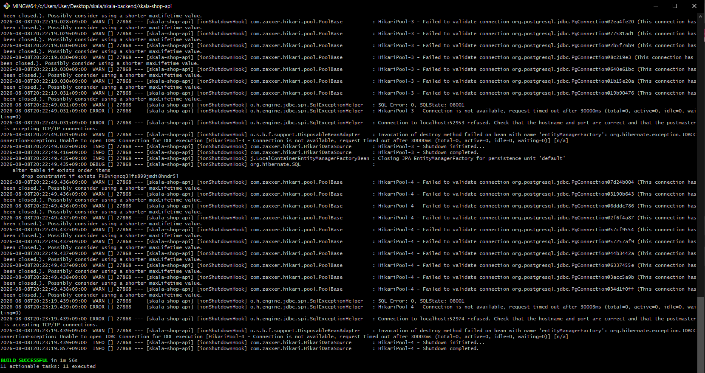

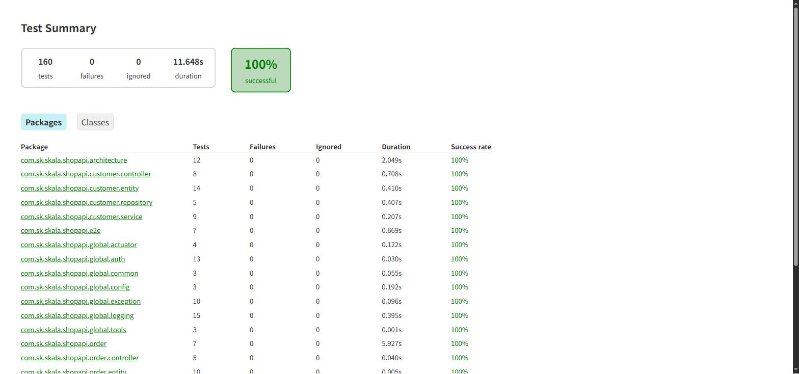

> **이 캡처를 찍는 과정에서 한 번 걸렸다.** 처음 `./gradlew build`를 돌리니 **2초 만에
> BUILD SUCCESSFUL**이 나왔다. Gradle이 최신 상태라 판단해 테스트 태스크를 건너뛴 것이고,
> 테스트 결과 파일은 3시간 전 것이었다. **"성공 화면이 일을 안 했다는 증거 없이 나온 사례"** 라
> `clean build`로 다시 돌려 찍었다. 4.4의 주제가 캡처 작업에서도 재현됐다.

### 100% 커버리지를 목표로 하지 않는다

DTO·엔티티 getter까지 테스트하면 **"테스트를 위한 테스트"** 가 된다.
숫자는 오르지만 회귀를 막는 능력은 늘지 않는다. 그래서 제외 대상을 정하고 **사유를 남겼다.**

| 제외 | 사유 |
|---|---|
| `ShopApiApplication` | `main()` 한 줄. 검증할 분기가 없다 |
| `global/config/**` | `@Bean` 정의를 테스트하는 것은 **스프링을 테스트하는 것**이다. 실제 동작은 E2E·`@WebMvcTest`가 검증한다 |
| `**/dto/**` | Lombok 생성분을 빼면 남는 것이 거의 없다. 필드 존재 여부(비밀번호 미노출 등)는 **Controller 테스트가 JSON으로 단언**한다 |
| **Lombok 생성 메서드** | 아래 별도 |

#### ★ Lombok 제외를 클래스 단위가 아니라 `addLombokGeneratedAnnotation`으로 한 이유

`lombok.config`에 이 한 줄을 넣으면 Lombok이 생성하는 메서드마다 `@lombok.Generated`가 붙고,
JaCoCo가 그것을 인식해 집계에서 뺀다.

```
lombok.addLombokGeneratedAnnotation = true
```

**클래스 단위 제외보다 정밀하다.**

| 방식 | 결과 |
|---|---|
| JaCoCo `excludes`에 엔티티 클래스를 넣는다 | getter·`equals`와 함께 **`usePoint`·`addQuantity` 같은 사람이 쓴 코드도 통째로 빠진다** |
| **`addLombokGeneratedAnnotation`** | **같은 클래스 안에서 생성 메서드만 빠지고 사람이 쓴 코드는 그대로 집계된다** |

엔티티는 이 프로젝트에서 **불변식을 지키는 가장 중요한 코드**가 있는 곳이다(2부 ④).
그걸 커버리지 집계에서 빼면 게이트가 지켜야 할 것을 지키지 못한다.
**제외의 단위가 커질수록 게이트의 의미가 줄어든다.**

### 게이트 85 / 80 — 목표치가 아니라 바닥이다

**리포트만 만들고 아무도 보지 않으면 게이트가 아니다.**
JaCoCo 검증을 `check` 태스크에 물려 **`./gradlew build`가 게이트를 지나가게** 했다.

```
JaCoCo 커버리지 (게이트: 라인 85% / 분기 80%)
  INSTRUCTION   92.6%  (1450/1566)
  BRANCH        86.3%  (88/102)
  LINE          91.4%  (331/362)
  METHOD        93.5%  (86/92)
  CLASS        100.0%  (22/22)
```

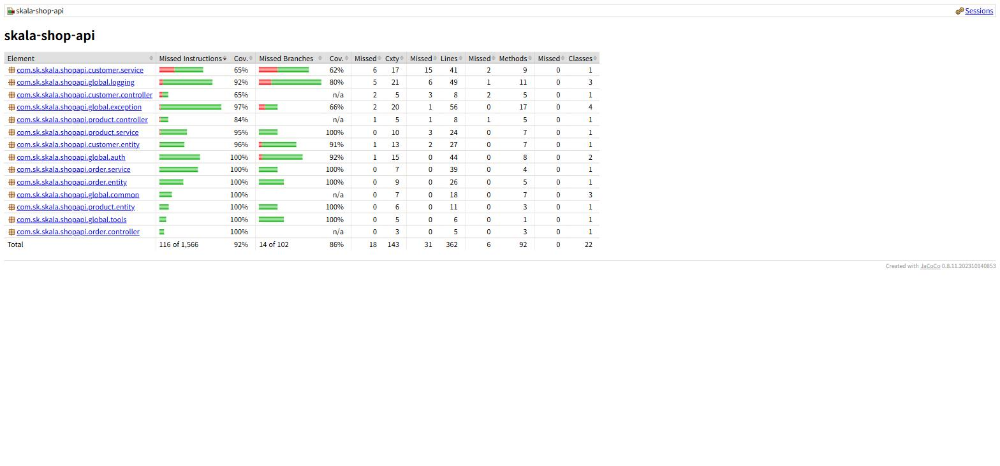

**임계치를 실측보다 낮게 잡은 것이 의도다.** 실측(91.4)에 맞춰 91%로 잡으면
정상적인 리팩터링 한 번에 게이트가 깨지고, 그러면 **임계치를 낮추는 습관**이 생긴다.
게이트가 매번 내려가면 그건 게이트가 아니다.

> **숫자 자체에 이론적 근거는 없다.** 이 프로젝트 규모에서 관측된 값에서 여유를 뺀 것이다.
> **근거를 못 대는 부분은 못 댄다고 적는다.**

### curl E2E 48건을 자동화 테스트로 대체하지 않는다

`@SpringBootTest` E2E(`ShopScenarioTest` 7건)가 있는데도 curl 스위트 48건을 남겼다.
**중복이 아니라 검증 대상이 다르다.**

| | 검증 대상 |
|---|---|
| `ShopScenarioTest` (MockMvc) | **애플리케이션 내부 배선** — 컨트롤러·서비스·JPA·JWT가 이어지는가 |
| **curl E2E 48건** | **배포된 프로세스** — 실제 소켓, 실제 HTTP, 실제 `Set-Cookie` 헤더, `docker compose`로 뜬 컨테이너 |

**MockMvc는 서블릿 컨테이너를 거치지 않는다.** 다음 항목들은 원리적으로 검증 범위 밖이다.

- **포트 바인딩** — 컨테이너가 실제로 8080을 열었는가
- **실제 `Set-Cookie` 헤더** — `HttpOnly`·`SameSite=Strict`·`Path=/`가 응답 헤더에 실렸는가.
  MockMvc는 스프링이 만든 객체를 보지만, curl은 **네트워크를 지나온 헤더 문자열**을 본다
- **리버스 프록시 뒤에서의 동작** — Phase 6 HA 구성이 정확히 이 층이다
- **`docker compose` 기동 자체** — Phase 0의 이식성 검증이 이 스위트로 이뤄졌다

E2E 48건이 확인하는 것을 실제 출력으로 보면 이렇다.

```
  ✅    쿠키 발급         1
  ✅    HttpOnly              1
  ✅    SameSite=Strict       1
  ✅    Path=/                1
```

**이 네 줄은 MockMvc로 얻을 수 없는 종류의 확인이다.**
그리고 이 스위트는 **머신을 옮길 때 실제로 값을 했다** — Windows에서 `docker compose up --build`가
`./gradlew: not found`로 죽은 것을, 애플리케이션 테스트가 아니라 이 층이 잡았다 (4.4).

---

## 4.2 변이 테스트 — 이 부의 중심

### 왜 필요한가

> **커버리지는 "이 줄이 실행됐다"만 말한다. "이 줄이 옳은지 확인됐다"고는 말하지 않는다.**
> 단언 없는 테스트도 라인을 밟으면 숫자가 오른다.

이것을 말로만 적어두면 원론이다. **실제로 확인하는 방법이 변이 테스트다** —
운영 코드를 일부러 깨뜨려 **테스트가 실제로 실패하는지** 본다.

```
"실패할 수 없는 테스트는 없는 테스트보다 나쁘다."
```

없으면 검증이 없다는 걸 알지만, **있으면 검증된 줄 안다.**

### ★ 대표 사례 — 커버리지 93%인 `SessionHandler`가 인증 우회 회귀를 잡지 못했다

계층별 테스트를 다 짠 시점에 `SessionHandler`의 라인 커버리지는 **93%** 였다.
잘 덮인 클래스로 보인다.

여기에 변이를 하나 넣었다.

> **"서명 검증에 실패해도 페이로드의 `sub`를 그대로 신뢰한다"**

**테스트 104건 중 단 하나도 실패하지 않았다.**

이것은 사소한 회귀가 아니다. **위조 토큰으로 남의 계정에 접근할 수 있는 상태**이고,
2부에서 다룬 BOLA 방어(②)를 통째로 무력화한다 — 소유권 검사는 JWT에서 꺼낸 ID를 믿는데,
그 ID의 출처가 검증되지 않기 때문이다.

#### 원인 — 그 코드에 들어갈 일이 없었다

다른 테스트들이 전부 **정상 토큰으로 로그인해 그 쿠키를 다시 쓰는 경로**만 밟았다.

```
로그인 → 유효한 JWT 발급 → 그 쿠키로 주문/조회 → ...
```

**그 경로에서는 서명이 항상 유효하다.** 따라서 `catch (JwtException)` 블록에 **들어갈 일이 없고,
들어가지 않는 코드는 어떻게 고쳐놔도 아무도 모른다.**

정상 토큰만 쓰는 것은 잘못된 테스트 작성이 아니다 — E2E도 Controller 테스트도 그렇게 짜는 것이 맞다.
**빠진 것은 "잘못된 토큰"이라는 입력 자체였다.**

#### 조치와 재확인

`SessionHandlerTest` **8건**을 추가했다. 전부 **비정상 입력**이다.

| 무엇 | 막는 것 |
|---|---|
| 다른 키로 서명한 토큰 | 서명 위조 |
| **페이로드만 바꾼 토큰** | 이 변이가 노린 바로 그 경로 |
| 만료 토큰 | 시간 검증 |
| 쓰레기 값 · 쿠키 없음 | 파싱 실패 경로 |
| 보안 플래그 | `HttpOnly`·`SameSite` 회귀 |
| 약한 시크릿 fail-fast | 기동 시점 검증 |

**같은 변이를 다시 넣으니 이번엔 3건이 잡았다.**

> 이 항목은 **`PLAN.md`의 Phase 4 계획에 없었다.** 변이 테스트를 돌리다 나와서 추가된 것이고,
> 계획서에는 *"계획에 없던 항목. 아래 참조"* 로 남아 있다.

### ★ 전수 조사 후의 정정 — 문제는 도구가 아니라 집계 단위였다

위 이야기를 그대로 두면 **"커버리지는 못 믿는다"** 로 읽힌다.
Phase 5 착수 전 예외·실패 분기를 전수 조사한 결과, **그 결론은 절반만 맞았다.**

`SessionHandler`를 "93%"로 본 것은 **클래스 단위 백분율**이다.
같은 JaCoCo 리포트를 **라인·분기 단위로 열면 도구는 이미 정확히 말하고 있었다** —
`catch (JwtException)` 블록은 `mi > 0`(미실행)으로 찍혀 있었다.

전수 조사에서 나온 **미검증 3건이 전부 "라인 단위로는 미실행"으로 표시된 곳**이었다.

| 구멍 | 클래스 백분율 | **라인 단위** |
|---|---|---|
| 500 응답 정보 유출 | `GlobalExceptionHandler` **74%** | 101~104 **미실행** |
| `ParameterException` → 400 | 같은 클래스 **74%** | 42~43 **미실행** |
| `supportsParameter` 타입 검사 | `LoginCustomerArgumentResolver` **100%** | 25 **미실행**, **분기 1/2** |

**세 번째가 특히 분명하다 — 라인 커버리지 100%인데 분기는 1/2다.**
백분율 하나로 뭉개면 "완벽히 덮인 클래스"가 되고, 분기 열을 보면 절반이 비어 있다.

#### 정정된 결론

| 원래 서술 | 정정 |
|---|---|
| 커버리지는 "실행됐다"만 말한다 | ✅ **그대로 맞다** (단언 없는 테스트도 라인을 밟는다) |
| 그래서 커버리지로는 알 수 없었다 | ❌ **틀렸다.** **"밟히지 않은 곳"에 대해서는 도구가 이미 정확했다.** 우리가 안 봤을 뿐이다 |

> **"커버리지는 못 믿는다"가 편한 결론이었다.**
> 그렇게 정리하면 도구를 탓하고 끝나므로 더 볼 것이 없어진다.
> **실제로는 리포트를 한 단계 더 열면 됐다.**
>
> 도구를 탓하는 결론은 항상 편하다 — 고칠 것이 내 쪽에 없기 때문이다.
> 그리고 편하다는 것 자체가 그 결론을 의심할 이유다.

#### 여기서 나온 3단계 절차

| 단계 | 무엇을 | 왜 |
|---|---|---|
| **① 미실행 목록으로 연다** | 클래스 단위 백분율이 아니라 **미실행 라인·부분 분기 목록**을 본다 | 85% 게이트는 회귀 방지용 **바닥**이고, **읽어야 할 것은 그 숫자가 아니라 목록**이다 |
| **② 의도를 확인한다** | 각 미실행 항목이 *"테스트가 필요 없는 곳"* 인지 *"빠뜨린 곳"* 인지 판정한다 | 미실행이 전부 결함은 아니다. 판정 없이 다 채우면 다시 "테스트를 위한 테스트"가 된다 |
| **③ 좁은 범위에만 변이를 넣는다** | 밟히는데 단언이 없는 경우만 남는다 | 변이 테스트는 여전히 필요하다 — **"밟혔는데 단언이 없는" 경우는 커버리지로 알 수 없다.** 다만 **훨씬 좁은 범위**이고, 먼저 미실행 목록을 비우면 변이를 돌릴 곳도 줄어든다 |

**순서가 요점이다.** 변이 테스트부터 돌리면 비용이 크다(전체 테스트를 46번 돌린다).
커버리지 리포트를 제대로 읽으면 **그중 상당수를 훨씬 싸게 먼저 걷어낼 수 있다.**

### 변이 46건 — 분포와 역검증

Phase 4에서 임시 스크립트로 시작한 것을 정식 도구(`docs/verify/mutate.py`)로 만들었다.

```
$ python3 docs/verify/mutate.py --list
  · [mutate] python 3.9.2 @ C:\...\Python39\python.exe
  domain      9건
  layer      12건
  arch       10건
  exception  15건
```

| 세트 | 무엇을 깨뜨리는가 | 대응 테스트 |
|---|---|---|
| `domain` **9** | 엔티티 불변식 — 잔액 검사, 수량 검사, 스냅샷 계산 | 도메인 순수 JUnit |
| `layer` **12** | 계층 계약 — Service 분기, 상태 매핑, Repository 쿼리 | Service·Repository·Controller |
| `arch` **10** | 아키텍처 규칙 — **위반 코드를 클래스에 주입**한다 | ArchUnit |
| `exception` **15** | 예외 → HTTP 표현 — 상태 코드, 메시지 형식, 정보 유출 | Controller·`GlobalExceptionHandlerTest` |

**결과: 46건 전부 잡혔다.**

#### ★ 이 도구는 운영 코드를 변형한다 — 안전망이 도구의 일부다

**Phase 4에서 이 스크립트의 이전 판이 사고를 냈다.** 타임아웃으로 SIGKILL 종료되면서
`SessionHandler`·`CustomerService`에 **보안을 약화시키는 변이를 남겼다.**
`finally`만으로는 부족하다 — **SIGKILL은 잡히지 않는다.**

그래서 복원을 **3중**으로 두고, 마지막 한 겹은 프로세스 밖에 둔다.

| 겹 | 수단 | SIGKILL에도 남는가 |
|---|---|---|
| 1 | `finally`로 원본 복원 | ❌ |
| 2 | SIGTERM 핸들러에서도 복원 | ❌ (SIGKILL은 못 잡는다) |
| 3 | **`git checkout -- src/main/java`** | ✅ **프로세스 밖 수단** |
| 0 | **실행 전 작업 트리가 clean한지 확인** — dirty면 거부한다 | 사고를 **되돌릴 수 있는 상태**로 강제한다 |

**0번이 3번을 유효하게 만든다.** 작업 트리가 이미 dirty하면 `git checkout`이
사용자의 미커밋 작업까지 지운다. 그래서 **복원 수단이 안전한 상태에서만 실행을 허용**한다.

`--batch`로 쪼개 도는 것도 같은 이유다 — 한 번에 46건을 돌리면 실행이 길어지고,
**길어질수록 중간에 강제 종료될 확률이 오른다.**

---

## 4.3 ArchUnit — 문서 대신 테스트로 경계를 강제한다

### 도입 근거 — 성실함은 이미 두 번 실패했다

규칙을 문서에 적어두는 것으로 충분한지, **이 프로젝트의 실적으로 확인할 수 있었다.**

| # | 무엇을 써뒀나 | 무엇을 했나 |
|---|---|---|
| 1 | `DECISIONS.md` 7절 **"실패하려면 시끄럽게 실패해야 한다"** | 다음 Phase에서 **fail-late 코드를 짰다** — 시크릿이 너무 짧아도 앱이 정상 기동하고, 첫 로그인에서야 500으로 터졌다 |
| 2 | 검증 스크립트 헤더에 **브레이스 확장 경고** | **같은 실수를 반복했다** (4.4) |

**2번에서 실제로 막아준 것은 문서가 아니라 `chk`의 인자 수 검사 코드였다.**
경고문은 내가 직접 쓴 것이고 파일 맨 위에 있었는데도 소용이 없었다.

> **규칙은 지키자고 다짐하는 것이 아니라 어길 수 없게 만드는 것이다.**
> `CLAUDE.md`의 절대 규칙 — 엔티티 public setter 금지, 도메인 간 Repository 직접 참조 금지,
> Service의 웹 의존성 금지 — 은 **Phase 3까지 현재 성실함에만 기대고 있었다.**

### 12건이 강제하는 것

| 규칙 | 무엇을 막는가 |
|---|---|
| Controller는 Repository를 직접 호출할 수 없다 | 계층 건너뛰기 |
| 도메인 간 Repository 직접 참조 금지 | MSA 분리 시 데이터 접근 코드를 헤집어야 하는 상태 |
| **패키지 순환 참조 금지** | 아래 — **실제 위반을 찾았다** |
| 엔티티에 public setter가 없어야 한다 | 풍부한 도메인 모델의 붕괴 |
| Service는 웹 타입(`HttpServletRequest`·`Cookie`)에 의존할 수 없다 | 도메인이 웹에 묶이는 것 |
| Service는 `Response`를 반환하지 않는다 | HTTP 표현이 도메인으로 내려오는 것 |
| (그 외 6건 — 명명 규칙, 애노테이션 배치, 필드 주입 금지 등) | |

### ★ 첫 실행에서 실제 위반을 찾았다

순환 검사가 걸렸다.

```
customer.controller.CustomerController → order.service.OrderService
order.service.OrderService             → customer.service.CustomerService
```

**`DECISIONS.md` 4절은 이렇게 적고 있었다.**

> *"의존은 `order → customer`, `order → product` **단방향**이다.
> `customer`와 `product`는 `order`를 알지 않는다."*

**세 Phase 동안 그 문장은 사실이 아니었고, 사람은 못 봤다.**

#### 왜 못 봤는가 — 늘 서비스 계층만 봤다

`Service`·엔티티 계층은 **처음부터 깨끗했다.** 각 Service의 의존은 이랬다.

| Service | 의존 |
|---|---|
| `ProductService` | `ProductRepository` |
| `CustomerService` | `CustomerRepository` |
| `OrderService` | `OrderItemRepository` + `CustomerService` + `ProductService` |

**여기만 보면 완벽하게 단방향이다.** 그리고 규칙을 검토할 때마다 본 것이 정확히 이 표였다.
의존 방향을 확인한다는 것은 곧 "Service가 무엇을 주입받는가"를 본다는 뜻이었고,
**웹 계층은 그 검토 대상에 들어간 적이 없었다.**

새는 곳은 `CustomerController`였다. **주문 엔드포인트 3종**(`/{customerId}` 조회, `/order`, `/cancel`)을
서빙하고 있었고, 그러려면 `OrderService`를 주입받아야 한다.

#### 원인 — URI 접두사와 소유 도메인을 같은 것으로 봤다

이 코드를 `customer` 패키지에 둔 이유는 하나였다 — **URI가 `/api/customers`로 시작하니까.**

> **URI 접두사와 소유 도메인은 별개다.**
> `/api/customers/order`를 서빙하는 것은 **고객 서비스가 아니라 주문 서비스**다.
> 응답이 고객 정보가 아니라 주문 목록이라는 점이 그것을 말하고 있었다.

#### 조치 — `ignoreDependency`로 덮지 않고 실제로 해소했다

ArchUnit에는 특정 의존을 예외 처리하는 `ignoreDependency`가 있다.
**쓰지 않았다.** 그것을 쓰면 테스트는 초록색이 되지만 순환은 그대로 남는다 —
**규칙을 강제하려고 만든 도구로 규칙 위반을 숨기는 셈이다.**

`order/controller/OrderController`를 신설해 주문 엔드포인트 3종을 옮겼다.

- **URI·HTTP 메서드·요청/응답 형식은 그대로 유지**했다 (SPEC이 고정한 계약)
- **MSA로 나눌 때도 이 배치가 맞다** — 주문 서비스로 분리하면 이 컨트롤러가 통째로 따라간다

1부에서 API를 **상품 5 / 고객 5 / 주문 3**으로 나눈 것이 이 조치의 결과다.

### 각 규칙을 일부러 위반해 역검증했다

**통과만 보고 넘어가면 규칙이 강제되는지 알 수 없다.**
`arch` 세트 10건은 각 규칙을 위반하는 코드를 **클래스 본문에 주입**하는 방식으로 만들었다.

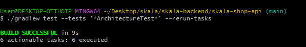

*(화면에는 실행 결과만 있고 건수는 없다. ArchUnit 12건은 위 `s16` 리포트의 `architecture` 항목에서 확인된다.)*

**10건 전부 잡혔다.**

> 이 역검증이 없으면 "ArchUnit 12건 통과"는 **"규칙이 지켜지고 있다"** 와
> **"규칙이 아무것도 검사하지 않는다"** 를 구별하지 못한다.
> 실제로 순환 규칙 하나는 처음에 잘못된 패키지 패턴을 잡고 있어 **아무것도 검사하지 않을 뻔했다.**

---

## 4.4 검증 도구 자체의 신뢰도 — 결함 13건

**테스트를 검증하는 것까지가 4.2·4.3이라면, 여기서는 측정·검증 도구 자체를 다룬다.**

이 프로젝트에서 **측정 대상보다 측정 장치가 더 자주 틀렸다.** Phase 3에서 4건을 표로 남겼고,
Phase 6까지 **13건**이 쌓였다.

### ★ 즉시 실패 vs 조용히 틀린 결론 — 이 구분이 도구 설계 원칙이다

13건을 두 부류로 가르면 **성격이 완전히 다르다.**

| 부류 | 해당 | 성질 |
|---|---|---|
| **즉시 실패** | 9, 10, 11 — **3건** | 실행이 멈춘다. **비용은 시간뿐이고 잘못된 결론으로 가지 않는다** |
| **조용히 틀린 결론** | 1, **2**, 3, 4, 5, 6, 7, 8, 12, 13 — **10건** | **수치가 나온다.** 그럴듯해서 **그대로 문서에 박힐 수 있다** |

두 부류는 위험의 크기가 다르다. 즉시 실패는 **시간을 잃고**, 조용히 틀린 결론은 **판단을 잃는다.**

| # | 무엇이 | 어떻게 보였는가 | 무엇이 잡았는가 |
|---|---|---|---|
| 1 | grep 패턴이 로거명과 불일치 | SQL 0개 | 0이 명백히 틀린 값 |
| 2 | 측정 픽스처가 DB를 오염 | 대조군이 2 → 1로 변동 | **대조군** |
| 3 | 스레드 배리어 교착 | 소요 30,213ms | 타임아웃 값과 일치 |
| 4 | TPS 비교의 분모 불일치 | 낙관적 락이 더 빠름 | 성공 14/100 |
| 5 | `countStatus` 삽입 오류 | `resp_2xx`가 `http_reqs`와 **완전 일치** | 엔드포인트별 태그 분리 (**세 번 헛돈 뒤**) |
| 6 | 부하 모델과 측정 목적 불일치 | "동시 주문 정합성" 이름으로 **잔액 소진**을 재고 있었다 | 성공 응답 내용 확인 |
| 7 | **측정 대상이 실행되지 않음** | 캐시 on/off 차이 0.3% → "이득 없음"으로 읽혔다 | 결론 직전 시나리오 파일을 열어봄 |
| 8 | 부하가 서버를 포화시키지 못함 | `sleep(0.1)`로 327 req/s에 묶임 | 용량(1,000+)과 대조 |
| **9** | MSYS 경로 변환이 python 인자까지 차단 | `can't open file` | **즉시 실패** |
| **10** | `fromisoformat`이 소수점 5자리 거부 | `ValueError` | **즉시 실패** |
| **11** | k6 원시 시계열 347MB | 저장소에 넣을 수 없다 | **즉시 실패** |
| 12 | **동시 append 유실** | 종료 로그 확인 블록이 **통째로 사라짐** | "블록은 있는데 출력이 없다"는 모순 |
| 13 | **처치가 전달되지 않음** | graceful/immediate **두 조건이 동일한 결과** | **측정 전 env 확인 가드** |

### 이 프로젝트의 모든 가드는 두 번째 부류를 첫 번째로 옮기는 장치다

이것이 4.4의 정리다.

| 가드 | 무엇을 확인하는가 | 없으면 |
|---|---|---|
| `pyguard.sh` — **표식 확인** | 인터프리터가 살아 있는가 | 스크립트가 실행되지 않고 성공처럼 끝난다 |
| `sweep.sh` — **파싱 실패 시 중단** | 표의 칸이 실제로 채워졌는가 | 빈 표가 `exit 0`으로 기록된다 |
| `run.sh` — **`http_reqs` 존재 검사** | 측정이 성립했는가 | 조건 헤더만 있고 수치는 없는 파일이 남는다 |
| `retro-check.sh` — **대조군 강제** | 검사기가 실패할 수 있는가 | "전부 ✅"가 "아무것도 못 잡는다"와 구별되지 않는다 |
| `shutdown-analyze.py` — **인플라이트 0이면 무효** | 잴 대상이 존재했는가 | 아무 일도 없던 실행이 "차이 없음"이 된다 |
| **측정 전 env 확인** | **처치가 컨테이너에 도달했는가** | 처치가 가해진 적 없는 실험의 결론이 남는다 |

> **13번이 그 값을 직접 보여줬다.** 가드가 없었다면
> **"세 번째 독립 시도에서도 변별되지 않았다"** 를 문서에 박았을 것이고,
> 그 결론은 **처치가 가해진 적 없는 실험**에서 나온 것이었다.
>
> 앞 턴에 *"대조 실험에서는 처치가 가해졌다는 것 자체가 검증 대상"* 이라고 적고 넣은 가드가
> **바로 다음 실행에서 발동했다.**

### 대표 사례 ① — 검증 스크립트가 쓰레기와 쓰레기를 비교하며 통과를 찍고 있었다

Phase 1 4단계에서 E2E 결과가 이상했다.

```
✅ 중복 가입            internal server error      ← 기대값은 DATA_DUPLICATED인데 통과
✅ 1) 가입 포인트       PARSE_ERR                  ← 기대값은 1000000.0인데 통과
```

`bash -x`로 추적하니 **bash 중괄호 확장**이었다.

```
++ post /api/customers '"customerId":"skala14273"'
++ post /api/customers '"customerPassword":"pw1234"'
+ chk '1) 가입 포인트' PARSE_ERR PARSE_ERR 1000000.0
```

`$( )` 안에 큰따옴표를 중첩했더니 따옴표가 풀려 `{...}`가 노출됐고, 중괄호 안의 쉼표 때문에
bash가 이를 **두 단어로 확장**했다. `post`가 조각난 JSON으로 **두 번** 호출되고,
`chk`는 인자를 3개가 아니라 **4개** 받았다.
그래서 **`$2`와 `$3`이 둘 다 `PARSE_ERR`이 되어 "같으니까 통과"** 로 찍혔다.

> **검증 도구가 쓰레기와 쓰레기를 비교하며 성공을 보고하고 있었다. 앱은 멀쩡했다.**

**조치는 세 겹이다.**

1. 중첩 따옴표를 없애고 페이로드를 변수에 먼저 담는다
2. **`chk`에 인자 개수 검사(`[ $# -ne 3 ]`)** 를 넣어 같은 사고가 나면 통과가 아니라 경고가 뜬다
3. 기대값을 일부러 틀리게 바꾼 사본으로 돌려 **스크립트가 실패를 실제로 잡는지 역검증**한다

#### ★ "고쳤으니 됐다"로 넘기지 않았다 — 과거 결과의 신뢰도가 함께 흔들린다

**도구를 고치면 그 도구로 낸 과거 결과가 전부 의심 대상이 된다.**
결함이 언제 유입됐는지 파일 이력으로 추적했다.

| 시점 | 검증 방식 | 영향 |
|---|---|---|
| Phase 0 전체 | 스크립트 없음. 인라인 curl로 응답 원문을 눈으로 확인 | 없음 |
| Phase 1 1~3단계 | 원본 스크립트 (홑따옴표) | 없음 |
| **Phase 1 4단계** | `sed` 수정본 (큰따옴표 중첩) | **거짓 통과 발생** |

**인용 방식 논증만으로는 부족해서, 고친 스크립트로 과거 커밋 5개를 실제로 다시 돌렸다.**
버전 무관 항목 18개만 추린 검증본을 각 커밋에서 기동해 실행했다.

```
82c4c37 Phase 0 기준점      18/18 ✅
2adfc0c 1단계 대리키         18/18 ✅
1bf0167 2단계 총액 스냅샷    18/18 ✅
bcb8058 3단계 BigDecimal     18/18 ✅
fb19442 4단계 DTO 분리       18/18 ✅
```

**과거의 "통과" 보고는 실제로도 통과였다.**
특히 Phase 6 성능 비교의 근거인 `phase0-baseline`이 검증된 상태임을 확인했다.

> **이 절차의 값은 결과가 아니라 확인했다는 사실에 있다.**
> 결과가 "문제 없음"이었다고 해서 하지 않아도 됐던 일이 되지 않는다 —
> **하기 전에는 문제가 있는지 없는지 알 수 없었다.**

같은 절차를 Phase 6에서 한 번 더 했다. 새 가드를 넣은 뒤 **macOS에서 잰 과거 측정 11개**에
같은 검사를 소급 적용했고, 정식 도구(`docs/verify/retro-check.sh`)로 편입했다.

### 대표 사례 ② — pyguard: 방어는 실패가 일어나는 층보다 위에 있어야 한다

Windows로 옮긴 뒤 검증 도구들이 **아무 일도 하지 않고 성공처럼 끝났다.**

```
$ echo '{"a":1}' | python3 -c "import sys,json;print(json.load(sys.stdin)['a'])"
Python           <- 이것만 찍고
exit=49          <- 끝난다. 스크립트는 실행조차 되지 않았다
```

`python3`이 **MS Store 앱 실행 별칭(스텁)** 으로 잡힌 것이다.
(원인은 PATH 순서가 아니었다 — 실제 파이썬 폴더가 이미 앞에 있었고, **그 폴더에
`python3.exe`가 없었을 뿐**이라 뒤쪽 스텁이 이름을 가져갔다. `python`은 정상이었다.)

#### ★ 한 번 헛짚었다 — 파일 안 검사는 구조적으로 불가능하다

처음엔 **"`.py` 시작 시점에 검사를 넣으면 된다"** 고 생각했다.

**넣을 수 없다. 스텁은 대상 파일을 실행하지 않는다.**
파일 안의 코드는 **파일이 실행돼야 도는 것**이므로, 파일이 실행되지 않는 실패를
파일 안에서 잡는 것은 원리적으로 불가능하다.

> **방어는 실패가 일어나는 층보다 한 층 위에 있어야 한다.**

그 자리가 **호출 경계**(`docs/verify/pyguard.sh`)다. 층을 나누면 이렇게 된다.

| 층 | 무엇을 맡는가 |
|---|---|
| 환경 | 실제 파이썬 폴더에 `python3.exe` 확보 — **이 머신에만 유효하다** |
| **호출 경계 (`pyguard.sh`)** | **인터프리터가 살아 있는지 확인하고, 아니면 `exit 1`** — 저장소에 남는다 |
| 파일 안 (`.py`) | 검사가 아니라 **시작 배너** — 배너가 없으면 "이 파일은 실행되지 않았다" |

#### 왜 종료 코드가 아니라 표식인가

**스텁도 종료 코드는 낸다.** 살아 있는지 물으려면 **인터프리터가 직접 만들어낸 것**을 받아야 한다.

```bash
_pg_out=$("$1" $2 -c 'import sys; print("PYGUARD_OK %d %d" % sys.version_info[:2])' 2>/dev/null) || return 1
case "$_pg_out" in
  "PYGUARD_OK "*) ;;
  *) return 1 ;;      # 스텁은 여기서 걸린다
esac
```

이것은 이 프로젝트에서 **세 번째로 만난 같은 형태**다.

| Phase | 겉보기 | 실제 |
|---|---|---|
| 3 | 쿼리 0개 = N+1 해결 | **401로 튕겨서** 쿼리가 안 나간 것 |
| 5 | 로그에 비밀번호 0건 = 마스킹 성공 | **로그가 아예 없었던 것** |
| **6** | **종료 코드 = 실행됨** | **스텁이 파일을 실행조차 안 한 것** |

**셋 다 "안 왔다"를 "막혔다"로 읽은 것**이고, 처방도 같다 —
**결과의 부재가 아니라 산출물의 내용으로 확인한다.**

> **환경 문제를 환경에서만 고치면 다음 머신에서 다시 난다.**
> 이 머신에서 고친 것은 `python3.exe` 사본 하나이고, **저장소에 남는 것은 `pyguard.sh`** 다.
> 같은 판단으로 `gradlew` CRLF는 `.gitattributes`로, MSYS 경로 변환은 `hostpath()`로 저장소에 넣었다.

### ★ 역검증의 역검증 — 가드를 망가뜨렸는데 13건이 그대로 통과했다

`pyguard.sh`의 역검증으로 `pyguard-selftest.sh` **13건**을 만들었다.
스텁을 모사한 가짜 실행 파일(`printf "Python "; exit 49`)로 재현한다.

| # | 상황 | 기대 |
|---|---|---|
| A | 모든 후보가 스텁 | `exit 1` + 안내 |
| B | `python3`만 스텁, `python` 정상 | 폴백 후 정상 실행 |
| C | 스텁 환경에서 `e2e.sh` | **검사 시작 전** 중단 (**통과 표시 0건**) |
| D | 요구 버전 미달 | `exit 2`, 작업 안 함 |
| E | 스텁으로 `.py` 직접 실행 | **배너 없음** |
| F | 정상 환경 | 46건 목록 + 한글 정상 |

**그리고 이 역검증 자체를 역검증했다 — 가드를 망가뜨려놓고 13건을 돌렸다.**

**13건이 그대로 통과했다.**

한순간 "역검증이 무력하다"로 읽혔다. **원인은 그게 아니었다.**

> **2차 방어선(버전 숫자 비교)이 잡고 있었다.**
> 표식 확인을 망가뜨려도, 스텁이 돌려주는 출력에서 버전 숫자를 뽑지 못해 걸렸다.
> **파괴가 불충분했던 것이지 역검증이 무력한 게 아니었다.**

**프로브를 완전히 무력화하니 8건으로 떨어지며 `exit 1`.** 역검증은 정상 작동하고 있었다.

그리고 그때 **C의 "통과 표시 0건"이 1이 됐다.**

> **망가진 가드에서 `e2e.sh`가 거짓 ✅를 하나 만든다.**
> 이 작업을 한 이유 전체가 그 한 줄에 있다.

#### 여기서 배운 것 — 역검증이 실패했을 때 결론을 서두르지 않는다

"가드를 깨뜨렸는데 테스트가 통과했다"는 두 가지로 읽힌다.

| 해석 | 처방 |
|---|---|
| 테스트가 무력하다 | 테스트를 다시 짠다 |
| **파괴가 불충분했다** | **더 깊이 깨뜨려본다** |

**둘을 구별하지 않으면 멀쩡한 방어를 버리게 된다.**
구별하는 방법은 하나다 — **깨뜨린 것보다 더 깊이 깨뜨려보고, 그때 잡히면 두 번째다.**
이 경우 프로브를 완전히 무력화하자 8건이 떨어졌으므로 **방어는 층으로 작동하고 있었다.**

---

## 4.5 반복 패턴 — "검증하는 쪽을 검증하지 않았다"

같은 형태의 실수가 이 프로젝트에서 **다섯 번** 나왔다.
처음엔 *"그럼 그 사이엔? 을 안 물었다"* 로 묶었는데, 그건 **사후 수습의 관점이라 다음을 예측하지 못한다.**
더 정확한 각도는 **검증 장치 자체를 점검하지 않았다**는 것이다.

| # | 검증하지 않은 것 | 결과 |
|---|---|---|
| 1 | **기준** — 구현을 검증할 원본 자료를 확보하지 않음 | 클래스명·패키지 **6곳** 어긋남 |
| 2 | **범위** — 대조 단위를 정하지 않음 | 메서드명 **9곳** 어긋남 |
| 3 | **도구** — 스크립트가 작동하는지 확인 안 함 | **거짓 통과** (4.4 ①) |
| 4 | **조건** — 시나리오 설계가 무엇을 배제하는지 묻지 않음 | **동시 첫 주문 500 — 세 Phase 동안 미발견** (2부 ⑥) |
| 5 | **처치 전달** — 처치가 대상에 도달했는지 확인 안 함 | graceful/immediate **두 조건이 동일한 결과** (4.4 표 13번) |

**매번 "검증했다"고 믿은 상태였다는 점이 같다.**
검증의 **산출물**(통과/불일치 목록)만 보고 검증의 **입력**(기준·범위·도구·조건·처치)은 보지 않았다.

### 앞의 셋과 네 번째는 원인이 정반대다

**1~3은 검증이 허술해서 생겼다. 4는 반대로 검증이 정교해서 생겼다.**

Phase 3의 동시성 테스트는 *"경합 지점을 하나만 남긴다"* 는 이유로 스레드마다 **서로 다른 상품**을
주문하게 했다. 고객 행 경합만 남겨 낙관적 락의 효과를 깨끗하게 보려는 설계였고,
**그 목적은 실제로 달성했다.**

**그리고 그 설계가 동시 첫 주문 결함을 정확히 배제한다.**
상품이 서로 다르면 `(고객, 상품)` 조합이 겹치지 않아 복합 UNIQUE 경합이 **원천적으로 일어날 수 없다.**

> **신호 대 잡음을 높이려고 변수를 하나로 줄이는 것은 좋은 실험 설계다.
> 그런데 줄인 변수 쪽에 있던 결함이 함께 사라진다.**
>
> **좋은 격리는 공짜가 아니라 관측 범위를 대가로 지불한다.**

### 다섯 번째는 관측이 아니라 처치 쪽이다

1~4는 전부 **"보는 쪽"** 의 문제다 — 무엇을 기준으로, 어디까지, 어떤 도구로, 어떤 조건에서 보는가.

**5는 반대편이다.** 관측은 정확했다. `SERVER_SHUTDOWN=immediate`로 돌린 실행과
`graceful`로 돌린 실행의 결과를 정확히 측정했고, 정확히 같았다.

**두 실행이 실제로는 같은 조건이었기 때문이다.**
환경변수가 `docker-compose.yml`의 `environment:` 블록에 없어서
**컨테이너에 도달하지 않았다.** 처치가 가해진 적이 없다.

> **대조 실험에서는 "처치가 가해졌다"는 것 자체가 검증 대상이다.**
> 관측을 아무리 정밀하게 해도, 두 조건이 같으면 잴 것이 없다.

### 처방이 각각 다르다

**이 표의 요점은 다섯 개를 나열하는 것이 아니라, 처방이 다르다는 것이다.**

| # | 처방 | "더 꼼꼼히"가 통하는가 |
|---|---|---|
| 1 **기준** | 원본을 확보하고 나서 시작한다. 기억으로 대조하지 않는다 | ✅ 통한다 |
| 2 **범위** | 대조 단위를 **먼저 선언**한다 (클래스? 메서드? 시그니처?) | ✅ 통한다 |
| 3 **도구** | 기대값을 일부러 틀리게 바꿔 **실패할 수 있는지** 확인한다 | ✅ 통한다 |
| 4 **조건** | **"이 실험 설계는 무엇을 볼 수 없게 만드는가"** 를 묻는다 | ❌ **통하지 않는다** |
| 5 **처치** | 측정 **전에** 처치가 대상에 도달했는지 확인하는 가드를 둔다 | ❌ **통하지 않는다** |

**4에 "더 꼼꼼히"가 통하지 않는 이유** — 꼼꼼할수록 격리가 깨끗해지고 **맹점도 커진다.**
그리고 그 질문은 **실험을 설계하는 그 순간에만** 물을 수 있다.
측정이 끝난 뒤에는 "안 나왔다"와 "볼 수 없었다"가 구별되지 않는다.

**5에 통하지 않는 이유** — 아무리 꼼꼼히 봐도 **관측 쪽만 보고 있기 때문**이다.
처치 전달은 관측의 정밀도와 무관한 축이고, **가드라는 별도 장치로만 확인된다.**

### 이 각도의 값 — 다음에 나올 형태를 예측할 수 있다

Phase 1에서 이 표를 세 줄로 만들었을 때, 앞으로 나올 형태를 함께 적어뒀다.

| 예측 | 결과 |
|---|---|
| **Phase 4 JaCoCo** — "커버리지 숫자가 나오는 것과 의미 있는 경로를 덮는 것은 다르다" | ✅ **발동했다.** 93%인 `SessionHandler`가 인증 우회 변이를 잡지 못했다 (4.2) |
| **Phase 6 k6** — "부하가 실제로 걸렸는지 확인하지 않으면 숫자만 나온다. 성공 응답 비율과 실제 처리 건수를 먼저 확인해야 한다" | ✅ **발동했다.** `load.js`가 캐시 대상을 부르지 않은 것, `sleep(0.1)`로 포화 실패 (4.4 표 7·8번) |

**예측한 함정이 예측한 Phase에서 발동했다.**
막지는 못했지만 **알아보는 시간이 짧았고**, "왜 안 잡혔는가"에 답할 수 있었다.

> **공통 처방은 하나다 — 검증 장치가 "실패할 수 있는지" 먼저 확인한다.**
> 기대값을 틀리게 바꿔보고, 테스트를 일부러 깨뜨려보고, 부하 대상을 내려보는 것.
> 이 부에서 한 일 전체가 그것이다 —
> **변이 46건, ArchUnit 역검증 10건, `pyguard-selftest` 13건, 그리고 그 13건의 역검증.**

---

## 4.6 이 부의 정리

**테스트 160건과 커버리지 91.4%는 결과지 근거가 아니다.**

이 부에서 실제로 근거가 되는 것은 다음이다.

| 무엇 | 확인한 것 |
|---|---|
| **변이 46건** | 테스트가 **실패할 수 있다** — 도메인 9 · 계층 12 · 아키텍처 10 · 예외 15, 전부 잡힘 |
| **ArchUnit 12건 + 역검증 10건** | 경계가 **강제된다.** 그리고 첫 실행에서 실제 순환을 찾았다 |
| **`pyguard-selftest` 13건 + 그 역검증** | 가드가 **발동한다.** 그리고 층으로 작동한다 |
| **과거 커밋 5개 재검증 18/18** | 도구를 고치기 **전의 결과도 유효했다** |
| **소급 검사 11개 + 대조군** | 검사기가 **실패할 수 있다** — `*FAILED*` 파일이 정확히 걸렸다 |

그리고 이 부의 발견 셋은 전부 **"통과하고 있었다"** 에서 나왔다.

- `SessionHandler` — **테스트 104건 통과** 중에, 주입한 인증 우회 변이를 **한 건도 잡지 못했다**
- 패키지 순환 — **문서가 단방향이라고 적은 채** 세 Phase 통과
- E2E 스크립트 — **✅를 찍으면서** 쓰레기와 쓰레기를 비교

> **실패는 눈에 띈다. 거짓 통과는 조용하다.**
> 그래서 이 프로젝트의 검증 작업은 대부분 **"통과가 진짜인지 묻는" 방향**으로 갔고,
> 그것이 4부가 가장 두꺼운 이유다.

---

# 5부 — 측정

**이 부의 주장은 "측정했더니 내 해석이 틀렸다"이다.**

Phase 6의 산출물은 성능 수치가 아니라 **판단**이었다 —
튜닝값을 확정하지 않았고, 만들어둔 캐시를 지웠고, 스스로 쓴 인과 해석을 철회했다.

> **모든 수치의 조건** — 전부 **단일 머신 로컬 측정**이다. 앱·DB·부하 생성기가
> **한 머신의 자원을 나눠 쓴다.** 절대 수치는 실제 배포 환경의 상한이 아니며,
> **의미가 있는 것은 같은 조건에서의 상대 비교**다.
>
> 그리고 **머신이 둘이다.** 작업 도중 macOS에서 Windows로 옮겼다.
> **두 세트의 수치를 같은 표에 넣지 않는다.**
>
> | 세트 | 머신 | 이 부에서 |
> |---|---|---|
> | **A** | macOS · Apple M5(ARM) 10코어 · Docker VM 10CPU/7GB | 5.2 N+1 · 5.3 동시성 · 5.4 락 비교 |
> | **B** | Windows 10 · x86_64 · **Docker Desktop WSL2** · 12CPU/7.7GiB | 5.5 스윕 · 5.6 캐시 · 5.7 HA · 5.9 graceful |

---

## 5.1 측정 원칙

측정을 시작하기 전에 정해둔 다섯 가지다. **네 개는 Phase 3에서 세웠고 다섯째는 Phase 6에서 추가됐다.**

### ① 편차를 먼저 잰다

**측정의 첫 단계는 대상을 재는 것이 아니라 측정기의 흔들림을 재는 것이다.**

같은 설정을 3회 반복해 폭을 구하고, **그보다 작은 차이는 설정 효과로 읽지 않는다.**
이걸 건너뛰면 **노이즈에 이름을 붙이게 된다.**

| 머신 | p95 3회 | 폭 |
|---|---|---|
| A (macOS) | 6.26 / 5.75 / 5.61ms | **0.65ms** |
| B (Windows·WSL2) | 14.25 / 13.49 / 15.40ms | **1.91ms** |

**편차는 코드의 성질이 아니라 측정 환경의 성질이다. 머신이 바뀌면 다시 재야 한다.**
그리고 이 규칙이 실제로 값을 했다 — 5.5에서 다룬다.

흥미로운 것은 **무엇이 흔들리는가**다. 머신 B에서 성공률은 100%로 완전히 안정적이고
req/s도 폭 1%인데, **p95만 폭 13%로 흔들린다.**
**평균이나 TPS만 봤다면 "안정적인 환경"이라고 결론냈을 것이다.**

### ② 판정 기준을 측정 전에 못박는다

편차를 재고 나면 **"이 값보다 크면 신호"** 라는 기준이 나온다.
그 기준을 **결과를 보기 전에** 고정한다.

> 결과를 보고 기준을 정하면 **원하는 결론에 맞출 수 있다.**
> 2.00ms 차이를 보고 나서 "1ms 이상이면 신호"라고 정하는 것과
> 미리 "1.91ms 이상이면 신호"라고 정해두는 것은 전혀 다른 일이다.

같은 이유로 HA 측정에서는 **409 발생률을 사전 등록했다** — 예측값을 파일에 적고 나서 쟀다.
그리고 그 예측이 빗나간 덕에 5.8의 반증이 가능했다.

### ③ 대조군을 둔다 — 변하지 않아야 할 경로가 실제로 변하지 않는지

**변한 것만 보면 변화의 출처를 알 수 없다.**

N+1 측정에서 `GET /api/products/list`를 대조군으로 뒀다. 이 경로는 개선과 무관하므로
쿼리 수가 그대로여야 한다. **그리고 실제로 흔들려서 측정 설계 결함을 알려줬다** (5.2).

### ④ 개선 전 상태를 먼저 실측한다

**고친 뒤에는 측정 기회가 사라진다.**

Lost Update는 `@Version`을 넣기 **전에** 재서 88,000이라는 수치를 얻었다.
넣고 나서는 그 값을 만들 수 없다 — 결함이 없으니까.
같은 이유로 캐시의 낡은 값 재현(6/6)은 `@Cacheable`을 지우면서 **다시 찍을 수 없게 됐다** (2부 2.0).

### ⑤ 성공 응답 비율을 먼저 본다

**4xx로 튕겨도 응답 시간 그래프는 그려진다.** 커넥션이 안 열려도 마찬가지다.

이 원칙은 Phase 1에서 **"Phase 6 k6에서 나올 형태"로 예고해둔 것**이고 (4.5),
실제로 발동했다 — `load.js`가 캐시 대상 경로를 부르지 않은 것,
`sleep(0.1)`이 서버를 포화시키지 못한 것 둘 다 여기서 걸렸다.

---

## 5.2 N+1 — 22 → 2

> **조건** — 2026-08-07 · 대조군 커밋 `phase2-security` · 머신 A ·
> 실행 중인 앱의 `org.hibernate.SQL` DEBUG 로그에서 **요청 하나가 유발한 SQL 수**를 센다 ·
> **로그 기반 1회성 캡처**다 (회귀를 계속 막는 영구 형태는 쿼리 카운트 테스트다).

### 재현 조건 — 같은 상품 반복으로는 재현되지 않는다

**1차 캐시 때문이다.** 첫 조회 이후 그 `Product`가 영속성 컨텍스트에 올라가
두 번째부터는 SQL이 나가지 않는다.

그래서 픽스처를 **서로 다른 상품 20종, 각 1개씩 주문**으로 구성했고,
측정 직전 `em.clear()`로 캐시를 비운다.

### 측정 장치가 N을 따라가는지 먼저 확인했다

상수가 아니라 **N에 비례해야** N+1이다.

| 상품 종수 N | 개선 전 쿼리 수 |
|---|---|
| 5 | 7 |
| 10 | 12 |
| 20 | **22** |

**정확히 N+2다.** 측정 장치가 N을 따라간다는 것이 확인된다.

### 개선 전 — 전형적인 N+1

```
✓ 반환 행 수 20 건 (= 주문한 상품 수)
GET /api/customers/{id}   쿼리 22 개   [상품 20 종]
✓ 대조군 반환 행 수 10 건
GET /api/products/list    쿼리 2 개    (대조군)
```

```
총 22 개
   20회  select p1_0.id, p1_0.product_name, p1_0.product_price from products p1_0 where p1_0.id=?
    1회  select c1_0.id, c1_0.customer_id, ... from customers c1_0 where c1_0.customer_id=?
    1회  select oi1_0.id, ... from order_items oi1_0 where oi1_0.customer_id=?
```

`OrderItem` 목록을 1번에 가져온 뒤, `item.getProduct().getProductName()`이
호출될 때마다 상품을 개별 조회한다.

### 개선 후 — `@EntityGraph(attributePaths = {"product"})`

```
총 2 개
    1회  select c1_0.id, ... from customers c1_0 where c1_0.customer_id=?
    1회  select oi1_0.id, ..., p1_0.id, p1_0.product_name, p1_0.product_price, ...
          from order_items oi1_0
          join products p1_0 on p1_0.id=oi1_0.product_id
          where oi1_0.customer_id=?
```

| 상품 종수 N | 개선 전 | 개선 후 | 반환 행 수 |
|---|---|---|---|
| 5 | 7 | **2** | 5 |
| 10 | 12 | **2** | 10 |
| 20 | 22 | **2** | 20 |
| **대조군** `GET /api/products/list` | 2 | **2** | 10 |

**개선 전은 N에 비례(N+2), 개선 후는 N과 무관한 상수 2다.**

두 가지가 이 결과를 뒷받침한다.

- **행 수가 양쪽 모두 N과 일치한다** — 쿼리가 줄어든 것이 "일을 덜 한" 결과가 아니다
- **대조군이 움직이지 않았다** — 변화의 출처가 `findByCustomer`의 페치 전략임이 확정된다

### ★ 401로 튕기면 쿼리 0개가 나온다 — 그것이 "완벽한 개선"으로 보인다

가장 중요한 확인이다. Phase 2에서 이 엔드포인트에 **인증을 걸었으므로**(2부 ②),
쿠키 없이 호출하면 401로 튕기고 **쿼리는 0개**가 된다.

```
$ curl -s http://localhost:8080/api/customers/nobody      # 쿠키 없음
{"result":"fail","message":"NOT_AUTHENTICATED","body":null}
  쿼리 : 0 개
```

**행 수를 단언하지 않는 측정이었다면 이 0이 "N+1이 완벽히 해결됨"으로 읽힌다.**
그래서 측정 스크립트는 **쿼리를 세기 전에 반환된 행 수를 먼저 단언**하고,
기대와 다르면 수치를 출력하지 않고 중단한다.

> **보안 강화가 측정의 위험을 키운 사례다.**
> Phase 1까지는 "결과가 비어야만" 걸리는 함정이었는데,
> Phase 2가 인증을 추가하면서 **인증 누락만으로도 완벽한 그래프가 나오는** 상태가 됐다.

실제로 같은 형태의 실패가 한 번 났다 — 로거명을 `o.h.SQL`(Spring Boot 축약형)로 grep해
**0을 받았다.** 0이 명백히 틀린 값이라 바로 잡혔지만,
**만약 "개선 후" 집계에서 같은 실수를 했다면 완벽한 개선으로 보였을 것이다.**

### 대조군이 흔들려서 측정 설계 결함을 찾았다

개선 후 첫 측정에서 **대조군이 2가 아니라 1**로 나왔다.
변하지 않아야 할 값이 변했으므로 **결과를 채택하지 않고 원인을 먼저 찾았다.**

원인은 코드가 아니라 **측정 픽스처**였다. 스크립트가 실행할 때마다 상품 N종을 새로 만드는데
이것이 **같은 DB에 누적**돼, 실행마다 대조군이 서로 다른 데이터 위에서 측정되고 있었다.

차이가 난 이유는 Spring Data의 최적화다 — `offset=0`이고 결과가 한 페이지에 다 들어가면
**count 쿼리를 생략한다.**

```
총 상품 38종,  count=10   → 2개 (list + count)
총 상품 38종,  count=1000 → 1개 (count 생략, 38건 반환)
```

> **대조군은 "값이 같기를 기대하는 경로"가 아니라 "측정 조건이 같은 경로"여야 한다.**
> 측정이 공유 상태를 바꾸면 대조군도 함께 오염된다.
> **대조군이 흔들린 것 자체가 신호였고, 그 신호가 없었다면 오염된 조건에서 나온
> "2 vs 1"을 개선 효과로 읽었을 것이다.**

### LAZY를 EAGER로 바꾸는 것은 해결책이 아니다

**`Product`를 EAGER로 바꾸면 상품이 필요 없는 조회에서도 조인이 붙어 전역적으로 나빠진다.**
N+1이 나는 한 지점을 고치려고 **모든 조회에 비용을 물리는** 것이다.

> **페치 전략은 매핑이 아니라 쿼리마다 정한다.** 매핑의 LAZY는 그대로 두고,
> 상품이 필요한 그 쿼리에만 `@EntityGraph`를 건다.

### 회귀는 로그가 아니라 테스트로 고정했다

로그는 사람이 보고 잊지만 **테스트는 깨진다.**
`OrderQueryCountTest`가 Hibernate `Statistics`로 쿼리 수를 단언한다.

그리고 이 테스트에도 위와 같은 함정 방어가 들어 있다 —
**쿼리 수를 세기 전에 반환된 주문 건수를 먼저 단언한다.**

---

## 5.3 동시성 — 락 없이 먼저 깨뜨렸다

> **조건** — 2026-08-07 · 코드 상태 `phase2-security` + N+1 개선(**`@Version` 이전**) ·
> 머신 A · `ExecutorService` + `CountDownLatch` · 동일 계정에 **동시 주문 100건** ·
> **3회 반복** · 스레드마다 **서로 다른 상품** 1개씩(단가 1,000) · 기대 최종 900,000.00

### 개선 전 — 성공 100건, 예외 0건, 그런데 차감은 12건

```
[동시성] 스레드 100 · 성공 100 · 실패 {} · 186ms
[동시성] 최종 포인트 988000.00 · 기대 900000.00 · 차이 88000.00

[동시성] 스레드 100 · 성공 100 · 실패 {} · 187ms
[동시성] 최종 포인트 988000.00 · 기대 900000.00 · 차이 88000.00

[동시성] 스레드 100 · 성공 100 · 실패 {} · 182ms
[동시성] 최종 포인트 988000.00 · 기대 900000.00 · 차이 88000.00
```

| 지표 | 값 |
|---|---|
| 주문 성공 | **100 / 100** (예외 **0건**) |
| 실제 차감액 | 12,000.00 |
| 차감됐어야 할 금액 | 100,000.00 |
| **증발한 차감** | **88,000.00 (88건)** |

> **고객은 상품 100개를 받고 12개 값만 냈다.**
>
> **예외가 한 건도 발생하지 않았다는 점이 핵심이다.**
> 애플리케이션은 100건 전부 정상 처리했다고 보고한다 —
> **로그를 아무리 뒤져도 발견되지 않는다.**

원인은 read-modify-write 사이의 끼어들기다. 고객을 읽고 → 포인트를 빼고 →
커밋 시 더티 체킹이 `UPDATE`를 내는데, 읽기와 쓰기 사이에 다른 트랜잭션이 끼어들면
**나중 커밋이 먼저 커밋의 차감을 덮어쓴다.**

`Customer.usePoint`가 잔액을 스스로 검사하지만 **그 검사는 자기가 읽은 값에 대한 것**이다.

> **불변식을 엔티티에 넣는 것과 동시 수정을 막는 것은 다른 문제이고, 후자는 DB가 판단해야 한다.**
> Phase 1에서 *"불변식은 그 데이터를 가진 객체가 지킨다"* 를 적용했지만 **그것으로는 부족했다.**

### 손실량이 3회 모두 정확히 같았던 것 — 절대값은 결론이 아니다

레이스인데 결과가 결정적이라 의심스러웠다.
**HikariCP 기본 최대 풀 크기 10**(당시 미설정, 기본값)이 동시 실행 폭을 고정한 결과로 **보인다**.

스레드는 100개지만 **DB 트랜잭션은 한 번에 최대 10개**만 진행되므로
**경합 폭이 10으로 고정**되고, 살아남는 차감 수도 매번 비슷하게 수렴한다.

> **다만 이것은 추정이다 — 풀 크기를 바꿔 손실량이 따라 변하는지 재측정하지 않았다.**
> 관측된 것은 "3회 모두 88,000" 하나뿐이다.
>
> 확실한 것은 **이 수치를 절대값으로 인용하면 안 된다**는 것이고,
> **"락이 없으면 차감이 소실된다"는 사실이 이 측정의 결론이다.**

*(이 해석 제한이 Phase 6에서 측정 대상이 됐다 — 5.5의 409 정규화가 같은 현상을 반대편에서 본 것이다.)*

### 개선 후 — 성공 14 / 충돌 86, 차감액이 성공 건수와 정확히 일치

`Customer`에 `@Version`을 걸었다.

```
[동시성] 스레드 100 · 성공 14 · 실패 {ObjectOptimisticLockingFailureException=86} · 774ms
[동시성] 최종 포인트 986000.00 · 기대 986000.00 · 차이 0.00
```

> **`차이 0.00`이 이 절의 핵심이다. 그리고 실패 86건이 늘어난 것이 곧 개선이다.**
>
> 락이 없던 시절에는 **100건이 전부 "성공"이면서 오차가 88,000**이었다.
> 지표만 보면 개선 후가 나빠 보인다 — 성공률이 100%에서 14%로 떨어졌다.
> **정합성을 먼저 보지 않으면 개선을 퇴보로 읽는다.**

### HTTP 409까지 확인했다

락 충돌을 애플리케이션이 잡는 것과 **클라이언트가 그것을 이해할 수 있게 응답하는 것**은 별개다.
핸들러가 없으면 `OptimisticLockingFailureException`이 일반 예외 핸들러로 떨어져
**정상적인 동시성 제어가 500으로 나간다.**

**409 `CONCURRENT_MODIFICATION`으로 매핑했다.** 409는
*"요청은 올바르고 현재 상태와 충돌한다. 다시 시도하면 성공할 수 있다"* 를 말한다.

충돌 로그는 `error`가 아니라 `debug`로 남긴다 — **충돌은 정상 동작이고, 500으로 새는 쪽이 진짜 문제다.**

### 테스트 메서드에 `@Transactional`을 붙이지 않는다

**붙이면 모든 스레드가 테스트의 트랜잭션 하나를 공유해 동시성 자체가 사라진다.**
통과해도 아무것도 증명하지 못하고, **"동시성 테스트가 있다"는 사실만 남는다.**

### 측정 장치가 먼저 걸린 것 — 배리어가 스스로 교착했다

첫 실행의 소요 시간은 **30,213ms**였다.
이 값이 `ready.await(30, SECONDS)`의 타임아웃과 소수점까지 맞아떨어져 확인해보니
**아무 일도 일어나지 않은 30초**였다.

스레드 풀을 32로 두고 래치는 100을 기다리게 했다. 먼저 실행된 32개는 대기하는데,
**나머지 68개는 큐에 갇혀 `ready.countDown()`을 호출하지 못한다.**

- 풀 크기를 스레드 수와 같게 맞췄다 → **186ms**
- `ready.await(...)`의 **반환값을 단언**하도록 고쳤다. 타임아웃으로 풀리면 동시성이
  성립하지 않은 것이므로 그 실행의 수치는 버려야 한다

> **Lost Update 자체는 두 경우 모두 88,000으로 동일하게 재현됐다.**
> 그래서 **결함 재현이라는 목적만 보면 첫 실행도 "성공"이었고,
> 30초를 그대로 소요 시간으로 기록했을 것이다.**
> 그리고 그 수치는 다음 절(락 비교)의 기준이 된다 — **30초와 186ms를 비교했다면 결론이 통째로 뒤집힌다.**

---

## 5.4 낙관적 vs 비관적 — 결론이 뒤집힌 사례

> **조건** — 2026-08-07 · `LockComparisonTest` · 머신 A · Testcontainers PostgreSQL 16 ·
> HikariCP 기본 풀(10) · 동시 스레드 100(풀 100, 배리어로 동시 출발) ·
> 각 스레드가 서로 다른 상품 1개씩 · **경합 지점은 `Customer` 한 행** ·
> 계측 구간은 배리어 해제 ~ 전원 종료(픽스처 생성 제외) · **2회 실행**

### 1차 표 — TPS만 보면 낙관적이 이긴다

| 방식 | 성공 | 실패 | 소요 | **성공 TPS** |
|---|---|---|---|---|
| 낙관적 `@Version` (재시도 없음) | 13~14 | 86~87 | 43~47ms | **277~326** |
| 낙관적 + 재시도 (상한 50회) | 100 | 0 | 574~586ms | 171~174 |
| 비관적 `SELECT ... FOR UPDATE` | 100 | 0 | 413~426ms | 235~242 |

**세 방식 모두 포인트 정합성은 지켜졌다**(차감액 = 성공 건수 × 단가, 차이 0.00).
정합성은 어느 쪽을 골라도 확보되므로, **선택 기준은 처리량과 실패 처리 비용**이다.

그리고 재시도 없는 낙관적 락의 TPS가 가장 높다.

### ★ 분모가 달랐다 — 빠른 게 아니라 일을 덜 한 것이다

**이 방식은 100건 중 14건만 끝냈다.**

낙관적 락의 실패 86건은 *"처리하지 않아도 되는 요청"* 이 아니라
**"다시 해야 하는 요청"** 이다. 사용자 입장에서 주문은 아직 안 된 상태다.

**같은 일(100건 완료)을 기준으로 분모를 맞춰야 비교가 성립한다.**

| 기준 | 낙관적+재시도 | 비관적 | 승자 |
|---|---|---|---|
| **100건 완료 시간** | 574~586ms | **413~426ms** | **비관적 (약 1.4배 빠름)** |

**결론이 뒤집혔다.** 낙관적 락은 충돌할 때마다 트랜잭션을 버리고 처음부터 다시 하므로,
충돌률이 86%면 **버려지는 일이 성공하는 일보다 훨씬 많다.**
비관적 락은 대기하지만 **버리는 일이 없다.**

교과서의 *"충돌이 잦으면 비관적, 드물면 낙관적"* 이 수치로 확인된다.

### ★ 그런데도 운영은 낙관적을 유지했다 — 조건의 대표성

**측정 결과와 운영 선택은 별개다.** 여기서 필요한 것은 **조건이 대표적인가**에 대한 판단이다.

> **이 실험은 한 명의 고객이 100건을 동시에 주문한다 — 경합이 극단적으로 높은 쪽이다.**
> 실제 트래픽에서는 서로 다른 고객이 각자의 행을 갱신하므로 **한 행에 대한 경합이 드물다.**

드문 충돌에 비관적 락을 걸면 **매 주문마다 행 잠금·대기 비용을 내면서 이득은 없다.**
게다가 비관적 락은 잠금 순서에 따른 **데드락** 위험이 있고,
**느린 트랜잭션 하나가 그 행 전체를 막는다.**

**조건이 바뀌면 결론도 바뀐다는 것을 함께 적어뒀다.**

> **재고 개념이 생기면 결론이 바뀐다.** 인기 상품 한 행에 주문이 몰리는 형태가 되어
> **이 실험의 경합 조건에 가까워진다.** 그때는 비관적 락 또는 원자적 UPDATE를 재검토한다.

**비관적 락 실험 코드는 테스트 소스에만 둔다** — 실험 때문에 운영 경로에 쓰지 않는 분기를 남기지 않는다.

---

## 5.5 튜닝 스윕 — 이 부의 중심

> **조건** — 머신 **B**(Windows·x86_64·WSL2·12CPU/7.7GiB) · **VUS=50 / 45초** ·
> 워밍업 시나리오 별도(measure 태그에만 임계값 적용) · **각 측정 직전 `app` 재기동으로 DB 초기화**
> (`ddl-auto=create`) · 원시 출력 `docs/evidence/perf/sweep-win-*.txt`

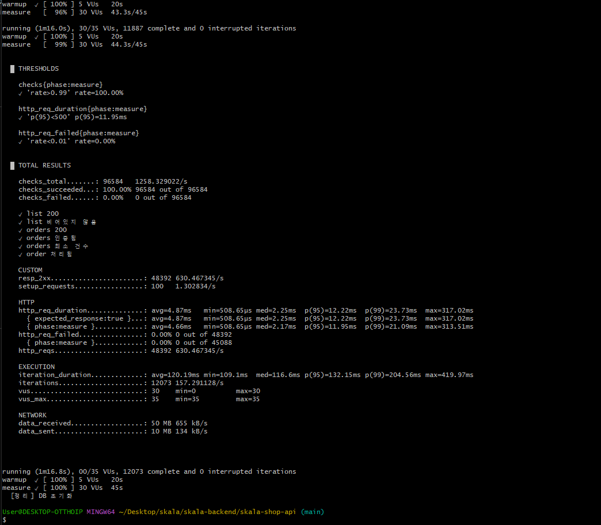

*(이 화면은 하네스의 **DB 초기화 전후**를 보이려고 실은 것으로, **VU 30**으로 돌린 별도 실행이다.
아래 스윕 표는 전부 VU 50 / 45초 조건이며 이 화면의 수치와 대응하지 않는다.)*

### 반복 편차를 먼저 쟀다 — 판정 기준을 측정 전에 고정

| 지표 | 3회 결과 | 폭 | 판정 기준 |
|---|---|---|---|
| p95 | 14.25 / 13.49 / 15.40ms | **1.91ms** | 이보다 작으면 신호 아님 |
| req/s | 1,009 / 1,019 / 1,011 | **약 1%** | 이보다 작으면 신호 아님 |
| 성공률 | 100.00% × 3 | 0 | 회귀 감시용 |

### HikariCP 풀 크기

| 풀 | 성공률 | p95 | req/s | 409 | 5xx |
|---|---|---|---|---|---|
| **2** | 100% | **46.32ms** | **710** | 46 | 0 |
| 5 | 100% | 16.57ms | 1,002 | 262 | 0 |
| 10 (기본) | 100% | 14.72ms | 1,003 | 500 | 0 |
| 20 | 100% | 14.82ms | 1,011 | 743 | 0 |
| 40 | 100% | 15.54ms | 991 | 754 | 0 |

| 구간 | p95 | req/s | 판정 |
|---|---|---|---|
| 풀 2 vs 나머지 | **31.6ms 차이** | **−29%** | ✅ **압도적 신호 — 병목** |
| **풀 5~40** | 폭 **1.85ms** < 편차 1.91ms | 폭 2%, **비단조** | ❌ **변별 불가** |

### Tomcat 스레드

| 스레드 | 성공률 | p95 | req/s | 409 | 5xx |
|---|---|---|---|---|---|
| **10** | 100% | **7.22ms** | **1,081** | 742 | 0 |
| 25 | 100% | 13.34ms | 1,013 | 691 | 0 |
| 50 | 100% | 12.40ms | 1,023 | 557 | 0 |
| 100 | 100% | 12.16ms | 1,030 | 555 | 0 |
| 200 (기본) | 100% | 14.79ms | 1,012 | 662 | 0 |

| 구간 | p95 | req/s | 판정 |
|---|---|---|---|
| 스레드 10 vs 나머지 | **4.94ms 빠름** (편차의 2.6배) | **+5%** | ✅ 신호 |
| **스레드 25~200** | 폭 2.63ms, **비단조** | 폭 1.8% | ❌ 신호 아님 |

**변별되지 않았다는 것도 결과이며, 그대로 적는다.**

### ★ 409 정규화 — 이번 측정의 결정적 산출물

p95가 대부분 구간에서 변별되지 않았으므로 남은 지표가 409 충돌 건수였다.

**절대 건수를 그대로 읽으면 안 된다.** 409는 주문 요청 수에 비례하므로
**처리량이 높은 설정에서 자동으로 커진다.** 요청 수로 나눠야 설정의 효과가 보인다.

| 풀 | 409 비율 | | 스레드 | 409 비율 |
|---|---|---|---|---|
| 2 | **0.08%** | | 10 | 0.90% |
| 5 | 0.34% | | 25 | 0.88% |
| 10 | 0.65% | | 50 | 0.71% |
| 20 | 0.96% | | 100 | 0.70% |
| 40 | **0.99%** | | 200 | 0.85% |
| | **단조 증가 12배** | | | **경향 없음 (0.70~0.90 배회)** |

기전은 이렇다. **DB 동시 실행 폭을 정하는 것은 커넥션 풀이지 톰캣 스레드가 아니다.**
스레드가 200이어도 풀이 10이면 DB에서 동시에 도는 트랜잭션은 10개다. 나머지는 커넥션을 기다린다.

### ★ 논증의 형태 — 반응하지 않은 것이 증거다

409가 풀에 반응한 것만으로는 *"부하가 세지면 충돌이 는다"* 로도 읽힌다.
**결정적인 것은 스레드 스윕에서 움직이지 않았다는 사실이다.**

> 409가 일반적인 부하 지표였다면 **스레드 스윕에서도 따라 움직였어야 한다. 움직이지 않았다.**
>
> 그리고 **이 예측은 데이터를 보기 전에 기전에서 나왔다.**
> 가설이 데이터를 사후에 맞춘 것이 아니라, 기전이 예측한 대로 나왔다.
> **두 스윕이 서로의 대조군이 된 셈이다.**

**"변하지 않았다"를 결과로 쓸 수 있으려면 변할 것이라 예측한 대안 가설이 먼저 있어야 한다.**
그게 없으면 무반응은 **그냥 정보가 없는 상태**다.

*(이 해석은 이후 반증됐다 — 5.8. 관찰은 유효하고 인과적 일반화만 철회했다.)*

### 409를 정반대로 읽을 수 있었다

**풀 2에서 409가 가장 적다(0.08%).** 이것만 보면 *"풀을 줄이면 충돌이 줄어든다"* 가 된다.

**틀렸다. 경합이 적은 것이 아니라 애초에 동시에 실행되는 트랜잭션이 2개뿐이다.**
같은 설정에서 **p95는 3배 나쁘고 처리량은 29% 낮다.**

> **지표 하나만 보면 정반대 결론에 도달한다.**
> p95만 봤으면 "풀 5~40 변별 불가"에서 멈췄을 것이고,
> 409 절대값만 봤으면 "풀 2가 최선"이라고 했을 것이다.
>
> 5.4에서 배운 것이 **분모를 맞춰라**였는데, 여기서는 **분모를 아예 만들어야** 했다.

### 결론 — 값을 확정하지 않았다

| 설정 | 판단 | 근거 |
|---|---|---|
| `DB_POOL_SIZE` = 10 | **유지** | **"10이 최적이라서"가 아니다.** 5~40 사이에서 **변별할 수 없으므로 기본값을 바꿀 근거가 없다.** 다만 **풀 2는 명백히 나쁘다** — 하한은 확인됐다 |
| `TOMCAT_MAX_THREADS` = 200 | **유지** | 스레드 10이 VU 50에서 유의하게 좋다. 그러나 **한 부하 수준의 한 점**이고, 스레드를 줄이면 **더 높은 동시 사용자에서 큐잉이 생긴다** |

**측정했다는 것과 결론을 내렸다는 것은 다르다.**

### 두 환경에서 결론이 뒤집혔다

| | 머신 A (macOS) | 머신 B (Windows·WSL2) |
|---|---|---|
| **풀 2** | **3.54ms — 최선** | **46.32ms — 최악** |
| **스레드 10** | **6.52ms — 유일하게 나쁨** | **7.22ms — 유일하게 좋음** |

*(두 세트의 절대값을 비교하는 것이 아니다. 비교 대상은 **각 환경 안에서의 순위**뿐이다.)*

기전은 일관된다 — WSL2를 경유해 **쿼리당 지연이 크다.** 처리량 ≈ 동시성 ÷ 지연이므로
지연이 큰 환경에서 **커넥션 2개는 50 VU를 감당하지 못한다.**
스레드 쪽은 반대 방향이다 — 지연이 커서 요청이 앱 안에 오래 머무는데,
스레드가 200개면 12 vCPU 위에서 **스케줄 경합만 늘어난다.**

> **한 축이 뒤집힌 것은 우연일 수 있다. 두 축이 모두 뒤집힌 것은 아니다.**

**단일 머신 측정만 있었다면 두 축 모두 확신 있게 틀렸을 것이다** —
macOS 곡선으로 풀을 2로 내렸다면 이 환경에서 **p95 3배·처리량 −29%** 였다.

> ### ★ 이 측정의 최종 결론
>
> **"측정했으므로 값을 정했다"가 아니라 "측정했더니 튜닝값이 환경에 종속된다는 것을 알았다"이다.**
>
> 실무의 결론은 **배포 환경에서 측정해야 한다**는 것이고,
> **이 프로젝트가 기본값을 유지하는 것은 그 결론의 귀결이다** — 게으름이 아니라
> "측정 환경이 배포 환경이 아니다"라는 사실의 반영이다.

**VU 축 스윕은 하지 않았다.** 축을 하나 더 늘려도 *"이 머신·이 워크로드·이 부하 범위"* 의
결과이며 환경 종속성은 그대로 남는다. **두 축 모두 뒤집힌 시점에 이미 결론은 나와 있고,
축을 더하는 것은 같은 결론에 도달하는 비용만 더한다.**

### 이 스윕이 실제로 찾아낸 것은 튜닝값이 아니라 결함이었다

풀 크기별로 `resp_5xx`를 **따로 세는 과정에서** 500이 나가고 있는 것이 드러났다 (2부 ⑥).
**설정을 재려고 만든 장치가 결함을 찾았다 — 지표를 잘게 쪼개는 것 자체가 관측 능력이다.**

위 두 표의 **`5xx` 열이 전 구간 0**인 것이 교정 후의 회귀 확인이다.
성공률·5xx는 **설정 변별력은 없지만 회귀 감시 지표로는 유효하다.**

---

## 5.6 캐시와 ETag — 같은 "캐싱"인데 판단이 갈렸다

> **조건** — 머신 B · 전용 시나리오 `docs/perf/cache.js` · **포화(`THINK=0`)** · VU 50 · 45초 ·
> 원시 출력 `docs/evidence/perf/win-detail-*.txt`

*(설계 판단과 제거 근거는 3부 3.4에서 다뤘다. 여기서는 측정만 본다.)*

### 첫 측정을 폐기했다 — 결론이 같았어도 근거가 없었다

`load.js`로 캐시 on/off를 재서 **0.3% 차이**를 얻었고, 그 측정을 버렸다.

> **`load.js`는 캐시가 걸린 `GET /api/products/{id}`를 한 번도 호출하지 않는다.**
> (`listProducts` · `getOrders` · `placeOrder` 뿐)
>
> **두 측정이 동일한 코드 경로를 돌았다.** 나온 0.3%는 캐시와 무관한 노이즈였다.

**폐기한 이유가 중요하다.** 최종 결론("이득 없음")은 재측정 후에도 같았다.
**결론이 맞았더라도 그 근거는 존재하지 않았다** — 캐시 대상 경로를 한 번도 실행하지 않은
측정으로 "캐시에 이득이 없다"고 말할 수는 없다.

전용 시나리오는 **트래픽 100%가 캐시 대상 경로**다 — **이득의 상한을 재는 설계**다.

### `@Cacheable` — 상한 조건에서도 이득이 측정되지 않았다

| 실행 | req/s | p95 |
|---|---|---|
| 캐시 ON (1회) | 10,645.7 | 11.58ms |
| **캐시 OFF** | **10,440.9** | **11.60ms** |
| 캐시 ON (2회) | 10,462.5 | 11.70ms |

**이 시나리오의 반복 편차**(ON 두 번의 폭): req/s **1.75%**, p95 **0.12ms**.

- **p95 — 효과 0.** OFF(11.60)가 ON 두 번(11.58, 11.70) **사이에 들어간다**
- **req/s — 편차 안.** ON 평균 대비 +1.08% < 편차 1.75%

> **포화시켰고, 트래픽 전부가 캐시 대상이었다. 그 조건에서도 이득이 없다.**
> **실제 트래픽에는 이 경로가 아예 없으므로 어떤 트래픽에서도 이득이 없다.**
>
> 이유는 추정할 수 있다 — 단일 행 PK 조회는 PostgreSQL 버퍼 캐시에서 이미 빠르고,
> 병목이 DB가 아니라 HTTP 처리·직렬화에 있다. **다만 이건 측정하지 않았고 추정이다.**

### 위험은 실측했다 — 불일치 50%, 만료 없음

| 항목 | **실측** |
|---|---|
| 낡은 값 | **불일치 50%** (라운드로빈 분포 그대로, 40회 중 20회) |
| 지속 시간 | **만료되지 않는다.** 61초·**3분 후에도** 낡은 값 |
| 결제 영향 | **없음.** 낡은 인스턴스가 처리한 주문 4건 전부 새 가격으로 차감 |

**`ConcurrentMapCacheManager`에는 만료 정책이 없다.**

> `Cache-Control: max-age=60`과 혼동하면 안 된다 — 그건 클라이언트·중간 캐시의 몫이고,
> **서버 캐시의 낡은 값 수명은 60초가 아니라 무한**이다.
> 해당 인스턴스에서 `@CacheEvict`가 일어나거나 재기동될 때까지 계속된다.

결제 안전성은 **코드 판단이 아니라 실측으로** 확인했다 —
낡은 캐시가 떠 있는 상태에서 주문을 걸어 8건 중 4건이 낡은 인스턴스에서 처리됐고
**전부 새 가격으로 차감**됐다. **영향 범위: 조회 표시에 한정, 금액 무관.**

### ETag — 이쪽은 명확한 효과가 있다


| | 전송량 | p95 | 2xx |
|---|---|---|---|
| 일반 GET | 7.4 MB | 2.86ms | 23,090 |
| **ETag 조건부 요청** | **3.6 MB (−51%)** | 3.08ms | **20** (나머지 304) |

**전송량은 절반이 됐고 서버 응답 시간은 변하지 않았다**(1.45 → 1.49ms).

측정 장치도 먼저 검증했다 — `setup()`에서 **ETag가 응답에 실제로 오는지 확인하고 없으면 중단**한다.
없으면 *"전송량이 안 줄었다"* 가 **ETag의 실패인지 조건부 요청 미성립인지 구분되지 않는다.**

### ★ 뭉쳐 말하면 안 되는 이유가 수치로 나왔다

| | **ETag** | **`@Cacheable`** |
|---|---|---|
| 아끼는 것 | **네트워크 전송** | **서버 부하**(DB 조회·직렬화) |
| 측정된 이득 | **−51%** | **없음** |
| 위험 | 없음 | 낡은 값, 만료 없음 |
| 판단 | **유지** | **제거** |

`ShallowEtagHeaderFilter`는 응답 본문을 **다 만든 뒤** 해시를 계산한다.
DB 조회도 직렬화도 그대로 일어나므로 **304를 받아도 서버 일은 줄지 않는다.**
`@Cacheable`은 **그 앞단의 작업 자체를 건너뛴다.**

> **용어가 같다는 이유로 함께 측정하지 않은 것이 두 개의 다른 결론을 가능하게 했다.**
> 뭉쳐서 봤다면 ETag의 −51%를 보고 *"캐싱은 효과가 있다"* 로,
> 또는 `@Cacheable`을 보고 *"캐싱은 효과가 없다"* 로 갔을 것이고,
> **어느 쪽이든 나머지 하나에 대해 틀린 결정을 했을 것이다.**

---

## 5.7 HA 다중 인스턴스 — 무상태 검증이 처리량보다 먼저다

> **조건** — 머신 B · `docker-compose.ha.yml`(nginx 1.27-alpine + app1 + app2 + 공유 PostgreSQL) ·
> **응용 코드 무변경** · 검증 캡처는 커밋 `cf61aff` · 처리량은 `docs/evidence/perf/win-ha-load*.txt` ·
> `X-Upstream-Addr`는 **기본 비활성**이며 측정 시에만 `LB_EXPOSE_UPSTREAM=1`로 켰다

### 순서를 지킨 것이 값을 했다

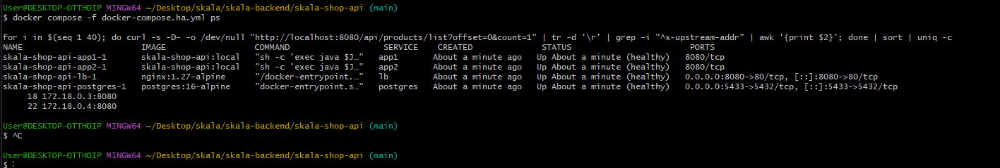

*(이 화면의 분산은 **18 : 22**다. 아래 표의 15 : 25는 **다른 실행**의 값이며,
두 값 모두 "매번 새 커넥션" 조건에서 나온 것이다 — 워커별 커서가 독립적이라 실행마다 갈린다.)*

```
app1  Up (healthy)  8080/tcp
app2  Up (healthy)  8080/tcp
lb    Up (healthy)  0.0.0.0:8080->80/tcp
postgres            0.0.0.0:5433->5432/tcp
```

**앱에는 호스트 포트가 없다.** LB 우회 접근이 가능하면
*"LB를 통해 동작한다"* 는 검증이 정직하지 않기 때문이다.

| # | 검증 | 결과 |
|---|---|---|
| **1** | **분산** | ✅ 40회 중 **15 : 25** 로 양쪽 수신 |
| **2** | **무상태** | ✅ **`.3`에서 로그인 → `.4`에서 주문 성공**, 잔액 970,000 정확 |
| **3** | **traceId 전파** | ✅ `X-Trace-Id`가 LB를 통과 (요청마다 다른 값) |
| **4** | **장애 내성** | ✅ app2 정지 중 **40 / 40 성공, 실패 0** |
| 5 | 헤더 비노출 | ✅ 기본 구성에서 `X-Upstream-Addr` **0개** |
| **6** | **처리량 증가** | ❌ **실증 실패 — 오히려 줄었다** |

```
--- ② 무상태: 한 인스턴스에서 로그인 → 다른 인스턴스에서 주문 ---
  로그인 처리 인스턴스: 172.18.0.3:8080
  주문  1  HTTP 200  인스턴스 172.18.0.3:8080  traceId b362a1b0
  주문  2  HTTP 200  인스턴스 172.18.0.4:8080  traceId 238409d0
  ★ 로그인(172.18.0.3)과 다른 인스턴스(172.18.0.4)에서 주문 성공 — JWT 무상태 확인
```

> **1번(분산)을 먼저 보지 않았다면 이후 "동작한다"가 한쪽 인스턴스만으로 통과한 결과였을 수 있다.**
> 이 프로젝트가 반복해서 만난 **"안 왔다를 막혔다로 읽는"** 형태다 (4.4).

**15:25가 정확히 반반이 아닌 이유**도 확인했다 — `worker_processes auto` = 12개이고
**라운드로빈 커서가 워커마다 독립적**이다. 매번 새 커넥션으로 보내면 워커가 분산되므로 편중된다.
**단일 keep-alive 커넥션으로는 10/10 완전 교대**였다.

### 처리량 — 대조를 두어 하락의 원인을 갈랐다

| 구성 | req/s | p95 | 409 비율 |
|---|---|---|---|
| 직접 1대 (LB 없음) | **1,003** | 14.72ms | 0.65% |
| LB + 1대 | 981 (**−2%**) | 18.68ms | 2.02% |
| **LB + 2대 (HA)** | **814 (−19%)** | **46.96ms (3.2배)** | 2.33% |

**LB 홉 자체는 −2%로 미미하다. 하락의 대부분은 두 번째 인스턴스가 만든다**(981 → 814, −17%).

원인은 명확하다. **12 vCPU 하나 위에서 app 2개 + nginx + postgres + k6가 전부 돈다.**
**이 머신에서 인스턴스를 늘리면 용량이 늘지 않고 나뉜다.**

> **이것은 설계의 실패가 아니라 측정 환경의 한계다.
> 그리고 그 구분을 수치로 말할 수 있게 된 것이 이 측정의 산출물이다.**
>
> `LB + 1대`라는 대조가 없었다면 "HA로 바꿨더니 느려졌다"까지만 말할 수 있고,
> 그것이 **LB 때문인지 자원 분할 때문인지** 가를 수 없었다.
>
> 수평 확장의 처리량 이득을 보이려면 **인스턴스가 서로 다른 물리 자원에 놓여야 한다.**
> 5.5의 "튜닝값은 환경에 종속된다"와 같은 결론의 다른 얼굴이다.

### ★ 정확한 서술 — "HA를 구현했다"가 아니다

> **"앱 계층의 수평 확장 가능성을 실증했다"가 정확하다.**

| 계층 | 상태 |
|---|---|
| 앱 | ✅ 2대. 하나가 죽어도 서비스 유지 확인 |
| **DB** | ❌ **단일.** 죽으면 전체 중단. 복제·페일오버 없음 |
| **LB** | ❌ **단일.** nginx가 죽으면 앱이 살아 있어도 접근 불가 |

**진짜 HA에 필요한 것** — ① DB 이중화(스트리밍 복제 + 자동 페일오버, 또는 관리형 DB)
② LB 이중화(VIP/keepalived 또는 클라우드 LB) ③ 무중단 배포(롤링 업데이트 + 커넥션 드레이닝).
**현재는 셋 다 없다.**

그리고 HA 구성이 제약 하나를 더 드러냈다 — **`ddl-auto: create`는 다중 인스턴스와 양립하지 않는다.**
기동할 때마다 스키마를 지우고 다시 만들므로 **초기 기동이 경쟁 상태**이고,
**한 인스턴스만 재시작해도 공유 DB가 통째로 초기화된다.**
**무중단 배포를 논하려면 이것부터 `validate` + 마이그레이션으로 바꿔야 한다.**

---

## 5.8 반증 — 대조 설계가 반증을 가능하게 했다

*(철회의 내용과 판정 표는 3부 3.5에서 다뤘다. 여기서는 **측정 관점**만 본다.)*

### 사전 등록이 첫 번째 조건이었다

HA 측정에 들어가기 전, 5.5의 기전대로라면 `LB + 2대`에서 409가 얼마나 나올지
**예측을 먼저 파일에 기록했다**(`docs/evidence/perf/ha-prediction.md`).

- 인스턴스 2대 → DB 동시성 폭 10 → 20
- 풀 스윕 곡선(10에서 0.65%, 20에서 0.96%)을 따라 **≈0.96%** 예측

**실측 2.33%.**

> **예측을 측정 후에 적었다면 2.33%에 맞는 설명을 새로 붙였을 것이고,
> 일반화는 그대로 남았을 것이다.**

### `LB + 1대` 대조가 두 번째이자 결정적인 조건이었다

예측이 빗나간 것만으로는 **기전이 틀렸는지 다른 요인이 끼었는지** 알 수 없다.
그래서 **DB 동시성 폭을 전혀 바꾸지 않고 LB 홉만 추가한 구성**을 함께 쟀다.

| 구성 | DB 동시성 폭 | 409 비율 |
|---|---|---|
| 직접 1대 | 10 | 0.65% |
| **LB + 1대** | **10 (동일)** | **2.02%** |
| LB + 2대 | 20 | 2.33% |

**동시성 폭을 전혀 바꾸지 않고 LB 홉만 추가했는데 409가 3.1배가 됐다.**

> 이 대조군이 없었다면 `0.96% 예측 → 2.33% 실측`을 보고
> ***"인스턴스가 2대라 예상보다 경합이 더 심했다"*** 는 **그럴듯한 설명을 붙이고 넘어갔을 것이다.**
>
> `LB + 1대`가 그 설명을 봉쇄했다 — **동시성 폭이 같은데 3.1배**이므로 동시성으로는 설명되지 않는다.

**이 대조군은 처리량 해석에서도 값을 했다**(5.7) — 하나의 대조가 두 지표의 원인을 갈랐다.

### 대체 모델도 세우고 기각했다

"충돌 창 = 동시성 × 트랜잭션 지속시간"이라는 모델을 세워봤다.
LB 홉이 지연을 늘리면 트랜잭션이 오래 열려 있어 충돌이 는다는 설명이다.

**이것도 성립하지 않는다.** 스레드 스윕에서 p95가 **2배**(7.22 → 14.79ms)로 늘었는데
409 비율은 0.90 → 0.85%로 **오히려 줄었다.** **두 모델이 다 깨졌다.**

### 기전을 모른다로 남기고, 가르는 데 필요한 측정을 적었다

> **현재로선 기전을 설명하지 못한다. 미해결로 남긴다.**
> 가르려면 **동시성 폭과 트랜잭션 지속시간을 각각 고정한 측정**이 필요하다.

**설명을 만들어 붙이지 않는 것이 여기서의 판단이다.**
2.33%에 맞는 이야기를 새로 쓰는 것은 언제든 가능하고, **그것이 정확히 하지 말아야 할 일이다.**

---

## 5.9 graceful shutdown — 효과가 관측될 조건이 형성되지 않는다

> **조건** — 머신 B · k6 **VU 20** · `SERVER_SHUTDOWN` 환경변수로 조건 전환(**운영 소스 무변경**) ·
> **조건당 1회 실행** · 원시 출력 `docs/evidence/perf/win-shutdown-*.txt`

Phase 5가 **"기능이 켜진 것과 효과가 있는 것은 다르다"** 며 미검증으로 남긴 항목이다.

### Phase 5 판과 달라진 점

| | Phase 5 (curl) | **Phase 6 (k6)** |
|---|---|---|
| 부하 도구 | curl — **프로세스 기동이 SIGTERM보다 느려** 요청이 서버에 닿기 전에 닫혔다 | k6 VU 20 — SIGTERM 순간 **인플라이트가 실재** |
| 조건 전환 | `application.yml`을 정규식으로 재작성 | **환경변수** — 운영 소스를 고치지 않는다 |
| 인플라이트 확인 | 없음 | **요청별 시계열로 `start < T < end`를 센다** |

**측정이 운영 소스를 고치면 안 된다** — Phase 4에서 변이 스크립트가 강제 종료로
운영 코드에 변이를 남긴 사고와 같은 위험이다 (4.2).

### 처치가 실제로 가해졌다는 증거 — 두 겹

**① 전달 확인 (측정 전)** — 컨테이너의 `SERVER_SHUTDOWN` 값을 읽어 의도한 값이 아니면 중단한다.

**② 동작 확인 (측정 후)** — 종료 로그가 두 조건에서 다르다.

```
graceful  : Commencing graceful shutdown. Waiting for active requests to complete
            Graceful shutdown complete
immediate : (위 두 줄 없음. HikariPool 종료만)
```

### ★ 결정적 수치 — graceful 창은 66ms였다

```
09:40:02.813  Commencing graceful shutdown
09:40:02.879  Graceful shutdown complete      → 66 ms
```

**graceful shutdown은 정상 동작했고, 66밀리초 만에 끝났다.**
**인플라이트 19건이 전부 완료되는 데 그만큼밖에 안 걸린 것이다** — 응답이 3~5ms이기 때문이다.

### 결과 — 변별되지 않으며, 방향은 오히려 뒤집혔다

| | graceful | immediate |
|---|---|---|
| SIGTERM 시점 인플라이트 | 19 | 20 |
| 이후 200 | 2,464 | **2,762** |
| 이후 연결 실패 | 3,068 | **2,692** |

**immediate 쪽이 성공이 더 많다.** immediate가 우월해서가 아니라 **차이가 노이즈에 지배된다**는 뜻이다.
규모를 비교하면 분명하다.

| 양 | 크기 |
|---|---|
| graceful이 보호할 수 있는 요청 | **≤ 20건** (인플라이트) |
| 종료 창에서 영향받는 요청 | 약 5,500건 |
| 두 조건의 200 응답 차이 | 298건 (2,762 − 2,464) |

> **보호 대상(20건)이 두 조건의 차이(298건)보다 한 자릿수 작다.**
> 즉 **관측된 차이는 graceful이 보호할 수 있는 양으로 설명되지 않는다.**
>
> **다만 이 298건이 신호인지 노이즈인지는 판단할 수 없다.**
> **조건당 1회씩만 돌려 이 지표의 반복 편차를 측정하지 않았기 때문**이다.
> 298을 "실행 간 편차"라고 부르면 **처치 효과를 노이즈의 근거로 쓰는 순환**이 된다 —
> 같은 조건을 여러 번 돌려야 나오는 값과, 다른 조건 사이에서 나온 값은 다른 것이다.
>
> 확실한 것은 하나다 — **보호 대상이 수십 건 규모라 이 실험 설계로는 분해되지 않는다.**

### 실패 유형을 나누면 방향은 맞다 — 그래도 신호라 부르지 않는다

집계 성공/실패로는 안 보이던 것이, **실패를 종류별로 세면** 보인다.

| 실패 유형 | graceful | immediate | 의미 |
|---|---|---|---|
| `connection refused` | 많음 | 많음 | **새 연결 거부** — 서버가 이미 닫힌 뒤 |
| **`connection reset by peer`** | **14** | **21** | **진행 중이던 연결이 끊김** |
| `i/o timeout` | 40 | 40 | 동일 |

*(로그가 실패당 두 줄을 남기므로 원시 카운트 28·42를 요청 수 14·21로 환산했다.)*

**immediate가 진행 중인 연결을 더 많이 끊었다 — 예상한 방향이다.**

> **그러나 이것을 신호라고 부르지 않는다.**
> **조건당 1회 실행이고, 이 지표의 반복 편차를 재지 않았다.**
> 차이 7건은 인플라이트(19~20건) 규모와 **같은 자릿수**라 한 번의 실행 차이로 충분히 설명된다.
>
> **방향이 맞다는 것과 변별됐다는 것은 다르다.**
> *"기대한 방향으로 움직였으나 크기가 노이즈와 구분되지 않는다"* 가 정확한 서술이다.

굳이 확정하려면 조건당 여러 회 반복해 이 지표의 편차부터 재야 하는데,
**그 비용을 들여 얻을 결론이 이미 나와 있다** — 보호 대상이 수십 건 규모라는 것.

### 결론 — "측정할 수 없다"가 아니라 "관측될 조건이 형성되지 않는다"

Phase 5가 세운 원인 가설 — *"이 API의 요청이 3~5ms로 끝나 '진행 중'인 창이 좁다"* — 이
**두 독립 도구(curl, k6)에서 일관되게 지지됐다.** 그리고 이번엔 **창의 길이를 수치로 얻었다(66ms).**

- **graceful shutdown의 값어치는 장시간 요청이 있는 시스템에서 드러난다** —
  파일 업로드, 배치 트리거, 외부 API 연쇄 호출처럼 초 단위로 진행되는 요청이 있을 때
- **이 API에는 그런 요청이 없다.** 가장 무거운 경로(주문)도 밀리초 단위다

**그래도 켜둔다.** 비용이 0에 가깝고(설정 한 줄), 워크로드가 바뀌면 값이 생긴다.

> **"효과를 측정하지 못했다"가 아니라 "이 워크로드에서는 보호할 것이 20건뿐이다"** 라고
> 말할 수 있게 된 것이 이번 재검증의 산출물이다.

### ★ 처치가 전달되지 않았던 사고 — "동일한 조건을 두 번 쟀다"

측정 전 확인 가드가 발동했다. **`SERVER_SHUTDOWN`이 컨테이너 문턱에서 사라지고 있었다.**

`docker compose up` 앞에 환경변수를 붙여도 **`docker-compose.yml`의 `environment:` 블록에
선언돼 있지 않으면 컨테이너에 도달하지 않는다.** 즉 **두 측정이 모두 graceful로 돌았다.**

> 그 상태로 나온 결과는 *"두 조건이 동일하다"* 가 아니라 **"동일한 조건을 두 번 쟀다"** 였다.
>
> 가드가 없었다면 **"세 번째 독립 시도에서도 변별되지 않았다"** 를 문서에 박았을 것이고,
> 그 결론은 **처치가 가해진 적 없는 실험**에서 나온 것이었다.

그리고 이 가드는 **앞 턴에 스스로 넣은 것**이다 —
*"대조 실험에서는 처치가 가해졌다는 것 자체가 검증 대상"* 이라고 적고 넣었고,
**바로 다음 실행에서 발동했다.**

이것이 4.5의 다섯 번째 요소(**처치 전달**)가 나온 자리다.

---

## 5.10 이 부가 남긴 것

### 산출물은 성능 수치가 아니라 판단이었다

| 측정 | 기대했던 산출물 | **실제 산출물** |
|---|---|---|
| 설정 스윕 | 최적 풀 크기·스레드 수 | **튜닝값을 확정하지 않기로 한 결론** + **500 결함 1건** |
| 캐시 효과 측정 | 캐시 이득의 크기 | **캐시를 제거하기로 한 결정** |
| HA 처리량 | 수평 확장 이득 | **"앱 계층 수평 확장 가능성"이라는 정확한 서술** + 단일 지점 목록 |
| graceful shutdown | 효과의 크기 | **"관측될 조건이 형성되지 않는다"** + 창 길이 66ms |
| 409 예측 검증 | 기전 확인 | **기전 해석의 철회** |

**다섯 중 어느 것도 "튜닝해서 X% 좋아졌다"가 아니다.**

### 측정이 해석을 뒤집은 지점

| # | 처음 생각 | 측정 후 |
|---|---|---|
| 1 | 낙관적 락이 TPS가 높으니 빠르다 | **100건 중 14건만 끝낸 것** — 분모가 달랐다 |
| 2 | 풀 2가 409가 적으니 경합이 적다 | **동시 실행 트랜잭션이 2개뿐** — p95 3배 나쁘다 |
| 3 | macOS 곡선대로 풀을 줄이면 좋다 | **다른 머신에서 최악** — 두 축 모두 뒤집혔다 |
| 4 | 409는 DB 동시성 폭의 특이 지표다 | **LB 홉만으로 3.1배** — 일반화 철회 |
| 5 | 캐시는 조회를 빠르게 한다 | **상한 조건에서도 이득 0** — 제거 |
| 6 | HA면 처리량이 는다 | **단일 머신에서는 자원을 나눈다** — 줄었다 |

### 그리고 한 걸음 더 갔다

Phase 3에서 *"이 Phase의 성격 — 측정이 결과물이다"* 라고 적었다.
Phase 6의 이 구간은 그 다음이다.

> **측정 도구의 신뢰도가 결과물이다.**

graceful shutdown을 재검증하려고 시작했는데 **나온 것의 대부분은 측정 도구의 결함**이었고,
그중 둘은 **조용히 틀린 결론으로 직행할 수 있는 종류**였다 (4.4).

그래서 이 부의 수치를 읽을 때 함께 봐야 할 것은
**그 수치가 나오기 전에 무엇을 확인했는가**다 —
편차를 쟀는가, 기준을 미리 정했는가, 대조군을 뒀는가,
성공 응답을 먼저 봤는가, **처치가 실제로 전달됐는가.**

---

# 6부 — 운영과 배포

**이 부는 전부 선택 사항을 수행한 영역이다.**

공지는 **JWT와 Docker적용을 "안 해도 되는 요소"** 로 명시했고,
**Actuator와 AOP는 "자유롭게 선택적으로 하기 바람"** 이라고 밝혔다.
0부의 2·3번 구획이 그것이며, 이 부는 그 구획의 근거를 채운다.

**선택 사항이므로 "했다"보다 "어디까지 확인했다"가 중요하다.**
그래서 각 항목에서 **동작을 실제로 확인한 방법**과 **확인하지 못한 것**을 함께 적는다.
그리고 이 영역에서 나온 결함 대부분은 **코드를 읽어서는 알 수 없는 종류**였다.

---

## 6.1 Docker

### 구성

| 항목 | 내용 | 근거 |
|---|---|---|
| **멀티스테이지 빌드** | 빌드(JDK) → layered jar 분해 → 실행(JRE) 3단계 | **크기 문제만이 아니다** — 컴파일러와 빌드 도구가 운영 이미지에 있으면 공격자가 쓸 수 있다 |
| **`eclipse-temurin:17-jre`** | JDK가 아닌 JRE | JDK에는 컴파일러·디버거·`jmap` 같은 도구가 들어 있고 **운영에 필요 없다** |
| **non-root (uid 1001)** | `groupadd/useradd --system`, `USER shop` | root로 돌면 **컨테이너 탈출 시 호스트 권한이 그대로 넘어간다.** `--system`은 로그인 불가 계정을 만든다 |
| **layered jar** | dependencies / spring-boot-loader / snapshot / application 4계층 | 아래 |
| **컨테이너 인식 JVM** | `-XX:MaxRAMPercentage=75.0` | 컨테이너는 CPU·메모리 제한을 받는다. JVM이 **호스트 전체를 보고 힙을 잡으면 OOMKill**이 난다 |
| **`HEALTHCHECK`** | Actuator readiness | 6.1 마지막에 별도 |
| **PID 1 유지** | `ENTRYPOINT ["sh", "-c", "exec java ..."]` | `exec`가 없으면 셸이 PID 1이 되어 **SIGTERM이 JVM에 직접 전달되지 않고 graceful shutdown이 동작하지 않는다** |

레이어 순서는 **변경 빈도의 역순**이다 — 뒤로 갈수록 자주 바뀐다.

```dockerfile
COPY --from=extract --chown=shop:shop /layers/dependencies/          ./
COPY --from=extract --chown=shop:shop /layers/spring-boot-loader/    ./
COPY --from=extract --chown=shop:shop /layers/snapshot-dependencies/ ./
COPY --from=extract --chown=shop:shop /layers/application/           ./
```

빌드 스테이지에서도 같은 원칙을 쓴다 — `settings.gradle`·`build.gradle`을 먼저 복사하고
의존성을 해석한 뒤에 `src`를 복사한다. **소스만 바뀌면 의존성 레이어가 캐시된다.**

### ★ 크기는 줄지 않았다 — 얻은 것은 재배포 전송량이다

**하드닝은 이미지 크기를 줄이지 않았다 — 160MB → 168MB로 오히려 8MB 늘었다.**
이전 Dockerfile도 이미 멀티스테이지 + JRE였기 때문이다(증가분은 non-root 계정 생성과
layered jar 분해로 늘어난 레이어 수에서 온 것으로 **보이며, 분해해 측정하지는 않았다**).

**실제 이득은 레이어 구성이다.**

| | 재배포 시 전송량 |
|---|---|
| 부트 jar를 통째로 `COPY` | **56.9 MB** |
| **layered jar** | **393 kB** |

코드 한 줄만 바뀌어도 통째로 새로 만들어지던 레이어가, **application 레이어(수백 KB)만
바뀌고 나머지는 `CACHED`** 로 재사용된다.

> **"이미지를 작게 만들었다"고 쓰지 않았다. 작아지지 않았기 때문이다.**
> 얻은 것을 정확히 말하면 **"자주 바뀌는 부분을 작게 분리했다"** 이다.

### ★ `docker images`의 SIZE를 믿고 "하드닝했더니 커졌다"고 쓸 뻔했다

`docker images`는 **583MB → 600MB**로 보여줬다. 하드닝했는데 커진 것이다.
alpine 베이스로 바꿔봐도 564MB라 "alpine이 작다"는 상식과 맞아 보였다.

**상식과 어긋난 지점(하드닝했는데 커졌다)에서 멈추고 다른 도구로 다시 쟀다.**

| | `docker images` | **`docker image inspect`** |
|---|---|---|
| before | 583MB | **160MB** |
| after | 600MB | **168MB** |
| corretto-alpine | 564MB | **202MB** |

`docker images`의 SIZE는 이 환경(containerd 이미지 스토어, 멀티플랫폼)에서
**다른 아키텍처 블롭까지 합산**한 값이었다.
**alpine이 "작아 보였던" 것도 그 때문이고, 실제로는 가장 컸다.**

> **같은 대상을 재는 두 도구가 다른 값을 주면, 둘 중 하나는 내가 생각하는 것을 재고 있지 않다.**
>
> 이 확인이 없었다면 보고서에 **"alpine으로 바꿔 이미지를 줄였다"** 는 정반대 문장이 들어갔을 것이다.
> 5부의 측정 원칙이 성능이 아닌 곳에서도 그대로 적용된 사례다.

### ★ HEALTHCHECK가 매번 실패하고 있었다 — `/bin/sh`는 dash다

의존성을 늘리기 싫어 셸 내장 `/dev/tcp`로 헬스체크를 짰다.
**컨테이너가 영원히 `health: starting`이었다.**

```
2 | /bin/sh: 1: cannot create /dev/tcp/127.0.0.1/8080: Directory nonexistent
```

**`/dev/tcp`는 bash 확장이고 `HEALTHCHECK`는 `/bin/sh`로 실행된다.**
이 이미지의 `/bin/sh`는 dash다. **컨테이너 안에 `bash`는 있었지만 쓰이지 않았다.**

> **코드만 봐서는 절대 알 수 없는 종류의 결함이다.** 문법도 맞고 논리도 맞는데 **실행 셸이 다르다.**
> `docker inspect`의 `Health.Log`를 보지 않았으면 몰랐다.

그리고 **더 나빴을 시나리오가 있었다.**

> `depends_on: service_healthy`로 다른 서비스가 app을 기다렸다면 **기동이 대기 상태에 갇힌다.**
> **HA 구성(6.8)이 정확히 그 형태다.**
>
> 즉 이 결함은 Phase 5에서 발견되지 않았다면 **Phase 6의 HA 구성에서 훨씬 진단하기 어려운
> 형태로 터졌을 것이다** — "app이 안 뜬다"가 아니라 "compose가 멈춰 있다"로.

`eclipse-temurin:17-jre`(jammy)에 **`curl`이 이미 들어 있어** 설치 없이 교체했다.

```dockerfile
HEALTHCHECK --interval=10s --timeout=3s --start-period=40s --retries=5 \
  CMD curl -fsS http://127.0.0.1:8080/actuator/health/readiness | grep -q '"status":"UP"' || exit 1
```

**없다고 가정하기 전에 확인한다** — `curl`이 없을 거라 넘겨짚어서 더 복잡한 길로 갔다.

### 한 줄 실행과 이식성

```bash
docker compose up
```

**PostgreSQL과 애플리케이션이 함께 뜬다.** `.env` 파일도 필요 없다 — 기본값이 compose에 있다.
기동 상태 화면은 1부 1.5에 있다.

이식성은 **두 번 검증했다.**

| 시점 | 방법 | 결과 |
|---|---|---|
| Phase 0 | **저장소 밖 클론**에서 `docker compose up`만으로 기동 | ✅ E2E 통과 |
| Phase 5 | 원본 스택(8080)을 **켜둔 채** 포트를 바꿔 동시 기동 | ✅ health `healthy`, E2E **48/48**, Swagger 302 |
| **머신 이전** | **다른 물리 머신(Windows·x86_64)** 에서 클론 후 기동 | ⚠️ 아래 |

**세 번째에서 문서에 없는 조치가 3건 필요했다** — Docker Desktop 수동 기동,
`python3` 실인터프리터 확보, `gradlew` 줄바꿈 정정.

**Phase 0에서 세운 기준("문서에 없는 수동 조치가 필요했는가")을 그대로 적용하면 이 3건은 결함이다.**
둘은 저장소를 고쳐서 닫았고(`pyguard.sh`, `.gitattributes` — 4부 4.4), 하나는 README로 닫았다.
**환경만 고쳤다면 다음 머신에서 재발한다.**

> **이 검증에서 x86_64 아키텍처도 함께 닫혔다.** Phase 0에서 *"ARM에서만 빌드했다"* 로
> 남겨둔 항목이며, `postgres:16-alpine`·`eclipse-temurin:17-jre`의 멀티아치가 실제로 동작했다.
>
> **여전히 열려 있는 것** — **리눅스 호스트**다. WSL2를 경유했을 뿐 호스트는 Windows이고,
> 포트 바인딩 동작은 미검증이다 (7부).

---

## 6.2 설정과 시크릿

### 계층 분리 — 애플리케이션은 fail-fast, 개발 편의는 실행 환경이 책임진다

`jwt.secret`이 Phase 0에서는 `application.yml`에 평문으로 있었다.
환경변수로 빼면서 **기본값을 둘지가 쟁점이었다.**

- **두면 그 값이 곧 새로운 하드코딩**이다
- **안 두면 `.env` 없이는 `docker compose up`이 실패해** Phase 0에서 확보한 이식성이 깨진다

**둘을 계층으로 나눠 해결했다.**

| 계층 | 정책 |
|---|---|
| 애플리케이션 (`application-docker.yml`) | `${JWT_SECRET}` — **기본값 없음. 없으면 기동 실패** |
| 실행 환경 (`docker-compose.yml`) | `JWT_SECRET: ${JWT_SECRET:-dev-only-...}` — 개발 편의 제공 |

**애플리케이션은 "시크릿 없이는 뜨지 않는다"는 계약을 지키고, 개발 편의는 실행 환경이 책임진다.**
`docker compose up` 한 줄은 그대로 되고, **컨테이너 밖에서 직접 배포하면 시크릿을 빠뜨릴 수 없다.**

기본값 문자열은 `dev-only-do-not-use-in-production-0123456789`다.
**값 자체에 용도를 박아 두어** 실수로 운영에 흘러가도 로그·설정 어디서든 눈에 띄게 했다.

### ★ fail-fast를 설계했는데 fail-late였다

위 설계를 해놓고 **실제로는 기동 시점에 아무것도 검증되지 않고 있었다.**

`SessionHandler`가 **요청마다 `Keys.hmacShaKeyFor()`를 호출**하고 있었다.
그래서 **시크릿이 32바이트 미만이어도 앱이 정상적으로 떴고**,
`WeakKeyException`은 **첫 로그인에서야** 터졌다 — 그것도 500 `"internal server error"`로 나가
원인이 보이지 않았다.

| | 설계 의도 | 실제 |
|---|---|---|
| 검증 시점 | 기동 | **첫 토큰 발급** |
| 실패 형태 | 기동 실패(로그에 원인) | **정체불명의 500** |

키 생성을 **`@PostConstruct`로 옮겨 기동 시점에 실패**하게 했다.
부수 효과로 **요청마다 키 객체를 새로 만들던 것도 사라졌다.**

> **`DECISIONS.md` 7절에 "실패하려면 시끄럽게 실패해야 한다"고 적어놓고
> 다음 Phase에서 스스로 어긴 것이다.**
> 이것이 4부에서 ArchUnit을 도입한 근거 두 건 중 하나다 —
> **문서에 적어두는 것으로는 지켜지지 않는다.**

### "설정이 없을 때"와 "설정이 잘못됐을 때"는 다르다

이 결함의 형태를 일반화하면 이렇다.

| 상황 | 스프링이 잡아주는가 |
|---|---|
| **설정이 없다** (`${JWT_SECRET}` 미주입) | ✅ **기동 시 실패한다** — 플레이스홀더 해석 실패 |
| **설정이 잘못됐다** (시크릿이 너무 짧다) | ❌ **아무도 안 잡는다** — 문자열은 들어 있으니까 |

**프레임워크가 잡아주는 것은 전자뿐이다.** 값의 유효성은 애플리케이션이 직접 검증해야 하고,
**그 검증을 어디에 두느냐가 fail-fast와 fail-late를 가른다.**

### 시크릿 길이가 서명 알고리즘을 결정한다 (실측)

`Keys.hmacShaKeyFor()`는 **키 길이로 알고리즘을 고른다.**

| 시크릿 길이 | 알고리즘 |
|---|---|
| 32바이트 미만 | **`WeakKeyException`** — 기동 실패 |
| 32~47 | HS256 |
| 48~63 | HS384 |
| 64 이상 | HS512 |

**실측으로 확인했다** — 기본값(44바이트)은 `{"alg":"HS256"}`,
오버라이드값(55바이트)은 `{"alg":"HS384"}`로 **같은 코드에서 알고리즘이 달라졌다.**

> **시크릿 로테이션 시 길이를 바꾸면 알고리즘도 바뀐다.**
> 기존 토큰 검증에 영향이 있는지 확인해야 한다 —
> "시크릿을 더 강하게 바꿨다"가 **의도치 않게 서명 방식 변경**이 되는 경로다.

### 시크릿이 커밋 히스토리에 남아 있다 — 재작성하지 않는 이유

**현재 코드와 히스토리를 구분해 읽어야 한다.**

| | 상태 |
|---|---|
| 현재 코드 | **제거됨.** `application.yml`에 시크릿이 없다 |
| **커밋 히스토리** | **남아 있음.** Phase 0 커밋(`449b74f`)부터 A-2 직전까지의 `application.yml`에 평문 |

**파일에서 지우는 것은 유출을 되돌리지 못한다.** `git show 449b74f:src/main/resources/application.yml`이면 그대로 보인다.

**그럼에도 히스토리를 재작성하지 않았다.**

- **학습용 더미 값이다** — 실제 서비스에 쓰인 적이 없다
- **재작성하면 `phase0-baseline`·`phase1-structure` 태그가 가리키는 커밋이 바뀐다.**
  Phase 3·6의 개선 전/후 비교 기준이 통째로 무너진다

**실무라면 순서가 반대다** — ① 즉시 시크릿 로테이션(유출된 값 무효화)
→ ② 히스토리 정리 → ③ 재발 방지(`git-secrets`·pre-commit 훅).

> **지금 하지 않는 이유는 "괜찮아서"가 아니라
> "값이 가짜이고, 히스토리 보존이 이 프로젝트의 목적 중 하나라서"다.**

---

## 6.3 쿠키 보안

### 플래그

`jakarta.servlet.http.Cookie`는 SameSite를 지원하지 않아
스프링의 `ResponseCookie`로 만들고 `Set-Cookie` 헤더에 직접 싣는다.

| 플래그 | 값 | 막는 것 |
|---|---|---|
| `HttpOnly` | **항상 true** | XSS로 스크립트가 주입돼도 **자바스크립트가 토큰을 읽지 못한다** |
| `SameSite` | **`Strict`** | 교차 사이트 요청에 쿠키가 실리지 않는다 (CSRF) |
| `Secure` | `${COOKIE_SECURE:false}` | HTTPS에서만 전송. 아래 |
| `Path` | `/` | 전 경로 |
| `Max-Age` | 3600s | 토큰 만료와 일치 |

**세 플래그가 실제 응답 헤더에 실리는지는 E2E 48건이 확인한다** (1부 1.7의 네 줄).
MockMvc로는 검증할 수 없는 층이다 (4부 4.1).

### ★ `Secure`를 가르는 것은 프로파일이 아니라 전송 계층이다 — 되돌린 설계

처음에는 DB·시크릿과 **같이 프로파일별로 나누려 했다** (`local`은 false, `docker`는 true).
구현하다 보니 **축이 잘못됐다.**

> **`docker` 프로파일도 HTTP로 서비스한다.**
> 여기서 `Secure=true`로 켜면 브라우저와 Postman이 쿠키를 아예 보내지 않아
> **채점 환경에서 로그인이 동작하지 않는다.**
>
> `docker` = 운영이 아니라 `docker` = **컨테이너 실행**일 뿐이고,
> 이 프로젝트에는 **TLS를 종단하는 프로파일이 없다.**

`Secure`를 가르는 것은 프로파일이 아니라 **전송 계층이 HTTPS인가**다.
프로파일 분리를 걷어내고 공통 설정에 `${COOKIE_SECURE:false}`로 두었다.

> **이것은 성공이 만든 함정이었다.**
> DB 접속 정보와 JWT 시크릿을 프로파일로 나눈 것은 **옳았고 잘 동작했다.**
> 그 성공이 *"환경별로 다른 값은 프로파일로 나눈다"* 는 규칙으로 굳었고,
> **`Secure`에 그 규칙을 적용하는 순간 틀렸다.**
>
> 앞선 두 항목은 **실행 환경**에 따라 달라지고, `Secure`는 **전송 계층**에 따라 달라진다.
> **패턴이 잘 맞았다는 것이 그 패턴을 다음에도 적용할 근거가 되지 않는다.**

**HA 구성(6.8)에서도 `Secure`를 켜지 않았다. 그 LB도 HTTP다.**
nginx를 앞에 세운 것과 TLS를 종단하는 것은 다른 일이고,
**"프록시가 생겼으니 이제 HTTPS일 것"이라고 가정하지 않았다.**

### 위험한 기본값은 스스로를 드러내야 한다

`Secure=false`로 끈 사실이 조용히 넘어가지 않도록 **기동 로그에 정책을 찍는다.**

```
쿠키 정책 — HttpOnly=true, Secure=false, SameSite=Strict, Path=/, Max-Age=3600s
Secure=false — HTTP 환경 전용이다. TLS 뒤에 배포하면 COOKIE_SECURE=true로 켠다
```

**설정 파일을 열어봐야만 알 수 있으면 운영에서 확인을 건너뛰게 된다.**
기본 시크릿 문자열에 `dev-only-do-not-use-in-production`을 박은 것(6.2)과 같은 발상이다.

### `SameSite=Strict`를 고른 근거와 한계

`Lax`는 **최상위 내비게이션 GET**에 쿠키를 실어준다. 외부 링크를 타고 들어와도 로그인이 유지돼 편하다.

**그런데 이 API에서 인증이 필요한 요청은 전부 `POST`(`/order`·`/cancel`)와 `PUT`·`DELETE`다.**
`Lax`가 완화해주는 경로(GET)에는 **애초에 인증이 필요 없으므로**
**완화해서 얻을 것이 없고 CSRF 표면만 넓어진다.**

> **한계** — **프론트엔드가 없어 실제 CSRF 시나리오를 테스트하지 못했다.**
> 검증한 것은 `Set-Cookie` 헤더에 `SameSite=Strict`가 실린다는 사실까지다.
> **브라우저가 교차 사이트 요청에서 실제로 쿠키를 빼는지는 브라우저 동작이므로 확인 범위 밖이다.**

**쿠키 인증이 브라우저에서 그대로 동작한다는 것은 Swagger 화면으로 확인했다** (1부 1.6·1.7) —
`s2b`의 curl 명령에 인증 헤더가 없는데 200이다.

### 토큰 만료 1시간

리프레시 토큰이 없으므로 만료되면 재로그인해야 한다.
짧으면 학습·시연 중 계속 끊기고, 길면 탈취 시 노출 창이 커진다. **1시간은 그 절충이다.**

**값을 바꿀 근거(세션 길이 측정, 위험도 평가)가 없으므로 숫자를 흔들지 않는다.**

**실무라면 구조가 다르다** — 액세스 토큰을 5~15분으로 짧게 두고 **리프레시 토큰을 분리**한다.
넣지 않은 이유는 토큰 저장소(폐기 목록)와 회전 로직이 필요해
**범위가 인증 서버 수준으로 커지기 때문**이다 (7부).

---

## 6.4 AOP 로깅과 MDC

### 무엇을 남기는가

Controller 진입·종료와 **실행시간**을 남긴다. **실패도 실행시간과 함께 기록한다** —
느린 실패와 빠른 실패는 원인이 다르다.

비밀번호 방어는 **두 겹**이다.

| 겹 | 방법 | 막는 것 |
|---|---|---|
| 1 | 요청 DTO에 `@JsonProperty(WRITE_ONLY)` | **직렬화 자체에서 필드가 빠진다** |
| 2 | `SensitiveDataMasker` | `toString()`·쿼리스트링 등 **다른 경로** |

스프링과 **같은 `ObjectMapper`로 직렬화**해 같은 규칙이 로그에도 적용되게 했다.

### Phase 2에서 "미점검"으로 남긴 자리가 여기서 닫힌다

Phase 2 자산 점검에서 비밀번호의 **로그 경로는 "미점검"** 이었다.
응답 경로(DTO·`@JsonIgnore`)만 막았고, 그때는 **로그에 요청 바디를 찍는 코드가 아예 없었다.**

**없는 경로는 점검할 수 없다. API 로깅이 그 경로를 만드는 시점이 Phase 5다.**

> 이것이 2부 2.3에서 얻은 **"경로가 아니라 자산에서 출발한다"** 의 실제 적용이다.
> 비밀번호라는 **자산**의 경로를 세어보니, 기능을 하나 추가하면서 **새 경로가 생겼다.**
> 응답 DTO만 보고 있으면 보이지 않는 경로다.

자산 점검표는 이렇게 닫혔다.

| 경로 | 상태 |
|---|---|
| 응답 바디 | ✅ 응답 DTO에 필드 없음 + 엔티티 `@JsonIgnore` (Phase 2) |
| **API 로그(AOP)** | ✅ **DTO `WRITE_ONLY` + `SensitiveDataMasker` 이중 방어** |
| 예외 메시지 → 500 응답 | ✅ traceId만 노출 (2부 ⑤와 같은 계열) |
| Actuator `/env`·`/heapdump` | ✅ 닫혀 있음 (6.5, 테스트로 고정) |
| SQL 로그 바인딩 파라미터 | ⚠️ **기본 비활성.** 켜면 해시가 찍힌다 — 주석으로 경고 |

### ★ 첫 검증이 거짓 음성이었다

로그에 평문 비밀번호가 **0건**으로 나왔다. **그런데 마스커가 한 일이 아니었다.**

```
→ CustomerController.createCustomer (com.sk.skala...CustomerRequest@327b3e8b)
```

**DTO에 `@ToString`이 없어 객체 해시가 찍혔을 뿐이고, 로그는 아무 정보도 남기지 않고 있었다.**

> **"비밀번호가 없다"와 "아무것도 없다"는 다르다.**

그래서 로그 캡처 테스트는 **두 가지를 함께 단언한다** —
**비밀번호가 없다, 그리고 다른 필드는 있다.**
후자가 없으면 **"아무것도 안 찍힘"도 통과한다.**

이것이 4부에서 반복해 나온 형태이며 (**"안 왔다"를 "막혔다"로 읽는 것**),
2부 ⑥의 회귀 테스트에 **"최소 1건은 성공한다"** 를 넣은 것과 같은 처방이다.

### 테스트가 마스커의 실제 구멍을 잡았다

`authorization=Bearer <token>`에서 **값의 공백을 끝으로 봐서
`Bearer`만 가려지고 토큰이 그대로 남았다.**

구분자까지 삼키도록 고쳤다.

> **로그에서는 과하게 가리는 쪽이 안전하다. 덜 가리면 그게 유출이다.**

### MDC traceId

**모든 로그 줄과 응답 헤더 `X-Trace-Id`에 같은 값이 들어간다.**
500 응답에 실리는 8자리 traceId와 로그의 traceId가 **일치한다.**

```
{"result":"fail","message":"internal server error (traceId: 784b9687)","body":null}
```

**스택트레이스는 응답에 싣지 않고 로그에만 남긴다.** 예외 메시지에 테이블명·쿼리·파일 경로가
섞여 나가면 그 자체가 정보 유출이다 (2부 ⑤와 같은 판단).

Phase 4의 `GlobalExceptionHandlerTest`가 **traceId가 요청마다 다른지까지 단언한다** —
**고정 문자열이면 로그에서 사고를 구별할 수 없다.**

HA 구성에서도 **`X-Trace-Id`가 LB를 통과하는 것을 확인했다** (5부 5.7).

### 한계 (테스트로 명시)

**`@Valid` 실패와 인증 실패는 컨트롤러 메서드 진입 전에 터져 AOP에 잡히지 않는다.**
`GlobalExceptionHandler`의 debug 로그가 담당한다.

요청 단위로 빠짐없이 남겨야 한다면 **필터·인터셉터로 옮겨야 하고,
그때는 이 동작을 고정한 테스트가 깨지며 알려준다.**

### 비용을 함께 적는다

**AOP 로깅과 MDC는 공짜가 아니다.** 요청당 상시 비용을 더한다.

> **조건** — **머신 A**(5부 첫머리의 세트 구분 참조) · 같은 머신·같은 DB·**30회 평균** ·
> 두 커밋을 각각 기동해 비교한 **상대 측정**이다.

| 경로 | `phase3-performance` | `phase5-operations` | 차이 |
|---|---|---|---|
| 상품 목록 (인증 X) | 3.5ms | 3.6ms | +0.1ms (노이즈) |
| **주문 조회 (인증 O)** | **4.1ms** | **5.3ms** | **+1.2ms (+29%)** |
| 로그인 | 68.8ms | 66.6ms | BCrypt가 지배, 노이즈 |

AOP는 **모든 요청에서 인자를 JSON으로 직렬화**하고, MDC 필터가 요청마다 추가되며,
엔티티마다 감사 컬럼이 늘었다. 절대값은 작지만 **요청당 상시 비용**이고,
주문 조회처럼 짧은 경로에서는 상대적으로 크게 나타난다.

**이 프로젝트가 지불한 성능 비용은 하나가 더 있다 — Phase 2의 BCrypt다.**

| Phase | 무엇이 | 비용 |
|---|---|---|
| **2 (보안)** | BCrypt 비밀번호 해싱 | 로그인 **0.0076s → 0.0699s, 약 9배(+62ms)** · 가입 **+75ms** |
| **5 (관측성)** | AOP 로깅 · MDC · 감사 컬럼 | 주문 조회 **4.1ms → 5.3ms (+29%)** |

두 경우 모두 **대조군이 움직이지 않아 출처가 확정됐다** — BCrypt에서는 해싱과 무관한
주문 조회가 그대로였고, Phase 5에서는 인증 없는 상품 목록이 노이즈 수준(3.5 → 3.6ms)이었다.

> **"개선했다"보다 정확한 서술은 이것이다** —
> **N+1과 락은 성능을 되찾았고, 보안과 관측성은 성능을 지불했다.**
> **BCrypt의 +62ms는 결함이 아니라 의도적으로 느린 연산을 선택한 결과**이고,
> AOP·MDC의 +29%는 **장애를 추적할 수 있게 된 값**이다.
> 총합 처리량 하나로 뭉뚱그리면 이 구분이 사라진다.

**이 수치 때문에 Phase 6의 성능 대조군을 `phase5-operations`로 바꿨다** —
`phase3-performance`를 쓰면 **운영 계측 비용이 튜닝 효과에 섞인다.**

---

## 6.5 Actuator — 화이트리스트로만 연다

**`include: health` 하나만 연다.** `readiness`/`liveness` 프로브를 켜고 `show-details: never`.

### 왜 화이트리스트인가

**`include: "*"` 한 글자면** 다음이 열린다.

| 엔드포인트 | 새는 것 |
|---|---|
| `/actuator/env` | **`JWT_SECRET`·DB 비밀번호가 그대로 보인다** |
| `/actuator/configprops` | 설정 전체 |
| `/actuator/heapdump` | **힙 전체를 파일로 내려준다** — 메모리에 있던 평문 비밀번호와 토큰이 함께 나간다 |

> **Phase 2에서 막은 것과 같은 자산이고, 설정 한 줄로 되돌아간다.**
> 그래서 이것은 "설정을 잘 했다"로 끝낼 항목이 아니라 **테스트로 고정할 항목**이다.

### 닫힘을 이름으로 단언한다 — 11개

테스트가 **"닫혀 있어야 할 것"을 이름으로 나열해 전부 404인지 단언한다.**

```
env · configprops · beans · mappings · loggers · heapdump
threaddump · metrics · info · conditions · scheduledtasks   → 전부 404
```

**화이트리스트가 실수로 넓어지면 거기서 깨진다.**

> **"열려 있는 것이 맞는가"만 확인하면 부족하다.**
> `include`를 실수로 넓히는 변경은 **열린 목록만 보면 정상으로 보인다** —
> health는 여전히 잘 동작하기 때문이다. **닫힘을 이름으로 고정해야 그 변경이 잡힌다.**

### `liveness`와 `readiness`를 구분한 이유

**DB가 잠깐 끊겼을 때 멀쩡한 프로세스를 재시작하지 않고 로드밸런서에서만 빼기 위해서다.**
하나로 합치면 그 구분이 사라진다.

- `liveness` — 프로세스가 살아 있는가. 실패하면 **재시작**
- `readiness` — 트래픽을 받을 수 있는가(DB 연결 포함). 실패하면 **LB에서 제외**

Docker `HEALTHCHECK`는 **`readiness`를 본다** (6.1) —
*"포트가 열렸다"* 가 아니라 *"DB까지 연결돼 트래픽을 받을 수 있다"* 를 확인한다.

### Swagger도 같은 판단을 적용했다

`springdoc-openapi`를 붙이고 **켠 채로 제출하되 `SWAGGER_ENABLED=false`로 끌 수 있게** 두었다.

**켜는 이유** — 채점자가 Postman 설정 없이 브라우저만으로 전체 API를 호출할 수 있어야 하고,
**그것이 산출물의 일부**다.

**스위치를 두는 이유** — **문서는 곧 공격 표면의 지도다.**
엔드포인트·파라미터·에러 코드·인증 요구가 한 화면에 정리돼 나간다.

> 실서비스라면 끄거나 내부망에만 여는 것이 맞다.
> **지금 켜는 것은 이 프로젝트의 목적에 따른 선택이지 "공개해도 괜찮아서"가 아니다** —
> 그 구분을 코드에 남기려고 스위치를 뒀다.

---

## 6.6 닫힌 엔드포인트를 두드리다 나온 것

**Actuator 화이트리스트가 정말 닫혔는지 손으로 확인하는 과정에서**
404·405·415·타입 불일치가 **전부 500 + ERROR 로그(스택트레이스 48줄)** 로 나가는 것을 발견했다.

**상태 코드보다 로그가 더 문제였다** — 스캐너가 `/wp-admin` 같은 경로를 훑기만 해도
ERROR가 쌓여 **진짜 장애를 덮는다.**

**상세는 2부 2.5.** 여기서 적어둘 것은 발견 경로다.

> **Actuator를 붙이는 작업이 계측의 전제를 점검하게 했다.**
> MDC traceId와 AOP 로깅을 붙여 "장애를 추적할 수 있게" 만드는 중이었는데,
> **추적 대상 로그 자체가 노이즈로 채워지고 있었다.**

---

## 6.7 배포와 롤백

### `latest`를 배포에 쓰지 않는다

**`latest`는 "지금 무엇이 떠 있는지"를 알려주지 못한다.**
같은 태그가 시점마다 다른 이미지를 가리키므로 **"어제 것으로 되돌려라"가 성립하지 않는다.**

배포 태그는 **커밋 해시**를 쓴다 — 코드와 이미지가 **1:1로 대응되고 불변**이다.

compose에는 `image: ${APP_IMAGE:-...}`를 두어 **미리 만든 이미지로 띄울 수 있게** 했다.
**이 한 줄이 롤백 절차와 오프라인 절차 양쪽에서 쓰인다.**

### ★ 절차를 문서로만 남기지 않았다 — 실행해보니 동작하지 않았다

README의 롤백 절차를 **그대로 실행해 확인했다.**

```
특정 태그로 빌드 → APP_IMAGE로 지정해 기동 → health: healthy
→ 실제로 뜬 이미지 확인 → E2E 48/48
```

**그 과정에서 compose에 `image:` 키가 없으면 절차가 동작하지 않는다는 것을 발견해 추가했다.**

> **동작하지 않는 절차를 문서에 적는 것은 없는 것보다 나쁘다.**
> 없으면 없다는 것을 알지만, 있으면 **된다고 믿고 장애 상황에서 처음 실행하게 된다.**
>
> 4부의 *"실패할 수 없는 테스트는 없는 테스트보다 나쁘다"* 와 같은 형태이며,
> 대상이 테스트가 아니라 **운영 절차**일 뿐이다.

### 롤백이 안 되는 것 — 스키마

**애플리케이션은 되돌릴 수 있지만 DB 스키마는 되돌아가지 않는다.**

현재 `ddl-auto: create`이라 재기동 시 스키마가 새로 만들어지고 **데이터가 사라진다.**
학습 프로젝트라 유지하지만, 실서비스라면 `validate` + 마이그레이션 도구가 전제이고
**컬럼 삭제·타입 변경은 추가 → 이행 → 제거의 세 배포로 나눠야** 롤백 가능한 상태가 유지된다.

*(같은 설정이 HA 구성에서 다른 형태로 걸린다 — 5부 5.7.)*

### 오프라인 빌드는 미리 대비하지 않았다

`docker compose up`은 **베이스 이미지 풀과 Gradle 의존성 다운로드에 인터넷이 필요하다.**
대응 방법 셋을 검토했고 **셋 다 비용이 있었다.**

| 방법 | 비용 |
|---|---|
| 빌드된 jar를 저장소에 커밋 | **"소스에서 빌드된다"는 성질을 잃는다.** 바이너리와 소스가 어긋나도 알 수 없다 |
| 의존성을 저장소에 동봉 | 저장소가 수백 MB가 된다. 리뷰·클론이 실질적으로 어려워진다 |
| 이미지 tar를 별도 제출 | 제출 경로가 하나 더 늘고, **그 tar가 최신인지 보장할 방법이 없다** |

**채점 환경이 폐쇄망이라는 근거가 없다.** 진행 내내 이미지 풀과 의존성 다운로드가 전제였고
Phase 0 이식성 검증도 네트워크가 있는 환경에서 통과했다.

> **근거 없는 대비는 이 프로젝트가 반복해서 피해온 것이다** —
> *"설정값에는 측정 결과나 명시적 근거가 붙어야 한다"* 를 대비 항목에도 적용했다.

**대신 한 것** — ① README에 *"네트워크가 필요하다"* 를 절로 분리해 **요구사항을 명시**했다
(실패하더라도 원인을 모르는 채 헤매지 않게 하는 것이 최소한의 대비다)
② `docker save`/`load` + `--no-build` **탈출구를 문서화**했다 (지금 비용은 0이고 필요할 때 바로 쓸 수 있다).

---

## 6.8 HA 구성

*(측정 결과는 5부 5.7. 여기서는 구성 판단만 다룬다.)*

**응용 코드를 한 줄도 바꾸지 않았다.** 무상태(JWT) 설계가 이미 전제를 갖추고 있었기 때문이다.

| 항목 | 결정 | 근거 |
|---|---|---|
| **LB** | **nginx:1.27-alpine** | 설정 20줄. **Traefik은 Docker 소켓 마운트가 필요해 컨테이너가 호스트 데몬을 제어하게 된다** — Phase 2의 노출 최소화 원칙과 어긋난다 |
| **인스턴스** | **`app1`·`app2` 명시** (`--scale` 아님) | 아래 |
| **포트** | **LB만 노출**, 앱은 호스트 포트 **없음** | **LB 우회 접근이 가능하면 "LB를 통해 동작한다"는 검증이 정직하지 않다** |
| **파일** | **독립 `docker-compose.ha.yml`** | 아래 |
| **재시도** | **`non_idempotent` 넣지 않음** | 넣으면 `POST /order`가 재시도돼 **중복 주문**이 된다 |

### `--scale` 대신 서비스를 두 개 명시한 이유

**nginx는 업스트림 호스트명을 기동 시 한 번만 해석한다.**

`--scale` + DNS 조합은 **컨테이너 재생성 시 옛 IP를 계속 보는 조용한 실패**를 만든다.
"설정은 맞는데 트래픽이 죽은 인스턴스로 간다"는 형태이고,
**이 프로젝트가 반복해서 경계해온 "조용히 틀린 결과"** 다 (4부 4.4).

### 독립 파일로 만든 이유 — 두 대안이 모두 불가능했다

| 방법 | 왜 안 되는가 |
|---|---|
| 프로파일(`profiles`) | **`profiles`가 없는 서비스는 항상 뜬다.** 기존 `app`이 함께 떠서 한 줄 실행이 깨지거나 포트가 충돌한다 |
| 오버라이드 파일 | **`ports`는 병합이라 제거할 수 없다.** 앱의 호스트 포트를 없앨 방법이 없다 |

그리고 독립 파일이 **기존 `docker compose up` 한 줄 실행을 그대로 보존한다.**
`docker-compose.yml`은 **무변경**이다 — 채점자용 실행 경로를 HA 작업이 건드리지 않는다.

### `non_idempotent`를 넣지 않은 것 — 같은 판단이 계층을 건너뛰어 적용됐다

nginx의 기본 재시도는 idempotent 요청만 대상으로 한다.
`non_idempotent`를 켜면 `POST`도 재시도되는데, **`POST /api/customers/order`가 재시도되면 중복 주문이다.**

> **Phase 3에서 `@Retryable`을 넣지 않은 판단이 LB 계층에도 그대로 적용된다** —
> *"주문은 금전 거래이고, 서버가 조용히 재시도하면 클라이언트는 몇 번 시도됐는지 모른다."*
>
> **같은 원칙이 애플리케이션과 인프라 양쪽에서 같은 결론을 냈다.**

### `X-Upstream-Addr`를 기본으로 켜지 않는다

인스턴스 식별에 `$upstream_addr`(내부 IP·포트)를 쓴다. **상시 노출하지 않는다.**

내부 토폴로지와 인스턴스 수를 알려주는 정보이고,
**제약명을 409 응답에서 뺀 것(2부 ⑥)·스택트레이스를 traceId로 바꾼 것(6.4)·
Actuator 화이트리스트(6.5)와 같은 부류다.**

> **위험도가 크지 않다는 것과 근거 없이 열어도 된다는 것은 다르다.**
> 이 헤더의 근거는 **측정**이지 운영이 아니므로 `LB_EXPOSE_UPSTREAM=1`일 때만 붙인다.

**기본 구성에서 헤더가 실제로 없는 것을 검증했다**(0개) — **껐다는 서술만 남기지 않는다.**

### ★ 예고된 함정을 말로 두지 않고 확인했다 — 그리고 예고가 틀렸다

6.1의 HEALTHCHECK 결함에서 *"`depends_on: service_healthy`를 쓰는 HA 구성이었다면
**기동이 무한 대기**했을 것"* 이라고 예고해뒀다.

**app2가 절대 healthy가 될 수 없게 만들어 확인했다.**

```
dependency failed to start: container skala-shop-api-app2-1 is unhealthy
compose exit=1, 24초
```

**무한 대기가 아니라 오류 종료였다.** Compose v2는 의존 서비스가 `unhealthy`로 **확정되면 중단한다.**

**다만 조건부다** — 헬스체크가 *실패로 확정*돼야 한다.
실제 설정(`start_period 40s / interval 10s / retries 5`)에서는 확정까지 **약 90초**가 걸리므로
"무한"은 아니어도 **느리다.** 헬스체크가 **응답 없이 매달리는 형태**라면 이야기가 달라진다.

> **예고가 틀렸다는 것도 검증의 산출물이다.**
> 확인하지 않았다면 **틀린 문장이 남아 다음 사람을 잘못 대비시켰을 것이다.**
> 지우지 않고 **조건을 좁혀 남겼다.**

### nginx 워커마다 상태가 따로다 — 설정이 말하는 것보다 차단기가 약하다

`worker_processes auto` = **12개**(CPU 수). 그리고
**라운드로빈 커서와 `max_fails` 실패 카운터가 워커마다 독립적이다.**

| 현상 | 내용 |
|---|---|
| 분산 편중 | 매번 새 커넥션이면 15:25. 단일 keep-alive로는 10/10 완전 교대 (5부 5.7) |
| **차단기 약화** | 인스턴스를 내린 뒤 30초 내내 **2~3초 간격으로 재시도가 계속 발생**한다. `max_fails=3`이면 곧 제외돼야 하지만 **각 워커가 독립적으로 3회를 채워야** 하므로 잘 채워지지 않는다 |

**클라이언트에는 영향이 없었다**(전부 200, 5부의 40/40).
그러나 **설정이 말하는 것보다 차단기가 약하게 동작한다.**

> 죽은 인스턴스가 *즉시 연결 거부*하면 비용이 작다.
> **매달리는 형태로 죽으면 `proxy_connect_timeout 2s`를 매번 물게 된다.**
> **후자는 측정하지 않았다** — 관측한 조건(즉시 거부)에서 괜찮았다는 것이지
> 모든 장애 형태에서 괜찮다는 뜻이 아니다.

---

## 6.9 graceful shutdown

**설정 한 줄과 컨테이너 연동이 전부다.**

| 층 | 설정 |
|---|---|
| 애플리케이션 | `server.shutdown: ${SERVER_SHUTDOWN:graceful}` + `spring.lifecycle.timeout-per-shutdown-phase` |
| 컨테이너 | Dockerfile `ENTRYPOINT`의 **`exec`** — 셸이 PID 1이 되면 **SIGTERM이 JVM에 전달되지 않는다** |
| compose | `stop_grace_period: 30s` — 이 시간 안에 끝나지 않으면 SIGKILL |

**세 층이 다 맞아야 동작한다.** 애플리케이션 설정만 켜고 `exec`를 빠뜨리면
**설정은 켜져 있는데 신호가 도달하지 않는다** — 6.2의 fail-late와 같은 형태다.

`SERVER_SHUTDOWN`을 환경변수로 둔 것은 **측정을 위해서다.**
운영 소스를 고치지 않고 조건을 바꿀 수 있어야 했다 (4부 4.2의 변이 스크립트 사고와 같은 이유).

> **그리고 그 환경변수가 `docker-compose.yml`의 `environment:`에 없어서
> 컨테이너에 도달하지 않은 사고가 있었다** — 5부 5.9.
> **설정이 존재하는 것과 전달되는 것은 다르다.**

**동작은 확인했고 효과는 관측될 조건이 아니다** — 창의 길이 66ms, 보호 대상 ≤20건.
**측정 결과와 판단은 5부 5.9.**

**그래도 켜둔다.** 비용이 0에 가깝고 워크로드가 바뀌면 값이 생긴다.

---

## 6.10 이 부의 정리

### 선택 사항에서 나온 결함이 코드 리뷰로는 잡히지 않는 종류였다

| 결함 | 왜 코드로는 못 잡는가 | 무엇이 잡았는가 |
|---|---|---|
| HEALTHCHECK `/dev/tcp` | **문법도 논리도 맞다.** 실행 셸이 dash라는 것이 코드에 없다 | `docker inspect` **Health.Log** |
| 이미지 크기 역전 | **도구가 다른 것을 재고 있었다** | 상식과 어긋난 지점에서 **다른 도구로 재측정** |
| fail-fast가 fail-late | **설계 문서에는 fail-fast라고 적혀 있었다** | 짧은 시크릿을 **실제로 넣어봄** |
| 마스킹 거짓 음성 | **grep 결과가 0건이었다** | 마스커를 **따로 시험** |
| `Secure` 프로파일 분리 | **앞선 두 항목에서 잘 동작한 패턴이었다** | 켜보니 **로그인이 안 됨** |
| 롤백 절차 미동작 | **문서에 절차가 적혀 있었다** | 절차를 **그대로 실행** |
| 404·405·415 → 500 | **테스트가 전부 실재 경로만 호출** | 닫힌 엔드포인트를 **두드려봄** |

> **일곱 건 모두 "실제로 해본" 것이 잡았다.**
> 읽어서 잡힌 것은 하나도 없다.

### 그리고 예고가 두 번 나왔다 — 하나는 맞았고 하나는 틀렸다

| 예고 | 결과 |
|---|---|
| *"`depends_on: service_healthy`면 기동이 무한 대기한다"* | ❌ **틀렸다.** 24초 오류 종료 — 확인해서 조건을 좁혔다 |
| *"AOP·MDC가 요청당 상시 비용을 더한다"* | ✅ **맞았다.** 주문 조회 +29% — 그래서 Phase 6 대조군을 바꿨다 |

**둘 다 확인했기 때문에 각각 다른 조치로 이어졌다.**
확인하지 않았다면 앞의 것은 틀린 채로 남았고, 뒤의 것은 **튜닝 효과에 운영 비용이 섞인 측정**이 됐을 것이다.

### 선택 사항이었다는 점을 다시 적는다

공지가 **"안 해도 되는 요소"** 로 명시한 JWT와 Docker,
**"자유롭게 선택적으로"** 라 한 Actuator와 AOP —
**이 부의 내용은 전부 그 영역이다.**

수행 여부보다 중요한 것은 **어디까지 확인했는가**이고, 확인하지 못한 것도 함께 적었다 —
**실제 CSRF 시나리오(프론트엔드 없음), 리눅스 호스트, nginx 차단기의 매달리는 장애 형태,
graceful shutdown의 효과.**

---

# 7부 — 한계와 확장 방향

앞의 여섯 부가 **"무엇을 했는가"** 였다면, 이 부는 **"무엇을 하지 않았고 왜인가"** 다.

**변명이 아니라 범위 인식이다.** 하지 않은 것을 적지 않으면
보고서를 읽는 사람이 **범위를 실제보다 넓게 읽는다.**

---

## 7.1 미해결 항목 6건

| # | 항목 | 왜 지금 하지 않는가 |
|---|---|---|
| 1 | **`offset` 해석** | 정답을 확인할 수단이 없다 |
| 2 | **`GET /api/customers/list` 익명 공개** | 역할 기반 접근 제어가 전제 |
| 3 | **로그인 타이밍 부채널** | rate limiting이 선행 조건 |
| 4 | **409 상승 기전 미상** | 반증 후 미해결. 가르는 측정이 판단을 바꾸지 않는다 |
| 5 | **미실행 경로** | 덮어야 할 빚이 아니라 다음에 볼 곳의 지도 |
| 6 | **오프라인·폐쇄망 빌드** | 폐쇄망이라는 근거가 없다 |

### ① `offset` 해석 — 원본 대조가 불가능하다

강의 자료는 **"Pageable 객체 생성"까지만 명시**하고 `PageRequest.of()`에 무엇을 넣는지 제시하지 않는다.
완성 코드는 "별도 Spring Boot 프로젝트 파일"로 배포된다고만 돼 있어 **확인할 수 없었다.**

**현행은 페이지 번호로 확정했다.** `Pageable`의 표준 용법이며, 실측으로 동작을 확인했다 (3부 3.1).

> **다만 파라미터명과 의미가 불일치한다.**
> `offset`은 통상 **건너뛸 레코드 수**를 뜻하므로, 명칭만 놓고 보면 `page`가 정확한 이름이다.
> **이름이 계약이고 계약은 바꾸지 않았으므로, 불일치를 해소하는 대신 기록한다.**

건수 해석으로 바꿔야 한다면 `PageRequest.of(offset / count, count)`가 되며,
**API 계약(URI·파라미터명)은 그대로이고 Service 한 줄만 고치면 된다.**
E2E가 쓰는 `offset=0`에서는 두 해석의 결과가 같아 **지금은 드러나지 않는다.**

### ② `GET /api/customers/list` 익명 공개

전체 `customerId`와 잔액이 인증 없이 열린다. **알고 있고, 고치지 않았다.**

**올바른 해법은 관리자 역할 기반 접근 제어이고 이 프로젝트에 역할 개념이 없다.**

> **"로그인만 요구"는 방어가 되지 못한다. 가입이 자유롭기 때문이다.**
> 공격자는 계정 하나를 만들고 그대로 전체 목록을 얻는다.
> **익명 스크래핑은 막지만 열거는 못 막는 반쪽 조치를 위해 계약을 바꾸는 것**은
> 이득보다 비용이 크다.

그리고 **이 항목이 ③과 2부 2.3의 성과를 함께 제한한다** —
로그인 경로의 사용자 열거를 막았지만 **목록 경로는 계약상 열려 있다.**

### ③ 로그인 타이밍 부채널

없는 ID는 BCrypt 검증을 건너뛰므로 **응답이 미세하게 빠르다.**
표준 대응은 없는 ID에도 더미 해시 연산을 태우는 것이다.

**넣지 않은 이유는 순서다.**

> **이 서비스에 요청 속도 제한이 없다.**
> 타이밍 차이를 재려면 같은 계정에 반복 요청을 보내야 하는데,
> **그 반복 자체가 무제한으로 가능한 상태**다.
> 응답 시간만 균일화하면 **공격 비용을 조금 올릴 뿐이고, 더 싼 공격 경로가 그대로 남는다.**
>
> **순서상 rate limiting이 먼저다.** 그리고 그것은 애플리케이션이 아니라
> 게이트웨이 계층의 일이라 이 프로젝트 범위 밖이다.

### ④ 409 상승 기전 미상

**26절의 인과 설명이 반증됐고 대체 설명도 기각됐다** (3부 3.5 · 5부 5.8).

**가르려면 동시성 폭과 트랜잭션 지속시간을 각각 고정한 측정이 필요하다.**

**그럼에도 하지 않는 이유는 그 결론이 이 프로젝트의 판단을 바꾸지 않기 때문이다.**
기전을 알아내도 튜닝값은 여전히 환경 종속이고, 기본값 유지라는 결론은 그대로다.

> **"모른다"를 적어두는 것과 "알아낼 때까지 미룬다"는 다르다.**
> 전자는 상태의 기술이고 후자는 계획이다. **이 항목은 전자다.**

### ⑤ 미실행 경로

**덮어야 할 빚이 아니라 다음에 볼 곳의 목록이다.**

커버리지 게이트(라인 85 / 분기 80)는 **회귀 방지용 바닥**이고 **100%는 목표가 아니다** (4부 4.1).
남은 미실행 분기는 대부분 방어적 예외 경로다.

> 4부에서 세운 3단계 절차 — **미실행 목록으로 연다 → 의도를 확인한다 → 좁은 범위에만 변이를 넣는다** —
> 의 첫 단계에 해당하는 산출물이며, **그 목록이 있다는 것 자체가 결과**다.
> 목록이 없으면 "무엇을 안 봤는지"를 모른다.

### ⑥ 오프라인·폐쇄망 빌드

**근거 없는 대비를 하지 않는다.** 판단 근거와 대신 한 것은 6부 6.7.

### ★ 여섯 항목의 공통점

> **전부 "할 수 있는데 안 한 것"이 아니라 "지금 하면 근거 없는 결정이 되는 것"이다.**

| 유형 | 해당 | 성격 |
|---|---|---|
| **판단 근거가 없다** | ①④ | 원본 대조 불가 · 기전 미상 |
| **전제가 되는 다른 기능이 없다** | ②③ | 역할 개념 · rate limiting |
| **하지 않는 것이 판단이다** | ⑤⑥ | 100% 미목표 · 근거 없는 대비 거부 |

**이 프로젝트가 반복해서 지켜온 원칙 — "설정값에는 측정 결과나 명시적 근거가 붙어야 한다" — 을
미해결 항목에도 적용한 결과다.** 근거 없이 고치는 것은 근거 없이 설정값을 정하는 것과 같다.

---

## 7.2 검증하지 못한 것

**미해결과 미검증은 다르다.**

| | 성격 |
|---|---|
| **미해결** (7.1) | **하지 않기로 판단**했다. 근거가 있다 |
| **미검증** | **확인할 수단이 없었다.** 판단의 대상이 아니다 |

미검증 항목 넷은 **6부 6.10에 모아두었다** — 실제 CSRF 시나리오(프론트엔드 없음),
리눅스 호스트, nginx 차단기의 매달리는 장애 형태, graceful shutdown의 효과.
여기서 반복하지 않는다.

> **한 가지만 덧붙인다.** 넷 중 셋은 **"환경이 없어서"** 이고
> 하나(graceful)는 **"조건이 형성되지 않아서"** 다.
> 앞의 셋은 환경을 만들면 검증되지만, **graceful은 환경을 만들어도 이 워크로드에서는 검증되지 않는다** —
> 보호 대상이 **종료 창에서 영향받는 요청(약 5,500건)보다 두 자릿수 작기** 때문이다 (5부 5.9).
> **"아직 못 했다"와 "이 조건에서는 원리적으로 안 된다"를 구분해 적었다.**

---

## 7.3 도메인 구조의 한계

### `OrderItem`은 "주문 이력"이 아니라 "현재 보유 수량"이다

이것이 이 프로젝트에서 **가장 큰 구조적 한계**다.

```
order_items
  마우스  수량 5   ordered_amount 90,000
```

이 행이 말하는 것은 **"지금 마우스를 5개 갖고 있고 총 90,000을 냈다"** 뿐이다.
**언제 몇 개를 얼마에 샀는지는 없다.**

**취소하면 기록이 사라진다.** 전량 취소하면 행 자체가 삭제되므로
**"이 고객이 무엇을 샀다가 취소했는가"를 알 방법이 없다 — 감사 추적이 불가능하다.**

### 이 구조가 낳은 실제 제약

3부 3.2에서 다룬 총액 스냅샷 설계가 **바로 이 한계의 표현이다.**

여러 주문이 한 행에 병합되므로 단가로는 결제 총액을 복원할 수 없고,
그래서 총액을 저장했다. 그리고 **총액을 저장하면 부분 취소가 평균가로 환불된다.**

```
15,000에 3개 + 10,000에 4개 = 85,000을 7개에 결제
→ 1개 취소하면 12,142.85 환불   (85,000 ÷ 7)
```

**15,000에 산 것을 취소해도 12,142.85가 나간다.**
**"어느 시점에 산 물건을 취소하는가"를 구분할 수 없다.**

이것은 계산 오류가 아니다 — 합계는 정확하고 원금도 정확히 복귀한다 (5부·3부 실측).
**구분할 정보가 애초에 저장돼 있지 않은 것이다.**

### 실무 구조에서는 이 문제가 구조적으로 사라진다

```
orders (헤더)                 order_lines (상세)
  #1  2월 1일  고객A            #1-1  마우스  단가 15,000  수량 3
  #2  3월 5일  고객A            #2-1  마우스  단가 10,000  수량 4
```

**행마다 결제액이 하나씩 대응하므로 단가 스냅샷으로 충분해진다** (3부 3.2에서
"단가가 실무 표준인 이유"로 적은 조건이 여기서 성립한다).

그리고 취소는 **어느 `order_line`을 취소하는지 지정**하므로
평균가 문제가 **생기지 않는다.** 이력도 남는다 — 헤더가 삭제되지 않기 때문이다.

### 그럼에도 바꾸지 않은 이유

**스펙 3절이 "같은 상품 재주문 시 수량 누적(신규 행 생성 아님)"을 계약으로 요구한다.**

`Order` + `OrderLine`으로 나누면 재주문이 **새 행을 만들게 되고, 그것이 계약 위반이다.**
그리고 `GET /api/customers/{customerId}`의 응답 형식(`products` 배열에 상품당 하나의 `quantity`)도
**병합된 뷰를 전제로 고정돼 있다.**

> **이 한계는 설계 실수가 아니라 계약의 귀결이다.**
> 그리고 **한계를 알고 선택한 것과 모르고 그렇게 된 것은 다르다** —
> 3부 3.2가 그 판단 과정 전체를 기록한 이유가 이것이다.

---

## 7.4 실제 서비스와의 격차

**과제 스펙이 정의한 범위는 상품 CRUD · 고객 CRUD · 포인트 기반 주문/취소다.**
아래는 전부 그 범위 밖이며, **없다는 것을 명시해두지 않으면 있는 것처럼 읽힌다.**

| 없는 것 | 왜 범위 밖인가 |
|---|---|
| **재고** | 스펙에 수량 개념이 상품 쪽에 없다. **주문이 상품 행을 갱신하지 않아** `Product`에 `@Version`도 붙이지 않았다 (3부). 재고가 생기면 **동시성 결론이 바뀐다** — 인기 상품 한 행에 경합이 몰려 비관적 락 재검토 대상이 된다 (5부 5.4) |
| **카테고리 · 검색** | 목록 조회가 전체 페이징뿐이다. **동적 검색이 생기면 MyBatis 도입 조건 중 하나가 충족된다** (3부 3.3) |
| **장바구니** | 주문이 단일 상품 단위다. 스펙의 요청 바디가 `{productId, quantity}` 하나로 고정돼 있다 |
| **주문 이력** | 7.3 참조. **구조적 한계이자 계약의 귀결** |
| **결제 수단** | 포인트가 유일한 결제 수단이다. 실제 PG 연동은 **외부 의존성이 생기는 지점**이고, 그때 서킷브레이커의 전제가 처음으로 충족된다 (7.5) |
| **배송지 · 배송 상태** | 주문 후 흐름이 스펙에 없다 |
| **리뷰 · 평점** | 스펙에 없다 |
| **역할 분리** | **가장 실질적인 공백이다** — 아래 |
| **rate limiting** | 게이트웨이 계층의 일이다. 없어서 ③이 미해결로 남았다 |
| **프론트엔드** | Swagger UI가 그 자리를 대신한다 (1부). 없어서 **실제 CSRF 시나리오를 검증하지 못했다** (6부 6.3) |

### 역할 분리가 없는 것의 실질적 영향

**상품 등록·수정·삭제가 인증조차 요구하지 않는다.**

```
POST   /api/products    인증 불필요
PUT    /api/products    인증 불필요
DELETE /api/products    인증 불필요
```

**누구나 상품을 만들고 가격을 바꾸고 지울 수 있다.** 스펙 1절이 그렇게 고정하고 있다.

> **이것을 "인증 필요"로 바꾸는 것도 해법이 아니다.**
> 가입이 자유로우므로 **아무 계정이나 하나 만들면 그대로 가능하다** — ②와 같은 형태다.
>
> **올바른 해법은 관리자 역할이고, 그것이 없다는 것이 ②와 이 항목의 공통 뿌리다.**
> 역할 개념 하나가 없어서 **두 개의 미해결이 생겼다.**

역할을 도입하면 연쇄적으로 정리되는 것들이 있다 —
`GET /api/customers/list`를 관리자로 제한할 수 있고, 상품 쓰기 API도 마찬가지이며,
403 `NOT_OWNER` 외에 **역할 기반 403이 생겨 에러 코드 설계도 확장된다** (2부 ②의 각주).

---

## 7.5 MSA 전환 로드맵

### 현재 위치 — 모듈러 모놀리스

**도메인 경계는 이미 그어져 있고, 문서가 아니라 ArchUnit 12건이 강제한다** (3부 3.2 · 4부 4.3).

```
        order
        ╱    ╲
   customer  product      (customer ↔ product 사이에는 의존이 없다)
```

| Service | 의존 |
|---|---|
| `ProductService` | `ProductRepository` |
| `CustomerService` | `CustomerRepository` |
| `OrderService` | `OrderItemRepository` + `CustomerService` + `ProductService` |

**어떤 도메인도 다른 도메인의 Repository를 참조하지 않는다.**
`order`만 두 도메인의 **엔티티**를 참조하는데, **JPA 연관관계라 불가피하다.**
그리고 그 한 줄이 다음 단계의 시작점이다.

### 분리 시 필요한 것 — 순서가 있다

| # | 작업 | 왜 이 순서인가 |
|---|---|---|
| **1** | **JPA 연관관계 → ID 참조 전환** | `OrderItem`이 `Customer`·`Product` **참조** 대신 `customerId`·`productId`를 든다. **이것 없이는 DB를 나눌 수 없다** — 외래키가 다른 DB를 가리킬 수 없기 때문이다 |
| **2** | **조인 대신 API 조합 또는 데이터 복제** | `@EntityGraph`로 접었던 조인(5부 5.2)이 **네트워크 호출이 된다.** N+1이 SQL 문제에서 **HTTP 문제로 형태를 바꿔 돌아온다.** 조합할지, 상품명·가격을 주문 쪽에 복제할지 결정해야 한다 |
| **3** | **로컬 트랜잭션 → Saga (보상 트랜잭션)** | 주문은 지금 `@Transactional` 하나로 **포인트 차감과 주문 행 생성이 원자적**이다. 서비스가 나뉘면 그 원자성이 사라진다. 실패 시 **되돌리는 연산을 명시적으로 작성**해야 한다 |
| **4** | **서킷브레이커 · 벌크헤드** | **이 시점에 처음으로 필요해진다** — 아래 |

### ★ 3부에서 "적용하지 않는다"고 한 것의 조건이 여기서 충족된다

서킷브레이커와 벌크헤드를 넣지 않은 근거는 이랬다.

> *"존재 목적은 **여러 외부 의존성 사이의 장애 격리**인데,
> 이 서비스의 외부 호출은 **DB 하나뿐**이다. 격리할 다른 대상이 없다."*

**MSA로 나누면 그 전제가 바뀐다.** `OrderService`가 `ProductService`와 `CustomerService`를
**네트워크로** 호출하게 되고, **격리해야 할 대상이 셋(상품·고객·DB)이 된다.**

- 상품 서비스가 느려질 때 **주문 스레드가 거기 묶이지 않아야** 한다 → 벌크헤드
- 상품 서비스가 죽었을 때 **매 요청이 타임아웃을 기다리지 않아야** 한다 → 서킷브레이커

> **패턴을 안 쓴 것이 아니라 조건이 아니었다는 것을, 조건이 생기는 시점과 함께 적어둔 것이다.**
> 3부의 미적용 판단이 "지금은 아니다"였지, "필요 없다"가 아니었다.

### Phase 1의 판단 하나가 여기에 연결된다

`findProduct`·`findCustomer`가 **엔티티를 그대로 반환하도록 둔 것**이 알고 남겨둔 경계다.

**MSA로 분리하면 이 자리가 원격 호출 경계가 되고 엔티티는 직렬화 경계를 넘지 못한다.**
그런데 지금 DTO로 바꾸지 않았다 — 호출자가 그 값을 `OrderItem`의 **JPA 연관관계로 그대로 쓰기** 때문이다.

```java
OrderItem.of(customer, product, quantity, amount)   // 연관 엔티티가 필요하다
```

DTO를 반환하려면 `OrderItem`이 참조 대신 ID를 들어야 하고, **그것이 곧 1번 작업이다.**

> **반쪽만 바꾸면 DTO를 받아 다시 엔티티를 조회하는 코드가 생겨 쿼리만 늘고 얻는 것이 없다.**
> **전환은 ID 참조와 함께 간다.**

### 함께 필요해지는 것

- **분산 추적** — 현재 MDC traceId는 **한 프로세스 안**이다 (6부 6.4).
  서비스가 나뉘면 traceId를 **호출 헤더로 전파**해야 하고, 수집기(Zipkin·Jaeger)가 필요해진다.
  **HA 구성에서 LB를 통과하는 것까지는 확인했다** (5부 5.7)
- **DB 스키마 분리** — 현재 `order_items`가 `customers`·`products`에 FK를 건다.
  **참조 무결성을 DB가 강제하던 것**(2부 2.7)이 애플리케이션 책임으로 넘어온다
- **`ddl-auto: create` 폐기** — 다중 인스턴스와 이미 양립하지 않는다 (5부 5.7 · 6부 6.7)

---

## 7.6 진짜 HA에 필요한 것

**5부의 서술을 다시 적는다 — "HA를 구현했다"가 아니라 "앱 계층의 수평 확장 가능성을 실증했다"이다.**

| 계층 | 현재 |
|---|---|
| 앱 | ✅ 2대. 하나가 죽어도 서비스 유지 확인 (40/40) |
| **DB** | ❌ **단일.** 죽으면 전체 중단 |
| **LB** | ❌ **단일.** nginx가 죽으면 앱이 살아 있어도 접근 불가 |

**앱 계층만 이중화한 것은 "가용성을 높였다"가 아니다** —
가용성은 **가장 약한 고리**가 정하고, 그 고리가 둘 남아 있다.

| 필요한 것 | 내용 |
|---|---|
| **DB 이중화** | 스트리밍 리플리케이션 + 자동 페일오버(Patroni 등), 또는 관리형 DB |
| **LB 이중화** | VIP + keepalived, 또는 클라우드 LB(그 자체가 다중화돼 있다) |
| **무중단 배포** | 롤링 업데이트 또는 블루-그린 + **커넥션 드레이닝.** graceful shutdown이 그 전제이고 (6부 6.9), **`ddl-auto: create`가 그 전제를 막고 있다** |
| **오케스트레이터** | compose는 **한 호스트**를 전제한다. 다중 호스트로 가려면 Kubernetes 등이 필요하고, **그래야 인스턴스가 서로 다른 물리 자원에 놓인다** |

**마지막 항목이 5부의 처리량 결과와 직접 연결된다.**

> 단일 머신에서 인스턴스를 늘리면 **용량이 늘지 않고 나뉜다**(1,003 → 814 req/s).
> **수평 확장의 처리량 이득을 보이려면 인스턴스가 서로 다른 물리 자원에 놓여야 한다.**
>
> 즉 **처리량 이득을 실증하지 못한 것은 구성의 문제가 아니라 오케스트레이션 계층의 부재**이고,
> 그 구분을 수치로 말할 수 있게 된 것이 5부의 산출물이었다.

---

## 7.7 이 프로젝트가 남긴 것

기술 목록은 0부에 있다. 여기서는 **방법에 대한 것**만 적는다.
**근거는 앞의 여섯 부에 있으므로 반복하지 않는다.**

### 검증하는 쪽을 검증하지 않으면 통과는 통과가 아니다

**기준 → 범위 → 도구 → 조건 → 처치** (4부 4.5).

다섯 단계에서 각각 한 번씩 걸렸고, **매번 "검증했다"고 믿은 상태였다.**
앞의 셋은 검증이 허술해서, 네 번째는 **검증이 정교해서**, 다섯 번째는 **관측이 아니라 처치 쪽**에서 생겼다.
**그래서 처방이 각각 다르다.**

### 실패는 시끄러워야 한다

측정 도구 결함 13건 중 **10건이 "조용히 틀린 결론"** 이었다 (4부 4.4).
수치가 나오고, 그럴듯하고, 그대로 문서에 박힌다.

이 프로젝트가 도구에 넣은 장치들 — `pyguard`의 표식 확인, `sweep.sh`의 파싱 실패 시 중단,
`run.sh`의 `http_reqs` 검사, `retro-check.sh`의 대조군 강제, 인플라이트 0 무효 판정,
측정 전 env 확인 — **은 전부 그 9건을 나머지 3건 쪽으로 옮기는 장치다.**

같은 원칙이 코드에도 적용됐다 — 호스트 DB 포트를 5433으로 옮긴 것,
시크릿 검증을 `@PostConstruct`로 옮긴 것, 기동 로그에 쿠키 정책을 찍는 것.

### 측정 도구의 신뢰도가 결과물이다

Phase 3에서 *"측정이 결과물이다"* 라고 적었다. Phase 6은 한 걸음 더 갔다.

graceful shutdown을 재검증하려고 시작했는데 **나온 것의 대부분은 측정 도구의 결함**이었고,
설정 스윕이 실제로 찾아낸 것은 **튜닝값이 아니라 500 결함 1건**이었다.

**수치를 읽을 때 함께 봐야 할 것은 그 수치가 나오기 전에 무엇을 확인했는가다.**

### 되돌린 것이 나온 Phase가 되돌릴 것이 없던 Phase보다 낫다

Phase 6에서 두 가지가 뒤집혔다 — **캐시는 이득이 없어 지웠고, 409 해석은 반증됐다.**
그 전에도 있었다 — `Secure` 프로파일 분리를 되돌렸고, 락 비교의 TPS 해석을 뒤집었고,
`orderedPrice`에서 `orderedAmount`로 갈아탔다.

**되돌린 코드는 커밋에서 사라진다.** 그래서 `JOURNAL.md`에 남겼고,
`DECISIONS.md`는 **원문을 지우지 않고 반증 블록을 앞에 덧붙이는 방식**을 택했다 (3부 3.5).

> **어떤 논증이 어디까지 갔다가 어디서 깨졌는지가 기록의 핵심이기 때문이다.**
> 결론만 남기면 다음 사람이 같은 길을 다시 간다.

### 마지막으로

이 보고서에서 **가장 많이 반복된 문장 형태는 "그런데 확인해보니 아니었다"** 이다.

93%인 클래스가 인증 우회 회귀를 잡지 못했고, 문서가 단방향이라 적은 의존이 순환이었고,
`docker images`가 보여준 크기가 다른 값이었고, grep 0건이 마스킹의 결과가 아니었고,
사전 등록한 예측이 빗나갔다.

**그 문장이 나올 수 있었던 것은 매번 한 번 더 확인했기 때문이고,
확인하지 않은 것들은 이 부에 목록으로 남겼다.**
